# Table of Contents

## Part I: Getting Started

- [What is Python?](#what-is-python)
- [Why learn Python?](#why-learn-python)
- [Python Alternatives](#python-alternatives)
- [Understanding Python Versions](#understanding-python-versions)
- [Installation and Setup](#installation-and-setup)
- [Setting Up Python on macOS](#setting-up-python-on-macos)
- [Installing an IDE (VS Code)](#installing-an-ide-vs-code)
- [Hello World](#hello-world)
- [How Python Runs Programs](#how-python-runs-programs)
- [How You Run Programs](#how-you-run-programs)

## Part II: Fundamentals & Built-in Types

- [Understanding Data Types and Type Hints](#understanding-data-types-and-type-hints)
- [Introducing Python Object Types and Type Hints](#introducing-python-object-types-and-type-hints)
- [Working with Variables](#working-with-variables)
- [Naming Conventions](#naming-conventions)
- [The Dynamic Typing Interlude](#the-dynamic-typing-interlude)
- [Python Builtin Types](#python-builtin-types)
  - [None Type](#none-type)
  - [bool (Boolean)](#bool-boolean)
  - [Numeric Types](#numeric-types)
    - [int (Integer)](#int-integer)
    - [float (Floating-Point)](#float-floating-point)
    - [complex (Complex Numbers)](#complex-complex-numbers)
  - [Text Type](#text-type)
    - [str (String)](#str-string)
  - [Binary Sequence Types](#binary-sequence-types)
    - [bytes](#bytes)
    - [bytearray](#bytearray)
    - [memoryview](#memoryview)
- [Using Operators](#using-operators)
- [Special Behavior with Numbers](#special-behavior-with-numbers)
- [String Fundamentals](#string-fundamentals)
- [Escaping Characters](#escaping-characters)
- [String Formatting (f-strings, .format())](#string-formatting-f-strings-format)
- [Structuring Multi-Line Code](#structuring-multi-line-code)
- [Adding Comments and Docstrings](#adding-comments-and-docstrings)
- [The Documentation Interlude](#the-documentation-interlude)
- [Variable Scope (LEGB Rule)](#variable-scope-legb-rule)
- [The input() Function](#the-input-function)
- [Avoiding Repetitive Code Execution](#avoiding-repetitive-code-execution)

## Part III: Data Structures

- [Sequence Types](#sequence-types)
  - [list (List)](#list-list)
  - [tuple (Tuple)](#tuple-tuple)
  - [range (Range)](#range-range)
- [Set Types](#set-types)
  - [set (Set)](#set-set)
  - [frozenset (Frozen Set)](#frozenset-frozen-set)
- [Mapping Types](#mapping-types)
  - [dict (Dictionary)](#dict-dictionary)
- [Tuples, Files, and Everything Else](#tuples-files-and-everything-else)
- [Choosing the Right Data Structure](#choosing-the-right-data-structure)
- [Comprehensions (List, Dict, Set)](#comprehensions-list-dict-set)
- [Combining Comprehensions and Conditionals](#combining-comprehensions-and-conditionals)
- [Reference vs Value Copying](#reference-vs-value-copying)
- [Shallow vs Deep Copies](#shallow-vs-deep-copies)
- [Slicing (Range Selector)](#slicing-range-selector)
- [Comparing is vs ==](#comparing-is-vs-)
- [Diving Deeper into Iterable Methods](#diving-deeper-into-iterable-methods)
- [all() and any() Functions](#all-and-any-functions)

## Part III: Data Structures

- [Sequence Types](#sequence-types)
  - [list (List)](#list-list)
  - [tuple (Tuple)](#tuple-tuple)
  - [range (Range)](#range-range)
- [Set Types](#set-types)
  - [set (Set)](#set-set)
  - [frozenset (Frozen Set)](#frozenset-frozen-set)
- [Mapping Types](#mapping-types)
  - [dict (Dictionary)](#dict-dictionary)
- [Tuples, Files, and Everything Else](#tuples-files-and-everything-else)
- [Choosing the Right Data Structure](#choosing-the-right-data-structure)
- [Comprehensions (List, Dict, Set)](#comprehensions-list-dict-set)
- [Combining Comprehensions and Conditionals](#combining-comprehensions-and-conditionals)
- [Reference vs Value Copying](#reference-vs-value-copying)
- [Shallow vs Deep Copies](#shallow-vs-deep-copies)
- [Slicing (Range Selector)](#slicing-range-selector)
- [Comparing is vs ==](#comparing-is-vs-)
- [Diving Deeper into Iterable Methods](#diving-deeper-into-iterable-methods)
- [all() and any() Functions](#all-and-any-functions)

## Part IV: Statements, Syntax & Flow Control

- [Introducing Python Statements](#introducing-python-statements)
- [Assignments, Expressions, and Prints](#assignments-expressions-and-prints)
- [if Tests and Syntax Rules](#if-tests-and-syntax-rules)
- [Boolean Operators](#boolean-operators)
- [Grouping Conditionals](#grouping-conditionals)
- [What About switch? (Match/Case)](#what-about-switch-matchcase)
- [while and for Loops](#while-and-for-loops)
- [Using else in Loops](#using-else-in-loops)
- [The range() Function](#the-range-function)
- [break and continue](#break-and-continue)
- [Iterations and Comprehensions](#iterations-and-comprehensions)
- [Iterables and Iteration Protocols](#iterables-and-iteration-protocols)

## Part V: Functions & Generators

- [Function Basics](#function-basics)
- [Default and Keyword Arguments](#default-and-keyword-arguments)
- [Understanding return](#understanding-return)
- [Unpacking Function Arguments](#unpacking-function-arguments)
- [Naming Conventions](#naming-conventions)
- [Lambda Functions](#lambda-functions)
- [map(), filter(), and reduce()](#map-filter-and-reduce)
- [Scopes](#scopes)
- [Arguments](#arguments)
- [Advanced Function Topics](#advanced-function-topics)
- [Comprehensions and Generations](#comprehensions-and-generations)
- [The Benchmarking Interlude](#the-benchmarking-interlude)

## Part VI: Modules & Packages

- [Modules: The Big Picture](#modules-the-big-picture)
- [What are Modules?](#what-are-modules)
- [Module Coding Basics](#module-coding-basics)
- [Creating a Module](#creating-a-module)
- [Importing Modules](#importing-modules)
- [Import Syntaxes](#import-syntaxes)
- [Module Packages](#module-packages)
- [What are Packages?](#what-are-packages)
- [The **init**.py File](#the-__init__py-file)
- [Absolute vs Relative Imports](#absolute-vs-relative-imports)
- [Controlling Exports (**all**)](#controlling-exports-__all__)
- [Advanced Module Topics](#advanced-module-topics)
- [The **name** Variable](#the-__name__-variable)
- [The **pycache** Folder](#the-__pycache__-folder)
- [Module Search Path](#module-search-path)
- [Reloading Modules](#reloading-modules)
- [Exploring the Standard Library](#exploring-the-standard-library)
- [Module Docstrings](#module-docstrings)

## Part VII: Object-Oriented Programming

- [OOP: The Big Picture](#oop-the-big-picture)
- [What is OOP?](#what-is-oop)
- [Class Coding Basics](#class-coding-basics)
- [Classes and Instances](#classes-and-instances)
- [Constructor & Instance Attributes](#constructor--instance-attributes)
- [Class Attributes](#class-attributes)
- [A More Realistic Example](#a-more-realistic-example)
- [Class Coding Details](#class-coding-details)
- [Instance vs Class vs Static Methods](#instance-vs-class-vs-static-methods)
- [Special Methods (Dunder Methods)](#special-methods-dunder-methods)
- [Operator Overloading](#operator-overloading)
- [Private & Public Attributes](#private--public-attributes)
- [Properties vs Attributes](#properties-vs-attributes)
- [Designing with Classes](#designing-with-classes)
- [Inheritance](#inheritance)
- [super() and MRO](#super-and-mro)
- [Composition vs Inheritance](#composition-vs-inheritance)
- [Abstract Base Classes (ABC)](#abstract-base-classes-abc)
- [Dataclasses](#dataclasses)
- [Encapsulation and Polymorphism](#encapsulation-and-polymorphism)
- [Advanced Class Topics](#advanced-class-topics)

## Part VIII: Error Handling & Debugging

- [Exception Basics](#exception-basics)
- [Understanding Error Types](#understanding-error-types)
- [Syntax Errors](#syntax-errors)
- [Runtime Errors (Exceptions)](#runtime-errors-exceptions)
- [Logical Errors](#logical-errors)
- [Finding Errors with the Debugger](#finding-errors-with-the-debugger)
- [Exception Coding Details](#exception-coding-details)
- [try, except, else, finally](#try-except-else-finally)
- [Handling Multiple Exceptions](#handling-multiple-exceptions)
- [The Exception Hierarchy](#the-exception-hierarchy)
- [Exception Objects](#exception-objects)
- [Creating Custom Exceptions](#creating-custom-exceptions)
- [Raising Exceptions](#raising-exceptions)
- [Designing with Exceptions](#designing-with-exceptions)
- [Assertions](#assertions)
- [Logging for Debugging](#logging-for-debugging)
- [Common Debugging Techniques](#common-debugging-techniques)
- [Which Errors Should You Handle?](#which-errors-should-you-handle)

## Part IX: File Handling & Serialization

- [Opening and Closing Files](#opening-and-closing-files)
- [Reading from Files](#reading-from-files)
- [Writing to Files](#writing-to-files)
- [The with Block Statement](#the-with-block-statement)
- [JSON Serialization](#json-serialization)
- [Pickle Serialization](#pickle-serialization)
- [Comparing JSON & Pickle](#comparing-json--pickle)

## Part X: Package Management & Virtual Environments

- [Python Package Index (PyPI)](#python-package-index-pypi)
- [pip: The Standard Package Installer](#pip-the-standard-package-installer)
- [Installing Packages](#installing-packages)
- [requirements.txt](#requirementstxt)
- [pyproject.toml](#pyprojecttoml)
- [Package Versioning](#package-versioning)
- [Why Virtual Environments?](#why-virtual-environments)
- [Standard venv](#standard-venv)
- [Creating & Activating venv](#creating--activating-venv)
- [uv: The Fast Modern Alternative](#uv-the-fast-modern-alternative)
- [pipenv: Python Dev Workflow](#pipenv-python-dev-workflow)
- [poetry: Dependency & Packaging](#poetry-dependency--packaging)
- [Using Anaconda](#using-anaconda)
- [Comparison and Recommendations](#comparison-and-recommendations)

## Part XI: Popular Libraries in Practice

- [Using requests Library](#using-requests-library)
- [Using hashlib](#using-hashlib)
- [Using json](#using-json)
- [Using pickle](#using-pickle)

## Part XII: Async Programming

- [Concurrency vs Parallelism](#concurrency-vs-parallelism)
- [Threading (I/O-bound Tasks)](#threading-io-bound-tasks)
- [The Global Interpreter Lock (GIL)](#the-global-interpreter-lock-gil)
- [Creating and Starting Threads](#creating-and-starting-threads)
- [Thread Synchronization](#thread-synchronization)
- [Multiprocessing (CPU-bound Tasks)](#multiprocessing-cpu-bound-tasks)
- [Process Pools](#process-pools)
- [AsyncIO](#asyncio)
- [async/await Syntax](#asyncawait-syntax)
- [Tasks and Coroutines](#tasks-and-coroutines)
- [Comparing Approaches](#comparing-approaches)

## Part XIII: Web Development & APIs

- [HTTP Requests Basics](#http-requests-basics)
- [API Endpoints / URLs](#api-endpoints--urls)
- [Setting Up Flask](#setting-up-flask)
- [Creating Routes (GET, POST)](#creating-routes-get-post)
- [Sending Requests from Python](#sending-requests-from-python)
- [Adding a User Interface](#adding-a-user-interface)

## Part XIV: Advanced Python Features

- [Unicode and Byte Strings](#unicode-and-byte-strings)
- [Managed Attributes](#managed-attributes)
- [Decorators](#decorators)
- [Decorators Deep Dive](#decorators-deep-dive)
- [Metaclasses](#metaclasses)
- [Iterators and Generators Deep Dive](#iterators-and-generators-deep-dive)
- [Context Managers Deep Dive](#context-managers-deep-dive)
- [Type Hinting and mypy](#type-hinting-and-mypy)
- [Regular Expressions](#regular-expressions)
- [C Extensions (ctypes)](#c-extensions-ctypes)

## Part XV: Ecosystem & Best Practices

- [Testing (pytest, unittest)](#testing-pytest-unittest)
- [Linting and Formatting (ruff, black)](#linting-and-formatting-ruff-black)
- [PEP 8 Style Guide](#pep-8-style-guide)
- [Building and Distributing Packages](#building-and-distributing-packages)
- [Documentation](#documentation)

### Part I: Getting Started

### What is Python?

Python is a high-level, interpreted, interactive, and object-oriented scripting language. It is designed to be highly readable. It frequently uses English keywords where other languages use punctuation, and it has fewer syntactical constructions than other languages.

The official Python documentation describes it as "an easy to learn, powerful programming language" with "efficient high-level data structures and a simple but effective approach to object-oriented programming" ([Python 3.14 Tutorial](https://docs.python.org/3/tutorial/index.html)).

#### Python is a High-Level Language

As a high-level language, Python abstracts away complex details of the computer's memory management and processor. This allows you to focus on solving problems with programming logic rather than worrying about low-level hardware intricacies. You manage data through flexible, built-in structures like lists and dictionaries, which we'll explore in detail in later chapters.

#### Python is Interpreted

Unlike compiled languages like C or C++, Python code is not directly converted to machine code before it runs. Instead, an **interpreter** reads your source code and executes it line by line. This has key practical advantages:

- **Rapid Development:** You can write code and immediately run it to see results, without a separate compilation step.
- **Interactive Mode (REPL):** You can use the Read-Eval-Print Loop (REPL) to test code snippets instantly, which is an excellent tool for learning and experimentation, detailed in the [Understanding the REPL section](#understanding-the-repl-and-data-types).

The standard and most widely used implementation of Python is **CPython**, which is written in C. When you download Python from the official website, you are almost certainly getting CPython.

#### Python is Object-Oriented

Everything in Python is an **object**, meaning data and the functionality to manipulate it are bundled together. This fundamental design principle makes the language consistent and powerful. You don't need to use classes to write useful programs, but Python's object model provides a powerful way to structure larger applications. The official tutorial states that "Python is an object-oriented programming language, but it also supports procedural and, to some extent, functional programming paradigms" ([Python 3.14 Tutorial](https://docs.python.org/3/tutorial/classes.html)). We will dive deep into OOP in [Part VII: Object-Oriented Programming](#part-vii-object-oriented-programming).

#### Why Python's Philosophy Matters

Python's design is guided by a clear philosophy summarized in the **Zen of Python**. These principles emphasize simplicity and readability, making Python code uniquely clean and maintainable. The following diagram illustrates how this philosophy influences the language's core attributes:

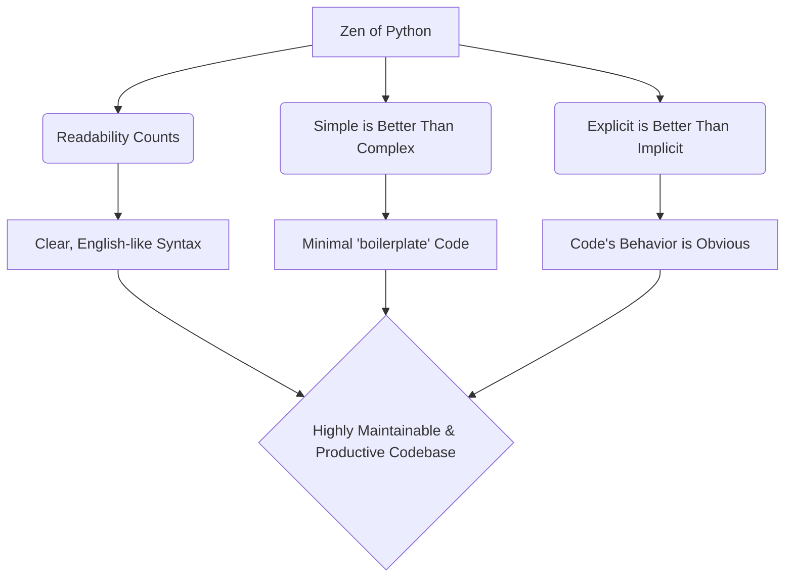

You can read the full Zen of Python by typing `import this` in your Python interpreter. Some key tenets that directly impact your code are:

- **"Beautiful is better than ugly"** and **"Readability counts."**: This directly encourages the use of clean formatting and meaningful whitespace (like indentation for code blocks), which we'll practice in the [Hello World section](#hello-world).
- **"Explicit is better than implicit."**: Python encourages you to write code where the purpose is clear and not hidden behind obscure shortcuts. This is a key differentiator from languages like Perl.
- **"There should be one—and preferably only one—obvious way to do it."**: This guiding principle reduces the number of decisions you need to make for a single task, leading to more uniform and predictable code across different projects and developers.

This philosophy is the foundation upon which all of Python's features are built, from its basic data types to its advanced metaprogramming capabilities.

With this core understanding of what Python is and why it was created, we can now look at the compelling reasons to make it your next programming language.

Building on our understanding of what Python is, let's explore the compelling reasons to learn it. This chapter draws from the established benefits highlighted in the official Python documentation and its widespread adoption.

### Why Learn Python?

Python's design philosophy translates directly into practical, real-world advantages. The language wasn't just built to work; it was built to make **your work** more productive and enjoyable. The official Python tutorial notes its ability to let you "concentrate on the solution to the problem rather than the programming language itself" ([Python 3.14 Tutorial](https://docs.python.org/3/tutorial/appetite.html)).

#### Key Benefits

- **Readability and Reduced Development Time**
  Python's clean, English-like syntax is not just an aesthetic choice. It fundamentally reduces the time you spend deciphering code, whether it's your own from six months ago or a colleague's. Fewer lines of code and less syntactic "noise" mean faster development and easier maintenance. As _Learning Python_ by Mark Lutz highlights, readable code is a cornerstone of Python's design, making it an ideal language for rapid prototyping and collaborative projects.

- **Versatility Across Domains**
  Python is a true general-purpose language. It is not confined to a single niche. This means the skills you build in one area are directly transferable to another.

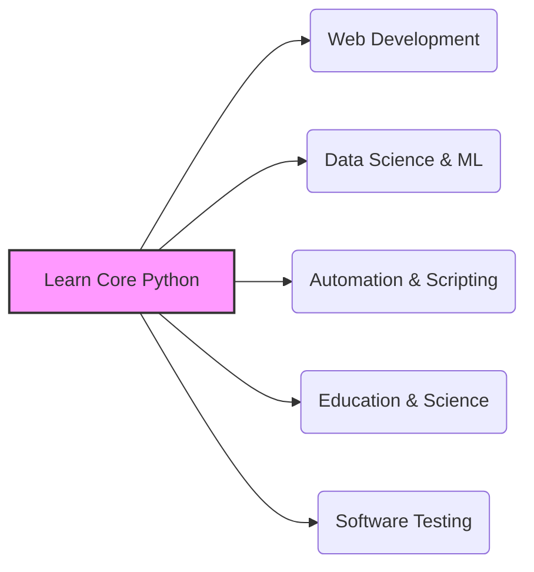

    This diagram shows how foundational Python knowledge opens doors to multiple advanced fields, all using the same core syntax and principles.

- **A Thriving and Supportive Ecosystem**
  You are never alone when learning or building with Python. The ecosystem is one of its greatest strengths.
  - **Comprehensive Standard Library:** Often described as "batteries included," Python's standard library provides ready-to-use modules for everything from reading CSV files and sending emails to working with JSON data and regular expressions. The [Library Reference](https://docs.python.org/3/library/index.html) is your go-to guide for these built-in capabilities.
  - **Extensive Third-Party Packages:** The [Python Package Index (PyPI)](https://pypi.org/) hosts hundreds of thousands of third-party packages that extend Python's capabilities into virtually every domain imaginable.
  - **Large, Welcoming Community:** A massive global community means that answers to your questions are usually a quick search away, and there are countless tutorials, conferences, and local meetups to support your learning journey.

- **In-Demand Career Skill**
  Python consistently ranks as one of the most popular and sought-after programming languages in the industry. Its pivotal role in data science, machine learning, and cloud computing has created a significant and sustained demand for Python developers across the globe.

### Python Alternatives

Understanding Python's position in the broader programming landscape helps you know when it's the right tool for the job. The official documentation positions Python as a high-level language that excels in development speed and code clarity, often at the cost of raw execution speed when compared to lower-level languages ([Python 3.14 Tutorial](https://docs.python.org/3/tutorial/appetite.html#what-is-python)).

| Language       | Primary Domain                                                | Typical Use Case vs. Python                                                                                                                                                                      |
| :------------- | :------------------------------------------------------------ | :----------------------------------------------------------------------------------------------------------------------------------------------------------------------------------------------- |
| **JavaScript** | Web browsers, front-end, now also back-end (Node.js)          | **Complementary** to Python. Unmatched for client-side web interactivity. Python dominates back-end web logic and data processing.                                                               |
| **Java**       | Enterprise systems, Android apps, large-scale back-end        | Often chosen for very large, performance-critical enterprise systems with strict typing. Python is preferred when development speed and flexibility are paramount.                               |
| **C/C++**      | Systems programming, game engines, high-performance computing | Used to build the Python interpreter itself (CPython). You use Python for rapid development and call C/C++ libraries for performance bottlenecks.                                                |
| **Go**         | Network servers, command-line tools, concurrent systems       | A modern alternative where Python's speed limitations are a problem, especially for highly concurrent network services. Syntax is a compromise between Python's readability and C's performance. |
| **R**          | Statistical computing and data visualization                  | Purpose-built for statistics. Python is a general-purpose language with extremely strong data science libraries, offering more flexibility to build end-to-end data products.                    |

This comparison shows that Python's strength lies not in being the absolute fastest or most specialized, but in being the most balanced, readable, and broadly applicable tool in the toolbox.

With a clear picture of why Python is a valuable skill to acquire, the next logical step is to understand what version to learn.

Now that the value of learning Python is clear, the next critical step is to understand the version landscape. Choosing the right version ensures you have access to the latest features, security patches, and community support.

### Understanding Python Versions

When you start learning, you will encounter Python 3. This is not just a newer version; it was a major, intentional overhaul of the language to fix fundamental design flaws. It’s essential to know that **Python 2 is obsolete and unsupported**. As of January 1, 2020, it no longer receives security updates or bug fixes ([Sunsetting Python 2 (PEP 373)](https://www.python.org/doc/sunset-python-2/)).

#### Python 3: The Modern Python

- **Python 3.0** was released in 2008 with the goal of cleaning up the language, even if it meant breaking backward compatibility with Python 2.
- The most significant fix was changing how text is handled, making a clear distinction between human-readable **Unicode text** and binary data. This solved a major source of bugs in multilingual applications.
- The official documentation is written assuming you are using Python 3.x ([Python 3.14 Tutorial](https://docs.python.org/3/tutorial/appetite.html)).

#### Choosing a Python 3.x Version

Within the Python 3 family, you have specific minor versions (the `x` in `3.x`). The following chart illustrates the typical lifecycle of a Python version and guides your choice:

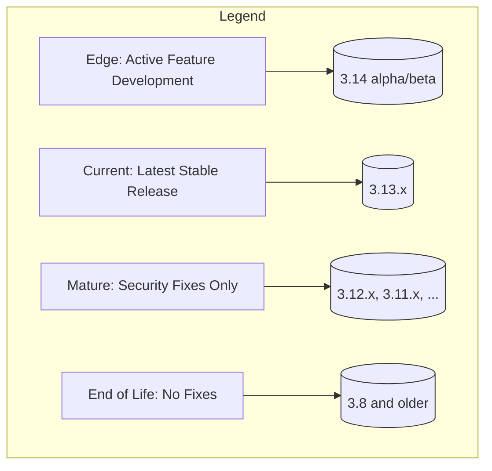

**For learning Python, your best choice is the latest stable release.** As of the documentation you are referencing, that is **Python 3.14.4**. This guarantees you are learning the most current syntax and idioms. For production work, you might choose a mature version to maximize stability, but for a learner, the latest version provides the most modern experience with the newest features and tools.

### Installation and Setup

With the version decided, we move to the practicalities of getting Python on your system. This section details a cross-platform approach.

#### General Installation

The primary and most universal way to install the latest version of Python is from the official website:

1.  Go to the [**Official Python.org Downloads Page**](https://www.python.org/downloads/).
2.  The site will automatically detect your operating system. Click the large download button for the latest Python 3 release (e.g., 3.14.4).
3.  Run the installer.

**Crucial Step on Windows:** On the first screen of the Windows installer, you **must** check the box labeled **"Add Python 3.x to PATH"** . This makes the `python` command available from your Command Prompt or PowerShell, which is essential for the entire course.

You can always find detailed, up-to-date instructions for all platforms in the official guide: [**Using Python on your computer**](https://docs.python.org/3/using/index.html).

#### Setting Up Python on macOS

- **Official Installer:** You can use the installer from the Python.org website. Just download the macOS installer and run it.
- **Homebrew (a popular package manager for macOS):** This method keeps your Python installation clean and makes updating it a single command.

  ```bash
  # In Terminal, first install Homebrew if you haven't:
  # /bin/bash -c "$(curl -fsSL https://raw.githubusercontent.com/Homebrew/install/HEAD/install.sh)"

  # Then, install Python
  brew install python
  ```

  This installs the latest Python 3 and the `pip` package manager without overriding the system's internal, older Python.

#### Confirming Your Installation

Regardless of your operating system, after installation, open your terminal (Terminal on macOS/Linux, Command Prompt on Windows) and verify the installation by checking the version:

```bash
# It's conventional to use 'python3' on macOS/Linux. On Windows it's 'python'.
python --version
# Or
python3 --version
```

You should see output similar to `Python 3.14.4`. This confirms the interpreter is installed and on your system's PATH.

### Installing an IDE (VS Code)

While you can write Python in any text editor, an Integrated Development Environment (IDE) drastically improves productivity with features like syntax highlighting, autocompletion, and debugging tools. **Visual Studio Code (VS Code)** is an excellent, free, and widely used choice.

With your environment fully prepared, it's time for the foundational rite of passage in programming: making the computer greet the world. This simple act is not just tradition; it proves your entire setup works and introduces you to Python's basic syntax and execution model.

### Hello World

The "Hello, World!" program in Python is a single, readable line of code. It demonstrates the core action of any program: receiving an instruction and producing output.

```python
print("Hello, World!")
```

Let's break down this simple instruction:

- **`print()`** is a built-in **function**. Functions are reusable blocks of code that perform a specific task. Python provides many built-in functions for common operations, and you'll create your own in [Part V: Functions & Generators](#part-v-functions--generators).
- **`"Hello, World!"`** is a **string**, a sequence of characters. It's the data you are passing to the `print()` function. Python uses quotes (single or double) to denote string literals, a topic explored deeply in [String Fundamentals](#string-fundamentals).

To execute this, you can use your IDE (VS Code) or your terminal. In VS Code, with your Python file open, you can click the "Run" button (a right-pointing triangle) in the top-right corner, or you can right-click in the editor and select "Run Python File in Terminal". The output, `Hello, World!`, will appear in the terminal pane. This confirms that the Python interpreter correctly processed your instruction and communicated with your system to display the text.

### How Python Runs Programs

When you run that single line of code, a sophisticated sequence of events unfolds behind the scenes. Understanding this process is crucial, but you don't need to master every detail right now. The following flowchart shows the journey your source code takes to become a running program:

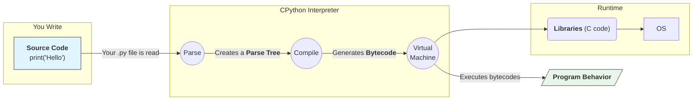

Let's trace these steps:

1.  **Source Code:** The process starts with your human-readable `.py` file.
2.  **Compilation to Bytecode:** The Python interpreter first **compiles** your source code into something called **bytecode**. This is a low-level, platform-independent representation of your program. Crucially, Python compiles automatically; you don't need to run a separate compiler. If Python has write permissions on your computer, it will often save this bytecode in a `__pycache__` folder to speed up future runs, a detail covered in the [The **pycache** Folder](#the-__pycache__-folder) section.
3.  **Execution by the Python Virtual Machine (PVM):** The compiled bytecode is then fed into the **Python Virtual Machine (PVM)**. The PVM is the runtime engine of Python; it's a loop that iterates over the bytecode instructions one by one and executes them.
4.  **Libraries & OS Interaction:** When a bytecode instruction requires interaction with the operating system (like displaying text on screen), the PVM calls into underlying C libraries that handle the system-specific details.

This entire process is why Python is characterized as both interpreted and compiled. It compiles to bytecode for efficiency, but executes that bytecode via interpretation in the PVM.

### How You Run Programs

The interactive way you tested `Hello, World` by running a file in VS Code is just one method. Python offers multiple ways to execute code, each with its own purpose:

1.  **The Interactive Prompt (REPL)**
    - **What it is:** The Read-Eval-Print Loop (REPL) is an interactive environment where you type a command, press Enter, and immediately see the result.
    - **How to use it:** Open your terminal and simply type `python` (or `python3`).
    - **Why it's crucial:** It's your primary tool for experimentation. Testing a small piece of syntax, checking a function's output, or exploring a new library happens instantly in the REPL. We will dedicate the entire next section to mastering it.

2.  **Running Script Files**
    - **What it is:** This is how you run a complete, saved program—your `.py` file. This is the standard way to build applications.
    - **How to use it:** In your terminal, type `python your_program_name.py`. This is what clicking "Run" in VS Code does for you in the background.

3.  **Executable Scripts (Script Mode on Unix/Linux/macOS)**
    - **What it is:** You can transform your Python script into a directly executable command without explicitly typing `python` first. This is a common pattern for scripts and tools on Unix-like systems.
    - **How to use it:**
      1.  Add a special "shebang" line as the very first line of your script: `#!/usr/bin/env python3`.
      2.  Make the file executable with a terminal command: `chmod +x your_program_name.py`.
      3.  Run it directly: `./your_program_name.py`. This method relies on the shebang line to locate the Python interpreter.

4.  **Integrated Development Environments (IDEs)**
    - **What it is:** Both simple code editors and full-featured IDEs (like the VS Code we set up) provide a "Run" button or command.
    - **How to use it:** This graphical method is the most convenient for day-to-day development. The IDE handles the call to the Python interpreter for you but the underlying mechanism is still the same as running a script from the terminal. A simpler alternative to VS Code is **IDLE**, Python's own basic IDE that comes with a standard installation, which is perfectly suitable for beginners.

Each method serves the same ultimate purpose of feeding your code to the Python interpreter, but they offer different workflows suited to different tasks: quick experimentation, building applications, and deploying tools.

With the "Hello, World!" program successfully running and a fundamental understanding of how Python executes your code, you are ready to explore the interactive heart of Python itself—the REPL.

1.  **Download and Install:** Go to the [VS Code website](https://code.visualstudio.com/) and install the appropriate version for your OS.
2.  **Install the Python Extension:** Launch VS Code. On the left sidebar, click the Extensions icon (it looks like four squares). Search for "Python" and install the official extension from Microsoft. This single extension enables IntelliSense (autocompletions), linting, debugging, and environment management.
3.  **Select Your Python Interpreter:** Open any `.py` file (or create a new one) in VS Code. In the bottom-left or bottom-right corner of the status bar, you'll see a label indicating the active Python interpreter. Click it, and a list of detected Python installations will appear at the top. Select the version you just installed (e.g., `Python 3.14.4`). This ensures VS Code uses the correct version for running and debugging your code.

Your development environment is now fully prepared. You've understood Python's philosophy, chosen the right version, and installed the necessary tools, setting a rock-solid foundation for writing your first lines of code.

With the "Hello, World!" program successfully running and a fundamental understanding of how Python executes your code, you are ready to explore the interactive heart of Python itself—the REPL. This environment is your most immediate connection to the language, and mastering it will accelerate all your future learning.

## Understanding Data Types and Type Hints

🧠 **Concept At A Glance**
A data type is a classification that tells the computer what kind of value a piece of data represents, and more importantly, what you can _do_ with it. Think of it like ingredients in a kitchen. Flour, eggs, and sugar are all ingredients, but you treat them very differently.

- **Why they matter:** Data types define the set of possible values and the operations that can be performed on them. You can't add two words together the same way you add two numbers; one concatenates, the other performs arithmetic.
- **Python's View:** In Python, everything is an **object**, and every object has a type. The type is not just a tag; it determines the object's identity and behavior.

### 💡 Type Hints: Your Code's Signpost

Starting with Python 3.6, we have **type hints**. This is a way to _optionally_ annotate your code to indicate the expected data types of variables, function arguments, and return values.

⚠️ **Critical Distinction:** Type hints in Python are **not** like static typing in compiled languages (e.g., C++, Java, Go).

- **Static Typing:** The type check happens at _compile time_. If the types don't match, the program won't compile.
- **Python's Type Hints:** They are **just documentation** that can be checked by external tools like `mypy`. The Python interpreter **completely ignores** type hints at runtime. A type mismatch will never crash your Python program on its own. They bridge the gap between Python's dynamic nature and the safety of static analysis.

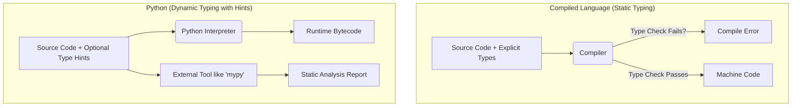

We'll use type hints throughout this cookbook. For more complex types, we tap into the `typing` module, keeping Python 3.6 compatibility in mind.

```python
# Python 3.6 compatible typing imports
from typing import List, Dict, Optional, Union, Any

# Without hints: ambiguous
# def process_orders(orders): ...

# With hints: clear intent!
def process_orders(orders: List[Dict[str, Union[int, str]]]) -> Optional[float]:
    """Calculates the total value of valid orders."""
    pass
```

---

## Introducing Python Object Types and Type Hints

Everything in Python is an object, from a simple `True` boolean to a complex user-defined class. We can use type hints to specify not just built-in types, but also custom ones.

Let's look at a simple function that works with different objects and see how hints document this.

```python
from typing import Union, List

# This function expects an object that can be an integer or a string
def display_id(entity: Union[int, str]) -> str:
    """Formats an entity ID, which could be a number or a code."""
    return f"Entity-{entity}"

# The function can return a list of different types
def get_user_data() -> List[Union[str, int, bool]]:
    """Returns a list of mixed data types representing a user record."""
    name: str = "Ada Lovelace"
    login_count: int = 42
    is_active: bool = True
    return [name, login_count, is_active]

# Example usage
record: List[Union[str, int, bool]] = get_user_data()
print(f"User record: {record}")
# Output: User record: ['Ada Lovelace', 42, True]
```

This flexibility is Python's strength. Type hints let us manage that flexibility with clarity.

---

## Working with Variables

### 🧠 What is a Variable?

A variable in Python is not a box that _contains_ a value. It's a **name tag** attached to an object. The object lives in memory, and the variable is a reference (a pointer) to it.

- **Creation:** A variable is created the first time you assign a value to it.
  ```python
  user_age: int = 30  # The name 'user_age' now points to the integer object 30.
  ```
- **Assignment:** Assignment always copies the _reference_, not the underlying object.
  ```python
  a: List[int] = [1, 2, 3]
  b: List[int] = a  # 'b' is a new tag pointing to the *same* list object as 'a'.
  ```
- **Mutability Matters:** If the object is mutable (like a list), changes through one variable are visible through the other. This is a classic pitfall!

```python
# ⚠️ Common Pitfall: Mutable objects and multiple references
original_list: List[int] = [10, 20, 30]
new_list: List[int] = original_list

new_list.append(40)  # Modifying the object through 'new_list'

print(f"original_list: {original_list}")  # Output: original_list: [10, 20, 30, 40]
print(f"new_list: {new_list}")            # Output: new_list: [10, 20, 30, 40]
# Both variables reflect the change because they point to the ONE list object.
```

---

## Naming Conventions

Readability is a core Python philosophy. PEP 8, the official style guide, provides clear naming conventions:

| Type                    | Convention                           | Example             |
| :---------------------- | :----------------------------------- | :------------------ |
| **Packages**            | Short, all-lowercase, no underscores | `mybpackage`        |
| **Modules**             | Short, all-lowercase, underscores ok | `data_processor.py` |
| **Classes**             | `CapWords` convention (PascalCase)   | `ShoppingCart`      |
| **Functions & Methods** | `snake_case`                         | `calculate_total()` |
| **Variables**           | `snake_case`                         | `items_count`       |
| **Constants**           | `UPPERCASE_WITH_UNDERSCORES`         | `MAX_RETRIES = 5`   |
| **Private Members**     | Leading underscore `_`               | `_internal_cache`   |

💡 **Tip:** Always choose descriptive, meaningful names. `user_name` is infinitely better than `x` or `data`.

```python
# ✅ Good: Clear, readable, follows conventions
MAX_CONNECTIONS: int = 100
_connection_pool: List[str] = []

def open_user_session(user_id: int, is_admin: bool = False) -> str:
    """Opens a session for a user."""
    # ...
    pass
```

---

## The Dynamic Typing Interlude

This is one of Python's most fundamental and unique features. Let's revisit the "name tag" analogy.

- **Dynamic:** The _object_ carries the type, not the variable. A variable can point to an integer, then a string, then a list, all in the same program's lifecycle.
- **No Declaration:** You never declare a variable's type. A variable `x` simply doesn't exist until you assign something to it.

```mermaid
graph TD
    subgraph "Time: Step 1"
        V1[x] --> O1[Object: <int> 5]
    end
    subgraph "Time: Step 2"
        V2[x] --> O2[Object: <str> 'hello']
        O1x[Object: <int> 5] -- No longer referenced --> GC1(Garbage Collection);
    end
    subgraph "Time: Step 3"
        V3[x] --> O3[Object: <list> [1, 2]]
        O2x[Object: <str> 'hello'] -- No longer referenced --> GC2(Garbage Collection);
    end
```

### 🧠 The Interpreter's "Bookkeeping"

When you assign `x = 5`, Python does this:

1.  Creates a **PyObject** in memory (a C struct), where one field is the **type** (`int`) and another is the **value** (`5`).
2.  Creates the variable `x` in the current namespace.
3.  Points `x` to the new object.

When you later do `x = "hello"`:

1.  A new string object is created.
2.  `x` is simply updated to point to this new object.
3.  The integer object `5` now has one less reference. If it has zero references, it becomes elegible for garbage collection.

```python
# Dynamic typing in action
data: Any = 42
print(f"Type: {type(data)}, Value: {data}")  # Type: <class 'int'>, Value: 42

data = "I'm a string now"
print(f"Type: {type(data)}, Value: {data}")  # Type: <class 'str'>, Value: I'm a string now

# This would be a compile-time error in a statically typed language!
```

---

## Python Builtin Types

Python comes with a rich set of standard data types. Here is their official hierarchy, which will be our guide.

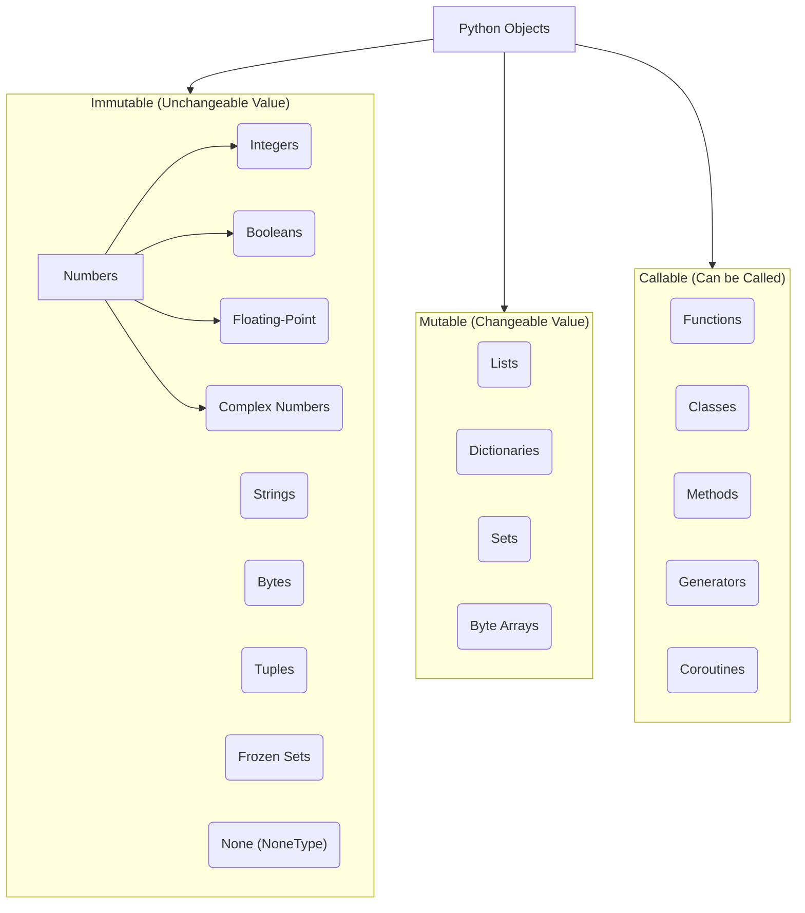

### None Type

The `None` type has a single value: `None`. It represents the absence of a value, a null state, or "nothing."

- **When to use:** Default value for function arguments, placeholder for variables that haven't been assigned a meaningful value yet, return value for functions that don't explicitly return anything.
- **Checking for `None`:** Always use the `is` operator, not `==`. `is` checks object identity, which is perfectly safe for the unique `None` singleton.

```python
from typing import Optional

def find_user(user_id: int) -> Optional[str]:
    """Simulates finding a user; returns None if not found."""
    known_users: Dict[int, str] = {1: "Alice", 2: "Bob"}
    # The .get() method returns None if the key is missing
    return known_users.get(user_id)

# Correct way to check
user_1: Optional[str] = find_user(1)
user_3: Optional[str] = find_user(3)

if user_1 is not None:
    print(f"Found user: {user_1}")
else:
    print("User not found.")  # This prints for user_3

# ⚠️ Pitfall: Don't use '=='
# if some_variable == None:  # This can be overloaded by objects and is slower
```

### bool (Boolean)

The simplest type, representing truth values: `True` or `False`. Importantly, booleans are a subclass of integers in Python.

- `True` is essentially `1`.
- `False` is essentially `0`.
- **Truthiness/Falsiness:** Any object can be tested for its truth value. "Falsy" values include `None`, `False`, `0`, `0.0`, `""` (empty string), `[]` (empty list), and `{}` (empty dict). Almost everything else is "Truthy."

```python
is_active: bool = True
is_admin: bool = False

# Booleans are integers!
print(f"True + True = {True + True}")    # Output: 2
print(f"Is True an int? {isinstance(True, int)}")  # Output: True

# Truthiness in action
user_list: List[str] = []
if user_list:
    print("This won't run because an empty list is falsy.")
else:
    print("List is empty, so this runs.") # Output: List is empty, so this runs.
```

---

### Numeric Types

Python has three distinct numeric types. They are all **immutable**.

#### int (Integer)

- **Unlimited Precision:** In Python, integers do not have a fixed bit-width. They can be as large as your system's memory allows. No more integer overflow errors!
- **Radix Support:** You can express integers in binary (`0b`), octal (`0o`), and hexadecimal (`0x`) notation.

#### float (Floating-Point)

- **IEEE 754 Doubles:** Python floats are implemented as double-precision (64-bit) floating-point numbers, which means they have a limited precision of about 15–17 decimal places.
- **Pitfall:** They suffer from the classic floating-point representation issues. Never use floats for exact monetary calculations.

#### complex (Complex Numbers)

- **First-Class Citizen:** Python has built-in support for complex numbers with `j` or `J` as the imaginary unit. This is a joy for scientific computing.

```python
# --- int ---
huge_number: int = 10**100  # A googol, runs perfectly
binary_val: int = 0b1011    # 11
hex_val: int = 0xFF         # 255

print(f"A googol: {huge_number}")

# --- float ---
pi: float = 3.14159
avogadro: float = 6.022e23  # Scientific notation

# ⚠️ Floating-point precision pitfall
total: float = 0.1 + 0.2
print(f"0.1 + 0.2 == 0.3? {total == 0.3}")  # Output: False! (It's 0.30000000000000004)
# The correct way to compare floats
print(f"Is it close enough? {abs(total - 0.3) < 1e-9}") # Output: True

# --- complex ---
z: complex = 2 + 3j
print(f"Complex number z: {z}")           # Output: (2+3j)
print(f"Real part of z: {z.real}")        # Output: 2.0
print(f"Imaginary part of z: {z.imag}")   # Output: 3.0
```

---

### Text Type

#### str (String)

Strings are **immutable sequences** of Unicode code points. This is a massive advantage, making Python ideal for international text. Once a string is created, it cannot be changed in place; any "modification" actually creates a new string object.

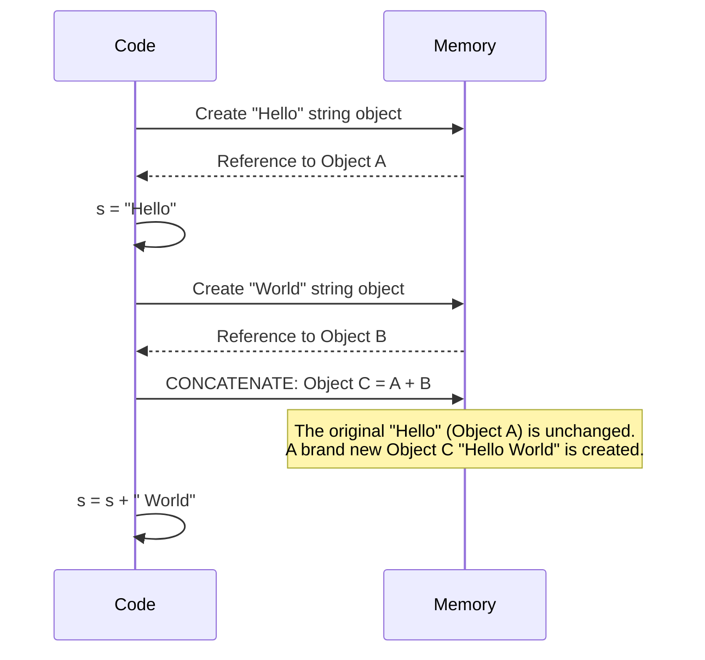

Strings support slicing, indexing, and a vast collection of methods, all of which return _new_ strings.

```python
greeting: str = "Hello, "
subject: str = "World"

# String concatenation creates a new string object
message: str = greeting + subject
print(f"Original greeting: {greeting}") # Unchanged

# Immutability in action
# greeting[0] = 'M'  # ❌ TypeError: 'str' object does not support item assignment

# Always creates a new string object
new_message: str = greeting.replace('H', 'M')
print(f"New message: {new_message}")
```

---

### Binary Sequence Types

These types handle raw binary data, like image files, network packets, or any non-textual data.

- **`bytes` (Immutable):** A sequence of integers from 0 to 255. Once created, it cannot be changed. It's the binary equivalent of a string.
- **`bytearray` (Mutable):** A mutable counterpart to `bytes`. You can change its elements in place, making it useful for building up binary data from chunks.
- **`memoryview` (A Window onto Data):** Allows you to access the internal memory of an object that supports the buffer protocol (like `bytes` or `bytearray`) without copying. This is critical for performance when handling large binary data.

```python
# --- bytes (Immutable) ---
data: bytes = b"hello"
print(f"Byte data: {data}")
# data[0] = 65  # ❌ TypeError: 'bytes' object does not support item assignment

# --- bytearray (Mutable) ---
mutable_data: bytearray = bytearray(b"hello")
print(f"Before: {mutable_data}")
mutable_data[0] = 74  # 74 is the ASCII code for 'J'
print(f"After: {mutable_data}") # Output: Jello

# --- memoryview (Zero-Copy Window) ---
# Imagine a 1GB binary file. Slicing it normally creates copies, which is slow.
# memoryview lets you view a slice without any copying.
huge_data: bytearray = bytearray(range(256)) # Simulating a large object
mv: memoryview = memoryview(huge_data)

# Create a view of the first 10 elements - NO DATA IS COPIED
window: memoryview = mv[0:10]
print(f"Window list: {window.tolist()}") # Output: [0, 1, 2, 3, 4, 5, 6, 7, 8, 9]
```

---

## Using Operators

Operators are symbols that represent a computation. Python has a rich set, and operator precedence is a crucial concept for writing correct expressions.

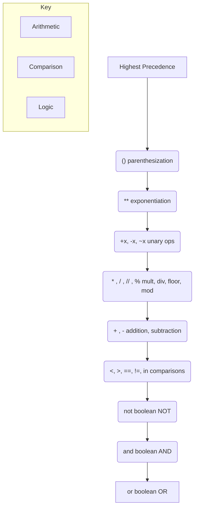

💡 **Tip:** When in doubt, use parentheses to make your intent crystal clear. It also makes your code more readable.

```python
a: int = 10
b: int = 3

# Arithmetic
exp: int = a ** b  # 10^3 = 1000
floor_div: int = a // b # 3 (truncates the decimal)
mod: int = a % b   # 1

# Comparison Chaining (A uniquely Pythonic feature)
x: int = 5
chained_comparison: bool = 1 < x < 10
print(f"Is x between 1 and 10? {chained_comparison}") # Output: True

# Identity vs. Equality
list1: List[int] = [1, 2]
list2: List[int] = [1, 2]
list3: List[int] = list1

print(f"list1 == list2? {list1 == list2}") # True, same content
print(f"list1 is list2? {list1 is list2}") # False, different objects in memory
print(f"list1 is list3? {list1 is list3}") # True, same object in memory
```

---

## Special Behavior with Numbers

Python's numeric types have some special behaviors designed for convenience and power.

- **Integer Division (`//`):** Does floor division, not truncation. -7 // 3 is -3 (floor) not -2 (truncation).
- **Operator Precedence Quirks:** `-3**2` is `-(3**2)` which is `-9`, not `(-3)**2` which is `9`.
- **Augmented Assignment Hacks:** You can assign and operate simultaneously (`x += 5`). This works on mutable objects by modifying them in place, but on immutable objects (like ints), it creates a new object.

```python
# Floor division vs. truncation
print(f"-13 // 4 = {-13 // 4}")   # Floor: -4
print(f"int(-13 / 4) = {int(-13 / 4)}") # Truncation: -3

# Exponentiation precedence
neg_val: int = -3
result: int = neg_val**2  # Equivalent to (-3)**2
print(f"(-3)**2 = {result}") # Output: 9

unparenthesized: int = -3**2
print(f"-3**2 = {unparenthesized}") # Output: -9

# Augmented Assignment
mutable_list: List[int] = [1, 2]
mutable_list += [3]      # Mutable: modifies the list IN-PLACE (same object)
print(f"Mutable list: {mutable_list}")

immutable_int: int = 5
immutable_int += 1       # Immutable: CREATES A NEW integer object (immutable_int now points to 6)
print(f"Immutable int: {immutable_int}")
```

---

## String Fundamentals

Strings are the workhorses of any programming language. Being expert with strings is a superpower.

- **Quoting:** Single `'...'` and double `"..."` are functionally identical. Triple-quotes `'''...'''` or `"""..."""` create multiline strings.
- **Indexing & Slicing:** Access individual characters (`mystring[0]`) or sub-strings (`mystring[2:5]`). Slicing is a powerful, zero-copy view operation. `mystring[start:stop:step]`.
- **Methods:** Strings have dozens of useful methods like `.upper()`, `.split()`, `.strip()`, `.find()`, and `.replace()`. These all create _new_ strings.

```python
filename: str = "  report_q3_2024.csv  "

# Common string methods
stripped_name: str = filename.strip()
upper_name: str = stripped_name.upper()
parts: List[str] = stripped_name.split("_")

print(f"Original: '{filename}'")
print(f"Stripped: '{stripped_name}'")
print(f"Upper: '{upper_name}'")
print(f"Split: {parts}") # Output: ['report', 'q3', '2024.csv']

# Slicing: [start:end:step]
alphabet: str = "abcdefg"
print(f"First three: {alphabet[:3]}")   # Output: abc
print(f"From index 2 to 5: {alphabet[2:5]}") # Output: cde
print(f"Every other letter: {alphabet[::2]}") # Output: aceg
print(f"Reversed: {alphabet[::-1]}")     # Output: gfedcba
```

---

## Escaping Characters

Escape sequences let you include special characters in a string. They start with a backslash `\`.

| Escape Sequence | Meaning               |
| :-------------- | :-------------------- |
| `\n`            | Newline               |
| `\t`            | Tab                   |
| `\\`            | Literal backslash `\` |
| `\'`            | Single quote          |
| `\"`            | Double quote          |

- **Raw Strings:** By prefixing a string with `r`, you tell Python to ignore escape sequences. This is extremely useful for regular expressions and file paths on Windows.

```python
# Standard escaping
file_path_a: str = "C:\\Users\\Alice\\Documents"
print(file_path_a) # Output: C:\Users\Alice\Documents

# Raw string: Simpler and cleaner!
file_path_r: str = r"C:\Users\Alice\Documents"
print(file_path_r) # Output: C:\Users\Alice\Documents

# Newline and tab
poem: str = "Roses are red,\n\tViolets are blue."
print(poem)
# Output:
# Roses are red,
# 	Violets are blue.
```

---

## String Formatting (f-strings, .format())

String formatting is how you weave variables and expressions into text. There are three main eras:

1.  **Old `%`-formatting:** `"Hello %s" % name` (C-style, still works, less flexible).
2.  **`str.format()`:** `"Hello {}".format(name)` (Very powerful, introduced in Python 2.6/3.0).
3.  **f-strings (Formatted String Literals):** `f"Hello {name}"` (Python 3.6+). **This is the modern, recommended way.** It's the most concise, readable, and fastest method.

```python
from datetime import datetime

user_name: str = "Bob"
score: float = 95.3456
total: int = 100

# f-strings: Clear, inline expressions
message: str = f"Player: {user_name.upper()}, Score: {score:.2f}/{total}"
print(message) # Output: Player: BOB, Score: 95.35/100

# Inline calculations
width: int = 10
height: int = 20
area_report: str = f"Area of a {width}x{height} rectangle is {width * height}."
print(area_report) # Output: Area of a 10x20 rectangle is 200.

# Formatting dates
today: datetime = datetime.now()
date_str: str = f"Report generated on {today:%B %d, %Y}"
print(date_str) # Output: Report generated on May 01, 2026.
```

---

## Structuring Multi-Line Code

Python uses indentation to define code blocks. This is called the **Off-side Rule**. There are no curly braces `{}`.

- **Indentation:** 4 spaces per level is the universal standard (PEP 8). Never mix tabs and spaces.
- **Line Continuation:**
  - Use backslash `\` for explicit line continuation. Be careful, there can't be any trailing space after the `\`.
  - Expression inside parentheses `()`, brackets `[]`, or braces `{}` can be split over multiple lines _implicitly_. This is the preferred method.

```python
# Implicit continuation (preferred style)
inventory: List[str] = [
    "Widget",
    "Gadget",
    "Doodad",
    "Thingamajig",
]

long_text: str = (
    "This is a very long string that "
    "is automatically concatenated into one."
)

# Explicit continuation (backslash)
total_price: int = 100 \
                 + 200 \
                 + 300

print(f"Total: {total_price}") # Output: Total: 600
```

---

## Adding Comments and Docstrings

- **Comments (`#`):** Explain the _how_ and _why_ of your code logic. They are for developers and are completely ignored by Python.
- **Docstrings (`"""..."""`):** String literals that appear right after the definition of a function, method, class, or module. They explain the _what_—what the object does, its parameters, and its return values. Docstrings are kept as an attribute of the object (`__doc__`) and are used by tools like `help()` and documentation generators.

```python
import math

def calculate_circle_area(radius: float) -> float:
    """
    Calculates the area of a circle given its radius.

    This function uses the standard geometric formula:
    A = π * r^2

    Args:
        radius: The radius of the circle. Must be non-negative.

    Returns:
        The area of the circle as a float.

    Raises:
        ValueError: If the radius is negative.
    """
    if radius < 0:
        raise ValueError("Radius cannot be negative.")

    area: float = math.pi * radius * radius  # π * r^2
    return area

# help(calculate_circle_area) would display the docstring beautifully!
```

---

## The Documentation Interlude

This short chapter exists to hammer home a vital habit: **write great docstrings.**

Python has a built-in philosophy called "Executable Pseudocode." The language is designed to be readable. Docstrings are the capstone of readable code.

- **Interactive Help:** The `help()` function is your best friend. It displays an object's docstring. Use `help(str)`, `help(list.append)`, or `help(calculate_circle_area)` directly in the interpreter.
- **The `__doc__` attribute:** You can access the docstring as a raw string.
  ```python
  print(calculate_circle_area.__doc__)
  ```

💡 **Best Practice:** For any function longer than a few lines, a docstring is mandatory. Trust me, your future self will thank you.

---

## Variable Scope (LEGB Rule)

The LEGB rule is the order in which Python looks for a variable name. It's a simple, elegant system for managing namespaces.

- **L (Local):** Names assigned within a function (`def` or `lambda`), and not declared global.
- **E (Enclosing):** Locals of any and all enclosing functions, from inner to outer. (Relevant for closures).
- **G (Global):** Names assigned at the top-level of a module file, or declared `global` in a `def` within the file.
- **B (Built-in):** Names preassigned in the built-in names module: `print`, `len`, `open`, `True`, etc.

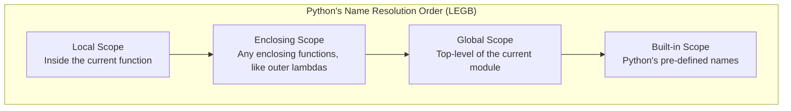

```python
# Scope demonstration
x: str = "Global X"  # G: Global

def outer() -> None:
    x: str = "Enclosing X"  # E: Enclosing
    def inner() -> None:
        x: str = "Local X"  # L: Local
        print(f"Inner: {x}") # Prints 'Local X'
    inner()

def modify_global() -> None:
    global x
    x = "Modified Global X" # Explicitly modifying the global variable

outer()
print(f"Module global after outer: {x}") # Prints 'Global X'
modify_global()
print(f"Module global after modify_global: {x}") # Prints 'Modified Global X'
```

---

## The input() Function

The `input()` function is your primary way to get interactive data from a user. It reads a line of text from standard input and returns it as a **string**. It always returns a string. If you want a number, you must cast it using `int()` or `float()`.

```python
# Get user's name
user_name: str = input("Please enter your name: ")

# Get user's age and convert it to an integer
age_str: str = input("Please enter your age: ")

try:
    # The type hint here is just a promise; the actual runtime check is done by int()
    age: int = int(age_str)
    print(f"Hello, {user_name}. In 10 years, you will be {age + 10}.")
except ValueError:
    print("That was not a valid integer for your age!")
```

---

## Avoiding Repetitive Code Execution

In programming, a cardinal sin is the **Don't Repeat Yourself (DRY)** principle. Repetitive code is hard to maintain, test, and read.

### The `if __name__ == "__main__":` Guard

This is the standard Python idiom to handle repetitive _execution_. When a Python file is run directly, its `__name__` variable is set to `"__main__"`. If it's imported as a module into another file, `__name__` is its filename. This pattern allows a file to act as both a reusable module _and_ a runnable script.

```python
# File: math_utils.py
"""A simple math utility module."""

import sys

def double_value(num: int) -> int:
    """Returns the doubled value of an integer."""
    return num * 2

def main() -> None:
    """The main function that runs when the script is executed."""
    # Get input from command line arguments
    if len(sys.argv) != 2:
        print(f"Usage: python {sys.argv[0]} <number>")
        return

    try:
        val: int = int(sys.argv[1])
        result: int = double_value(val)
        print(f"Double of {val} is {result}")
    except ValueError:
        print("Please provide a valid integer.")

# This block ONLY runs if you execute `python math_utils.py 5`
# It does NOT run if you `import math_utils` in another script.
if __name__ == "__main__":
    print("The math_utils script is being run directly.")
    main()
```

## Part III: Data Structures

Data structures are the containers that organize and store data in your computer's memory. Choosing the right one is a fundamental skill that separates good programmers from great ones. Python's built-in data structures are powerful, flexible, and beautifully designed.

### Sequence Types

Sequences are ordered collections of items. "Ordered" means the items have a defined positional order that will not change unless you explicitly do so. All sequences support indexing (`[i]`), slicing (`[i:j]`), and the `len()` function.

#### list (List)

A list is an **ordered, mutable** sequence of objects. It's Python's workhorse container, comparable to arrays in other languages but infinitely more flexible because it can hold objects of any type, including mixed types in the same list.

- **Mutable:** You can add, remove, or change items after the list is created.
- **Dynamic:** Lists grow and shrink automatically as needed.
- **Common Operations:** `.append()`, `.extend()`, `.insert()`, `.remove()`, `.pop()`, `.sort()`, `.reverse()`.

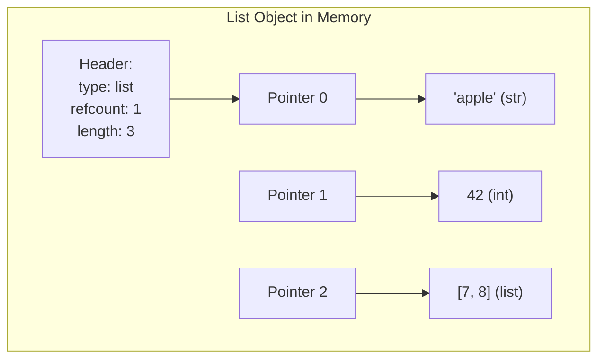

```python
from typing import List, Union, Optional

# Creating a list
fruits: List[str] = ["apple", "banana", "cherry"]

# Adding elements
fruits.append("date")          # Adds to end
fruits.insert(1, "blueberry")  # Inserts at index 1

print(f"After additions: {fruits}")
# Output: ['apple', 'blueberry', 'banana', 'cherry', 'date']

# Removing elements
removed: str = fruits.pop()    # Removes and returns last item
fruits.remove("banana")        # Removes first occurrence of value

print(f"After removals: {fruits}, removed: {removed}")
# Output: ['apple', 'blueberry', 'cherry'], removed: date

# Finding elements
index: int = fruits.index("cherry")
count: int = fruits.count("apple")
exists: bool = "kiwi" in fruits

print(f"Index of cherry: {index}, count of apple: {count}, has kiwi? {exists}")
# Output: Index of cherry: 2, count of apple: 1, has kiwi? False

# ⚠️ Common Pitfall: Modifying while iterating
numbers: List[int] = [1, 2, 3, 4, 5]
# Wrong:
# for num in numbers:
#     if num % 2 == 0:
#         numbers.remove(num)  # Skips elements!

# Right: Create a new list or iterate over a copy
filtered: List[int] = [num for num in numbers if num % 2 != 0]
print(f"Filtered odd numbers: {filtered}")  # Output: [1, 3, 5]
```

#### tuple (Tuple)

A tuple is an **ordered, immutable** sequence. Once created, you cannot change its contents. This immutability is its superpower.

- **Why tuples?**
  - **Integrity:** Perfect for data that shouldn't change, like coordinates `(x, y)`, RGB colors `(255, 128, 0)`, or database records.
  - **Dictionary Keys:** Because they are immutable and hashable, tuples can be used as keys in dictionaries, while lists cannot.
  - **Performance:** Tuples are slightly faster and use less memory than lists because they have a simpler, fixed-size internal structure.

```python
from typing import Tuple, Any

# Creating tuples
coordinates: Tuple[int, int] = (10, 20)
single_item: Tuple[str, ...] = ("hello",)  # The comma is essential!
empty: Tuple[()] = ()

# Packing and unpacking
person: Tuple[str, int, str] = ("Ada", 28, "Engineer")
name: str
age: int
role: str
name, age, role = person  # Elegant unpacking

print(f"Name: {name}, Age: {age}, Role: {role}")
# Output: Name: Ada, Age: 28, Role: Engineer

# Tuples as dictionary keys
location_map: dict = {
    (40.7128, -74.0060): "New York",
    (51.5074, -0.1278): "London",
}
print(f"City at (51.5, -0.12): {location_map[(51.5074, -0.1278)]}")
# Output: London

# ⚠️ Common Pitfall: The "mutable item" illusion
container: Tuple[List[int], str] = ([1, 2, 3], "fixed")
container[0].append(4)  # This WORKS! We're mutating the list inside the tuple.
# container[0] = [5, 6]  # ❌ This FAILS! We're trying to change the tuple's reference.
print(f"Modified tuple: {container}")
# Output: ([1, 2, 3, 4], 'fixed')
```

#### range (Range)

The `range` object represents an **immutable sequence of numbers**. It's not a list; it's a "lazy" sequence that generates numbers on demand, making it extremely memory-efficient, even for ranges of billions.

- **Syntax:** `range(stop)`, `range(start, stop)`, `range(start, stop, step)`.
- **Use Cases:** The king of `for` loops, creating numeric series, indexing.

```python
from typing import List

# range is lazy - does NOT create a list in memory
huge_range: range = range(1000000)
print(f"Type: {type(huge_range)}, Length: {len(huge_range)}")
# Output: Type: <class 'range'>, Length: 1000000
print(f"Memory size of range: {huge_range.__sizeof__()} bytes")  # Tiny!
print(f"Memory size of equivalent list: {list(huge_range).__sizeof__()} bytes")  # Huge!

# Generating sequences
by_twos: range = range(0, 11, 2)  # 0, 2, 4, 6, 8, 10
countdown: range = range(10, 0, -1)  # 10, 9, ..., 1

print(f"Evens to 10: {list(by_twos)}")
# Output: [0, 2, 4, 6, 8, 10]

# Classic for loop pattern
for i in range(5):
    print(f"Iteration {i}", end=" | ")
# Output: Iteration 0 | Iteration 1 | Iteration 2 | Iteration 3 | Iteration 4 |
```

---

### Set Types

Sets are **unordered** collections of **unique, hashable** objects. Their primary magic is blazingly fast membership testing (`x in set`) and mathematical set operations (union, intersection, difference).

#### set (Set)

A `set` is a **mutable, unordered** collection with no duplicate elements. Think of it like a bag of unique items where you don't care about the order.

- **Mutations:** `.add()`, `.remove()`, `.discard()`, `.pop()`, `.clear()`.
- **Set Algebra:** `|` (union), `&` (intersection), `-` (difference), `^` (symmetric difference).

```python
from typing import Set

# Creating sets - duplicates are silently discarded
primes: Set[int] = {2, 3, 5, 7, 11, 11, 11}
print(f"Primes (no duplicates): {primes}")
# Output: {2, 3, 5, 7, 11}

# Fast membership testing (O(1) average time complexity)
large_set: Set[int] = set(range(10000))
print(f"Is 9999 in set? {9999 in large_set}")  # Output: True (instantaneous)

# Mathematical set operations
a: Set[str] = {"apple", "banana", "cherry"}
b: Set[str] = {"banana", "dragonfruit", "elderberry"}

union: Set[str] = a | b
intersection: Set[str] = a & b
difference: Set[str] = a - b
symmetric: Set[str] = a ^ b

print(f"Union: {union}")                # Output: {'banana', 'elderberry', 'apple', 'cherry', 'dragonfruit'}
print(f"Intersection: {intersection}")  # Output: {'banana'}
print(f"A - B: {difference}")           # Output: {'apple', 'cherry'}
print(f"A ^ B: {symmetric}")            # Output: {'apple', 'dragonfruit', 'elderberry', 'cherry'}
```

#### frozenset (Frozen Set)

A `frozenset` is the **immutable** sibling of `set`. It's to `set` what `tuple` is to `list`.

- **Hashable:** Because it's immutable, a `frozenset` can be used as a key in a dictionary or an element in another set.
- **Use Case:** Representing a fixed collection of categories, permissions, or features.

```python
from typing import FrozenSet, Dict

# Creating a frozenset
colors: FrozenSet[str] = frozenset(["red", "green", "blue"])
# colors.add("yellow")  # ❌ AttributeError: 'frozenset' object has no attribute 'add'

# Frozensets as dictionary keys (powerful!)
# Imagine caching pre-computed results for specific sets of options
cache: Dict[FrozenSet[str], float] = {
    frozenset(["red", "blue"]): 0.95,
    frozenset(["green", "yellow"]): 0.87,
}

config: FrozenSet[str] = frozenset(["red", "blue"])
print(f"Cached value for {config}: {cache.get(config)}")
# Output: Cached value for frozenset({'blue', 'red'}): 0.95
```

---

### Mapping Types

Mappings are collections of key-value pairs. They provide a direct, named association between a lookup key and its associated value.

#### dict (Dictionary)

A dictionary (`dict`) is a **mutable, unordered** (insertion-ordered since Python 3.7) mapping of **unique, hashable keys** to arbitrary values. It's Python's most versatile built-in data structure, the foundation of the language's object system (`__dict__`).

- **Hashing:** Keys must be hashable (immutable types like `str`, `int`, `tuple` with immutable elements, `frozenset`).
- **Operations:** `.get()`, `.keys()`, `.values()`, `.items()`, `.pop()`, `.update()`.

```mermaid
graph TD
    subgraph "Dictionary (Hash Table) Under the Hood"
        H[hash('name')] --> B0
        subgraph Buckets
            B0[Bucket 0] --> E0["'name': 'Alice'" ]
            B1[Bucket 1] --> Empty1[Empty]
            B2[Bucket 2: H(42)] --> E2["42: 'the answer'"]
            B3[Bucket 3] --> E3["'city': 'New York'"]
            B4[Bucket 4] --> Empty4[Empty]
        end
    end
```

```python
from typing import Dict, Any, Optional

# Creating dictionaries
user: Dict[str, Any] = {
    "name": "Guido van Rossum",
    "age": 68,
    "languages": ["Python", "ABC"],
    "is_benevolent_dictator": False,
}

# Safe key access with get()
# Direct access: user["height"]  # ❌ KeyError if key is missing
height: Optional[int] = user.get("height", None)  # ✅ Returns default
print(f"Height (should be None): {height}")

# Iterating elegantly
for key, value in user.items():
    print(f"  {key}: {value}")

# Merging dictionaries (Python 3.9+ has `|` operator)
defaults: Dict[str, str] = {"theme": "dark", "language": "en"}
preferences: Dict[str, str] = {"language": "es", "notifications": "on"}
merged: Dict[str, str] = {**defaults, **preferences}
print(f"Merged preferences: {merged}")
# Output: {'theme': 'dark', 'language': 'es', 'notifications': 'on'}
```

---

### Tuples, Files, and Everything Else

This section bridges the "core four" (lists, tuples, dicts, sets) with the wider Python ecosystem.

- **Everything Is an Object:** A function, a module, a file handle, a class—they're all first-class objects. You can store them in data structures, pass them as arguments, and return them from functions.
- **Files as Context Managers:** The `with` statement is the canonical way to handle files. It guarantees proper resource cleanup, even if errors occur.

```python
from typing import List, Tuple, Callable

# Functions as first-class objects in a list
def add(a: int, b: int) -> int:
    return a + b

def multiply(a: int, b: int) -> int:
    return a * b

operations: List[Callable[[int, int], int]] = [add, multiply]
for op in operations:
    print(f"Result of {op.__name__}: {op(5, 3)}")
# Output: Result of add: 8 | Result of multiply: 15

# Files: The Pythonic Way
data_lines: List[str] = ["Line one.\n", "Line two.\n", "Line three.\n"]

# Writing (auto-closes file)
with open("temp_example.txt", "w") as file:
    file.writelines(data_lines)

# Reading (auto-closes file)
with open("temp_example.txt", "r") as file:
    content: str = file.read()
    print(f"File content:\n{content}")
```

---

### Choosing the Right Data Structure

This is a decision you'll make a hundred times a day. Here's a quick rule-of-thumb table:

| Need                           | Best Choice              | Why                                    |
| :----------------------------- | :----------------------- | :------------------------------------- |
| Ordered, mutable collection    | `list`                   | Fast appends, random access            |
| Ordered, immutable collection  | `tuple`                  | Hashable, slight speed gain, integrity |
| Unique, unordered items        | `set`                    | Lightning-fast membership test         |
| Immutable set, dictionary key  | `frozenset`              | Hashable                               |
| Key-value lookup               | `dict`                   | Instant access by key                  |
| First-in-first-out (FIFO)      | `collections.deque`      | O(1) pops from both ends               |
| Last-in-first-out (LIFO)       | `list` (acts as a stack) | `.append()` and `.pop()` are O(1)      |
| Fixed records / simple objects | `tuple` / `dataclass`    | Lightweight, clear structure           |

---

### Comprehensions (List, Dict, Set)

Comprehensions are a concise, expressive, and Pythonic way to create new data structures from existing iterables. They are often faster than equivalent `for` loops because the underlying machinery is optimized in C.

- **List Comprehensions:** `[expr for item in iterable]`
- **Dict Comprehensions:** `{key_expr: val_expr for item in iterable}`
- **Set Comprehensions:** `{expr for item in iterable}`

```python
from typing import List, Dict, Set

# List Comprehension: Square of numbers
numbers: List[int] = [1, 2, 3, 4]
squares: List[int] = [n**2 for n in numbers]
print(f"Squares: {squares}")  # Output: [1, 4, 9, 16]

# Dict Comprehension: Word length mapping
words: List[str] = ["hello", "world", "python"]
word_lengths: Dict[str, int] = {word: len(word) for word in words}
print(f"Lengths: {word_lengths}")  # Output: {'hello': 5, 'world': 5, 'python': 6}

# Set Comprehension: Unique vowels
sentence: str = "the quick brown fox"
vowels: Set[str] = {char for char in sentence if char in 'aeiou'}
print(f"Found vowels: {vowels}")  # Output: {'e', 'u', 'i', 'o'}
```

---

### Combining Comprehensions and Conditionals

Comprehensions can include `if` conditions to filter input items and even ternary expressions (`x if condition else y`) within the output expression.

```python
from typing import List

data: List[int] = [-5, 3, 0, 9, -2, 7]

# Filtering with `if` at the end
positive_only: List[int] = [x for x in data if x > 0]
print(f"Positive: {positive_only}")  # Output: [3, 9, 7]

# Conditional expression in the output
# Transform negative to zero, leave others
transformed: List[int] = [x if x > 0 else 0 for x in data]
print(f"Transformed: {transformed}")  # Output: [0, 3, 0, 9, 0, 7]

# Combined: Filter AND transform
# Double the positive numbers only
doubled_positives: List[int] = [x * 2 for x in data if x > 0]
print(f"Doubled Positives: {doubled_positives}")  # Output: [6, 18, 14]
```

---

### Reference vs Value Copying

This is one of the most crucial concepts in Python and a source of countless bugs for newcomers.

- **Reference Copy (Assignment):** `b = a` just creates a new name tag for the **exact same object**.
- **Shallow Copy:** Creates a new container object, but the _elements inside_ are still references to the same objects as the original.
- **Deep Copy:** Creates a completely independent clone. The new container and all objects inside it, recursively, are brand new copies. No references are shared.

### Shallow vs Deep Copies

```python
import copy
from typing import List

# Original nested list
original: List[List[int]] = [[1, 2, 3], [4, 5, 6]]

# ---- Reference Copy ----
ref_copy: List[List[int]] = original

# ---- Shallow Copy ----
shallow_copy: List[List[int]] = copy.copy(original)  # or list(original) or original[:]

# ---- Deep Copy ----
deep_copy: List[List[int]] = copy.deepcopy(original)

# Mutating the inner list of the ORIGINAL
original[0][0] = "X"

print(f"Original:     {original}")
print(f"Reference:    {ref_copy}")      # Changed! Same top-level object
print(f"Shallow Copy: {shallow_copy}")  # Changed! Inner lists are the same objects
print(f"Deep Copy:    {deep_copy}")     # Unchanged! Completely independent clone
```

```mermaid
graph TD
    subgraph "Shallow Copy"
        O[Original Outer List] --> I1[Inner List A]
        O --> I2[Inner List B]
        S[Shallow Copy Outer List] --> I1
        S --> I2
    end
    subgraph "Deep Copy"
        O2[Original Outer List] --> I3[Inner List C]
        D[Deep Copy Outer List] --> I4[Inner List D<br>(A true clone of C)]
    end
    style I1 fill:#f9f,stroke:#333
    style I2 fill:#f9f,stroke:#333
    style I4 fill:#9f9,stroke:#333
```

---

### Slicing (Range Selector)

Slicing is a powerful syntax for extracting portions of sequences using the `[start:stop:step]` notation. It works on any sequence: `list`, `tuple`, `str`, and even custom sequence types.

- **Default `start`:** Beginning of the sequence.
- **Default `stop`:** End of the sequence.
- **Default `step`:** 1.
- **Negative Indices:** Count from the end.
- **Copy Trick:** `my_list[:]` creates a shallow copy of the entire sequence.

```python
from typing import List, Tuple, Any

sample: List[int] = [0, 10, 20, 30, 40, 50, 60]

# Basic slicing
first_three: List[int] = sample[:3]    # [0, 10, 20]
last_two: List[int] = sample[-2:]      # [50, 60]
middle: List[int] = sample[2:5]        # [20, 30, 40]

# Slicing with steps
every_other: List[int] = sample[::2]   # [0, 20, 40, 60]
reverse_copy: List[int] = sample[::-1] # [60, 50, 40, 30, 20, 10, 0]

print(f"Every other: {every_other}")
print(f"Reversed: {reverse_copy}")

# Slicing for in-place modification (mutable sequences only)
numbers: List[int] = [1, 2, 3, 4, 5]
numbers[1:4] = [20, 30]  # Replace a slice with a shorter list
print(f"After slice assignment: {numbers}")  # Output: [1, 20, 30, 5]
```

---

### Comparing is vs ==

This is a classic Python interview question that separates the novices from the initiated.

| Operator | Meaning      | What It Compares                                                       | Example  |
| :------- | :----------- | :--------------------------------------------------------------------- | :------- |
| `==`     | **Equality** | Do these two objects have the same _value_?                            | `a == b` |
| `is`     | **Identity** | Are these two variables pointing to the _exact same object_ in memory? | `a is b` |

- Use `is` for comparing with singletons like `None`, `True`, `False`.
- Use `==` for comparing values of strings, numbers, lists, etc.
- ⚠️ **Small Integer/String Interning:** CPython (the default interpreter) caches small integers (-5 to 256) and some strings. `a = 256; b = 256; a is b` is `True`, but `a = 257; b = 257; a is b` will **usually** be `False`. Never rely on `is` for value equality.

```python
from typing import List, Optional

a: List[int] = [1, 2, 3]
b: List[int] = [1, 2, 3]
c: List[int] = a

print(f"a == b (value equality): {a == b}")  # True
print(f"a is b (object identity): {a is b}")  # False
print(f"a is c (same object): {a is c}")      # True

# Correct singleton comparison
result: Optional[str] = None
if result is None:  # ✅ Correct
    print("No result found.")
# if result == None: # ❌ Incorrect, slower, and could be overridden
```

---

### Diving Deeper into Iterable Methods

Python's iterables share a rich toolkit of methods. Knowing them makes your code more expressive and concise.

- **`enumerate()`:** Get index and value simultaneously.
- **`zip()`:** Iterate over multiple iterables in parallel.
- **`reversed()`:** Get a reverse iterator (without modifying the original).
- **`sorted()`:** Return a new sorted list (without modifying the original).
- **`.sort()` vs. `sorted()`:** `.sort()` is a _method_ on lists that sorts in-place and returns `None`. `sorted()` is a _function_ that works on any iterable, returns a new list, and never mutates the original.

```python
from typing import List, Tuple

names: List[str] = ["Alice", "Bob", "Charlie"]
scores: List[int] = [85, 92, 78]

# enumerate: Get index and value
for i, name in enumerate(names):
    print(f"  Rank {i+1}: {name}")

# zip: Combine two lists into pairs
paired: List[Tuple[str, int]] = list(zip(names, scores))
print(f"Zipped: {paired}")
# Output: [('Alice', 85), ('Bob', 92), ('Charlie', 78)]

# sorted vs .sort
original: List[int] = [3, 1, 2]
new_sorted: List[int] = sorted(original)  # Returns new list, original unchanged
original.sort()                           # Modifies original in place, returns None

print(f"Original (now sorted): {original}")     # [1, 2, 3]
print(f"New sorted copy: {new_sorted}")        # [1, 2, 3]
```

---

### all() and any() Functions

These two built-in functions are tiny but mighty. They apply a truthiness test to every element of an iterable and distill the result into a single boolean.

- **`all(iterable)`:** Returns `True` if **all** elements of the iterable are truthy (or if the iterable is empty).
- **`any(iterable)`:** Returns `True` if **any** element of the iterable is truthy. Returns `False` if the iterable is empty.

They are perfect for validation checks, making code read like natural language.

```python
from typing import List

# Example: Validating user input fields
user_inputs: List[str] = ["Alice", "alice@example.com", ""]

# Check if ALL fields are non-empty
is_valid: bool = all(user_inputs)  # Falsy empty string makes this False
print(f"All fields filled? {is_valid}")  # Output: False

# Check if ANY field is filled
has_any_data: bool = any(user_inputs)
print(f"Has any data? {has_any_data}")  # Output: True

# Real-world use: Check if all numbers in a list are positive
readings: List[int] = [21, 25, 19, 23, -1, 20]
all_positive: bool = all(r > 0 for r in readings)  # Generator expression
print(f"Are all readings positive? {all_positive}")  # Output: False

# Check if there's any error
http_statuses: List[int] = [200, 201, 500, 404]
has_errors: bool = any(s >= 400 for s in http_statuses)
print(f"Has server errors? {has_errors}")  # Output: True
```

## Part IV: Statements, Syntax & Flow Control

Now we move from the _nouns_ (data structures) to the _verbs_ of Python. Statements are the instructions that tell Python what _actions_ to perform. They direct the flow of execution, make decisions, and repeat tasks. Mastering them turns data into dynamic programs.

### Introducing Python Statements

In Python, everything is a statement or an expression. The distinction is simple but important:

- **Expression:** Something that _produces_ a value. You can print it or assign it to a variable. Think `2 + 2` or `len([1, 2, 3])`.
- **Statement:** An instruction that _does_ something but doesn't necessarily produce a value you can use directly. Examples: `if`, `for`, `while`, `def`, `import`, `pass`.

Python's clean syntax means most lines you write _are_ statements. The key design principle is that **indentation is syntax**, not style. This forces readable code, a gift disguised as a constraint.

```python
import sys
from typing import List

# --- Expressions produce values ---
sum_expr: int = 2 + 2           # 2 + 2 is an expression
list_len: int = len([1, 2, 3])  # len(...) is an expression

# --- Statements perform actions ---
if sum_expr == 4:               # The entire 'if' block is a statement
    print("Math still works!")  # 'print' is a function call, a statement

# You cannot assign a statement to a variable:
# result: ??? = (if True: 5)  # ❌ SyntaxError!
```

---

### Assignments, Expressions, and Prints

These are the most fundamental, everyday building blocks.

- **Assignment (`=`):** Binds a name (variable) to an object in memory. It's right-associative and doesn't return a value.
- **Expressions:** Any valid combination of literals, variables, operators, and function calls. They are evaluated from left to right, following precedence.
- **`print()`:** Sends text to the standard output stream. It's the universal debugging tool, despite its simplicity.

```python
from typing import Tuple

# Assignment: Python's right-associative chaining
a: int
b: int
a = b = 10          # Both 'a' and 'b' point to the integer 10
print(f"a = {a}, b = {b}")

# Tuple unpacking assignment (a powerful Pythonic pattern)
x: int
y: int
x, y = 5, 10        # x gets 5, y gets 10
# This is how you elegantly swap variables without a temp:
x, y = y, x
print(f"Swapped: x = {x}, y = {y}")  # Output: Swapped: x = 10, y = 5

# print() details
name: str = "World"
print("Hello", name, end="!\n", sep="-")  # sep controls separator, end controls line ending
# Output: Hello-World!
```

---

### if Tests and Syntax Rules

The `if` statement is Python's primary decision-making tool. It evaluates a condition and executes a block of code only if that condition is "truthy."

- **Syntax:** No parentheses are required around the condition, but a colon `:` is mandatory after it.
- **Block Definition:** The indented block following the colon is the body. A common pitfall is a block with _no_ code. Use the `pass` keyword to avoid an `IndentationError`.

```python
from typing import Optional

temperature: int = 25

# Basic if/elif/else structure
if temperature > 30:
    advice: str = "It's hot outside, stay hydrated!"
elif temperature > 20:
    advice = "Perfect day for a walk."
elif temperature > 10:
    advice = "A bit chilly, take a jacket."
else:
    advice = "It's cold, bundle up!"

print(f"Advice: {advice}")  # Output: Advice: Perfect day for a walk.

# ⚠️ Pitfall: Empty blocks must use 'pass'
status: Optional[str] = None
# if status is None:
#     # TODO: implement check later
# ❌ IndentationError: expected an indented block

if status is None:
    pass  # ✅ Valid placeholder
```

---

### Boolean Operators

Python's boolean operators are _word-based_: `and`, `or`, `not`. They are short-circuit operators, meaning they evaluate operands only as much as needed to determine the result.

- **Short-Circuit `and`:** If the left operand is falsy, return it immediately. Otherwise, evaluate and return the right operand.
- **Short-Circuit `or`:** If the left operand is truthy, return it immediately. Otherwise, evaluate and return the right operand.
- **`not`:** Negates the truth value of its single operand.

```python
from typing import Any, Optional

# Short-circuit behavior (this is idiomatic Python)
default_name: str = "Anonymous"
user_name: Optional[str] = None

# If user_name is truthy (not None/empty), use it. Otherwise, use the default.
display_name: Any = user_name or default_name
print(f"Hello, {display_name}")  # Output: Hello, Anonymous

# The 'and' operator is often used for guard clauses
data: Optional[dict] = {"key": "value"}
# If data exists, ACCCED its 'key'. This is safe.
value: Optional[str] = data and data.get("key")
print(f"Value from guard: {value}")  # Output: Value from guard: value

# ⚠️ Pitfall: Don't use bitwise &, | where logical and, or are intended
# a & b  # This is bitwise AND, different from logical 'and'
```

---

### Grouping Conditionals

Complex decisions require combining multiple conditions. Python gives you two tools:

- **Boolean Operators (`and`, `or`):** For combining conditions within a single `if` block.
- **Chained Comparisons:** A beautiful Python feature where you can write `1 < x < 10` instead of `1 < x and x < 10`. It's more readable and evaluates `x` only once.

```python
from typing import List

age: int = 25
income: float = 60000.0

# Combining with 'and' / 'or' (use parentheses for clarity)
if (age >= 18 and age <= 35) and (income > 50000 or income < 20000):
    print("Eligible for the special program.")
else:
    print("Not eligible.")  # Output: Eligible for the special program.

# Elegant chained comparisons
score: int = 85
if 80 <= score < 90:
    print(f"Grade: B ({score})")  # Output: Grade: B (85)

# This is equivalent to:
if score >= 80 and score < 90:
    print("Grade: B (using standard logic)")
```

---

### What About switch? (Match/Case)

Python didn't have a built-in `switch` statement for most of its life. This was an intentional design choice, encouraging polymorphism and dictionary dispatch.

**However, Python 3.10 introduced `match`/`case`**, affectionately known as **Structural Pattern Matching**. It's far more powerful than a simple switch. It can match types, unpack sequences, and extract values from complex data structures.

```python
from typing import Union

def process_command(command: str) -> str:
    """A simple command processor using match/case (Python 3.10+)."""
    match command.split():  # Splits the command string into parts
        case ["greet", name]:  # Matches a two-element list
            return f"Hello, {name}!"
        case ["add", x, y]:  # Unpacks two values
            return f"{float(x) + float(y)}"
        case ["quit"]:
            return "Goodbye!"
        case _:  # The 'default' wildcard
            return "Unknown command."

print(process_command("greet Alice"))  # Output: Hello, Alice!
print(process_command("add 5 3.2"))    # Output: 8.2
```

---

### while and for Loops

Loops are the engines of automation. Python provides two distinct loop constructs:

- **`while`:** Repeats a block _as long as_ a condition remains `True`. Perfect when the number of iterations is unknown beforehand.
- **`for`:** Iterates over every item in an **iterable** (string, list, dict, file, etc.). It's the workhorse for most looping tasks.

```python
from typing import List

# while loop: Unknown number of steps
countdown: int = 5
while countdown > 0:
    print(f"T-minus {countdown}...")
    countdown -= 1
print("Liftoff!")  # Output: T-minus 5... 4... 1... Liftoff!

# for loop: Known sequence
fruits: List[str] = ["apple", "banana", "mango"]
for fruit in fruits:
    print(f"  Serving: {fruit}")
```

---

### Using else in Loops

This is a subtle, uniquely Pythonic feature. A loop can have an `else` clause. It executes when the loop finishes _normally_—that is, without encountering a `break` statement.

- **`for...else`:** The `else` block runs if the `for` loop iterated through the entire iterable.
- **`while...else`:** The `else` block runs if the `while` condition became false.

💡 **Best Use Case:** Searching for something. If it's found, `break`; if it's never found, handle that in the `else` block. It elegantly eliminates a "found" flag variable.

```python
from typing import List

# Elegant search without a flag variable
def find_prime(numbers: List[int]) -> None:
    """Searches for a prime number in a list."""
    for num in numbers:
        if num > 1 and all(num % i != 0 for i in range(2, int(num**0.5) + 1)):
            print(f"Found prime: {num}")
            break  # Exits both the loop AND skips the 'else' block
    else:  # This block runs ONLY if the loop completed without 'break'
        print("No prime number was found.")

find_prime([4, 6, 8, 9])    # Output: No prime number was found.
find_prime([4, 6, 11, 9])   # Output: Found prime: 11
```

---

### The range() Function

We introduced `range` in Part III as a sequence type, but its true home is in loop control. Let's revisit it in its natural habitat.

- `range(n)`: Produces 0, 1, 2, ..., n-1. Perfect for looping `n` times.
- `range(start, stop)`: Produces integers from `start` up to, but not including, `stop`.
- `range(start, stop, step)`: Adds a step, which can be negative for countdowns.

```python
from typing import List

# The classic 'do something n times' loop
print("Processing 3 batches:")
for batch_num in range(3):
    print(f"  Batch {batch_num + 1} started.")
# Output: Batch 1, Batch 2, Batch 3

# Using range with a step to iterate over specific indices
indices: List[int] = list(range(0, 10, 2))
print(f"Even indices: {indices}")  # Output: [0, 2, 4, 6, 8]

# A clean countdown loop
print("Blastoff sequence:")
for i in range(5, 0, -1):
    print(i, end=" ")
# Output: 5 4 3 2 1
```

---

### break and continue

These two keywords give you surgical control within a loop.

- **`break`:** Immediately terminates the entire loop. Execution jumps to the first statement after the loop.
- **`continue`:** Immediately terminates the _current iteration_ and jumps to the top of the loop for the next iteration.

```python
from typing import List

logs: List[str] = ["OK", "OK", "ERROR", "SKIP", "OK", "CRITICAL"]
failure_found: bool = False

print("Processing log stream:")
for i, entry in enumerate(logs):
    if entry == "SKIP":
        print(f"  [{i}] Skipping entry...")
        continue  # Don't process this entry, go to the next one
    if entry == "CRITICAL":
        print(f"  [{i}] Critical failure found! Stopping pipeline.")
        failure_found = True
        break  # Stop the entire loop immediately
    print(f"  [{i}] Processing entry: {entry}")

print(f"Processing complete. Failure: {failure_found}")
# Output:
# Processing entry: OK (i=0), OK (i=1), ERROR (i=2), Skipping (i=3), Processing (i=4)
# Critical failure found! Stopping pipeline. Processing complete. Failure: True
```

---

### Iterations and Comprehensions

We touched on comprehensions as a way to _build_ data structures. Now let's understand them as a form of _iteration_. A comprehension is essentially a loop expressed in a declarative, highly optimized single line of code.

- **Readability First:** A comprehension is elegant if it's immediately clear. If it becomes a complex, nested beast, a standard `for` loop is more Pythonic.
- **Speed:** Because the iteration logic is executed in C, comprehensions are often measurably faster than equivalent `for` loops that repeatedly call the `.append()` method.

```python
from typing import List, Set

# Standard loop vs. Comprehension
numbers: List[int] = [1, 2, 3, 4, 5]

# Loop version
squares_loop: List[int] = []
for n in numbers:
    squares_loop.append(n**2)

# Comprehension version - more declarative
squares_comp: List[int] = [n**2 for n in numbers]

print(f"Loop squares: {squares_loop}")    # [1, 4, 9, 16, 25]
print(f"Comp squares: {squares_comp}")    # [1, 4, 9, 16, 25]

# Generator Expressions (the lazy cousin)
# Use () instead of [] to create a generator, not a tuple.
# This is memory-efficient for huge datasets.
lazy_squares = (n**2 for n in numbers)  # No list is created
print(f"Generator object: {lazy_squares}")
print(f"First square: {next(lazy_squares)}")  # Output: 1
```

---

### Iterables and Iteration Protocols

This is the magical, underlying machinery that makes `for` loops and comprehensions work. What makes something "iterable"?

Any object that can return its members one at a time is an **iterable**. An iterable implements the `__iter__()` method. This method is called by the `for` loop and returns an **iterator**.

An **iterator** is an object that keeps track of where it is during iteration. It implements the `__next__()` method to return the next item, and raises `StopIteration` when exhausted.

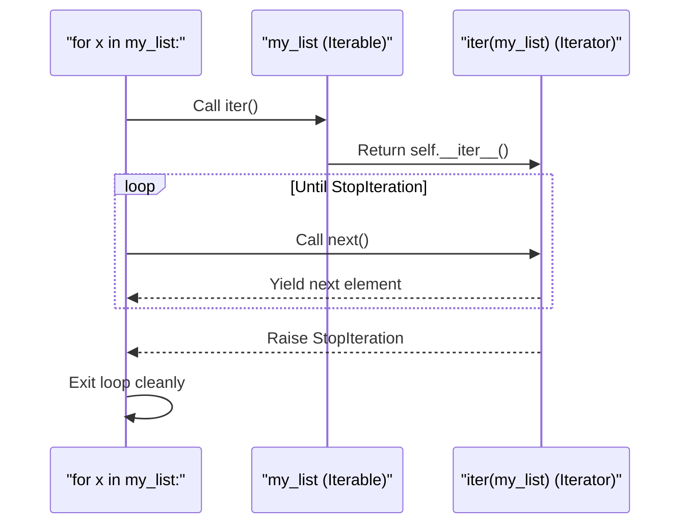

```python
from typing import Iterator, List

# Demystifying the for-loop's internal protocol
my_list: List[str] = ["a", "b", "c"]

# 1. Get an iterator from the iterable
list_iter: Iterator[str] = iter(my_list)  # calls my_list.__iter__()

# 2. Manually call next() on the iterator
# This is exactly what the for-loop does under the hood
print(next(list_iter))  # Output: a
print(next(list_iter))  # Output: b
print(next(list_iter))  # Output: c
# print(next(list_iter))  # ❌ StopIteration exception would be raised

# A for loop handles all of the above and the StopIteration gracefully:
print("Standard for-loop:")
for item in my_list:
    print(f"  {item}")
```

## Part V: Functions & Generators

Functions are the fundamental building blocks of reusable code. They encapsulate logic, reduce repetition, and make programs modular. If Part IV was about the _verbs_ of Python, Part V is about packaging those verbs into powerful, reusable _actions_. Let's master the art of writing elegant, efficient functions.

### Function Basics

A function is a named block of code designed to perform one specific task. It takes inputs, processes them, and (optionally) returns an output.

- **`def` Keyword:** Functions are defined with `def`, followed by the name, parentheses for parameters, and a colon.
- **Docstrings:** A triple-quoted string immediately after the `def` line becomes the function's documentation.
- **Calling:** A function is executed only when called with parentheses `()`.

```python
from typing import Union

def greet(name: str, greeting: str = "Hello") -> str:
    """
    Generates a personalized greeting message.

    Args:
        name: The name of the person to greet.
        greeting: The greeting word to use.

    Returns:
        A formatted greeting string.
    """
    return f"{greeting}, {name}!"

# Calling the function
message: str = greet("Alice")
print(message)  # Output: Hello, Alice!

message_custom: str = greet("Bob", greeting="Good morning")
print(message_custom)  # Output: Good morning, Bob!

# Functions are first-class objects
greeter_function = greet  # Assigning the function to a variable
print(greeter_function("Charlie"))  # Output: Hello, Charlie!
```

---

### Default and Keyword Arguments

Python gives you powerful, flexible ways to pass arguments.

- **Positional Arguments:** Passed in order, matched by position.
- **Keyword Arguments:** Passed with `name=value`, matched by name. They make calls self-documenting.
- **Default Values:** Parameters can have default values. If the caller omits the argument, the default is used.

⚠️ **Critical Pitfall (Mutable Defaults):** Default values are evaluated **only once** at function definition time, not each time the function is called. Using a mutable default (like `[]` or `{}`) is a notorious source of bugs.

```python
from typing import List, Optional

# ✅ Safe pattern: Use None as the default and create the mutable object inside
def add_item(item: str, target_list: Optional[List[str]] = None) -> List[str]:
    """
    Adds an item to a list. Creates a new list if none is provided.
    """
    if target_list is None:
        target_list = []  # Fresh list created on every call
    target_list.append(item)
    return target_list

# ❌ Dangerous pattern: Mutable default argument
# def add_item_bad(item: str, target_list: List[str] = []) -> List[str]:
#     target_list.append(item)  # Mutates the SAME list across all calls!
#     return target_list

print(add_item("apple"))   # Output: ['apple']
print(add_item("banana"))  # Output: ['banana']  (Fresh list each time)
```

---

### Understanding return

The `return` statement does two things: it specifies the value to send back to the caller, and it **immediately terminates** the function. A function without an explicit `return` statement returns `None`.

- **Multiple Return Values:** Returning multiple comma-separated values actually returns a `tuple`.
- **Early Returns:** Using `return` early in a function for guard clauses makes code cleaner.

```python
from typing import Tuple, Optional

def divide(a: float, b: float) -> Optional[float]:
    """Divides a by b. Returns None for division by zero."""
    if b == 0:
        print("Error: Division by zero.")
        return None  # Early return as a guard clause
    return a / b

result1: Optional[float] = divide(10, 2)
result2: Optional[float] = divide(10, 0)
print(f"10/2 = {result1}")  # Output: 10/2 = 5.0
print(f"10/0 = {result2}")  # Output: 10/0 = None

# Multiple return values (packed into a tuple)
def min_max(numbers: List[int]) -> Tuple[int, int]:
    """Returns both the minimum and maximum of a list."""
    return min(numbers), max(numbers)

lowest: int
highest: int
lowest, highest = min_max([3, 1, 4, 1, 5, 9])
print(f"Min: {lowest}, Max: {highest}")  # Output: Min: 1, Max: 9
```

---

### Unpacking Function Arguments

Python provides the `*` and `**` operators to unpack sequences and mappings directly into function arguments. This is an elegant, powerful pattern.

- **`*args`:** Unpacks a sequence (list, tuple) into positional arguments.
- **`**kwargs`:\*\* Unpacks a dictionary into keyword arguments.

```python
from typing import List, Dict, Any

def describe_person(name: str, age: int, city: str) -> str:
    """Formats a description of a person."""
    return f"{name} is {age} years old and lives in {city}."

# --- Unpacking a list/tuple with * ---
user_data: List[Any] = ["Diana", 30, "London"]
# Without unpacking:
# describe_person(user_data[0], user_data[1], user_data[2])
# With unpacking: Clean and concise!
description: str = describe_person(*user_data)
print(description)  # Output: Diana is 30 years old and lives in London.

# --- Unpacking a dictionary with ** ---
user_dict: Dict[str, Any] = {"name": "Eve", "age": 25, "city": "Paris"}
description_dict: str = describe_person(**user_dict)
print(description_dict)  # Output: Eve is 25 years old and lives in Paris.
```

---

### Naming Conventions

Consistent naming is vital for readable code. Revisiting and reinforcing PEP 8 for functions:

| Element                 | Convention                       | Example                                      |
| :---------------------- | :------------------------------- | :------------------------------------------- |
| **Functions**           | `snake_case`                     | `calculate_total()`                          |
| **Methods**             | `snake_case` (same as functions) | `cart.add_item()`                            |
| **Parameters**          | `snake_case`                     | `user_id`, `max_retries`                     |
| **Private Helpers**     | Leading underscore `_`           | `_internal_cache()`                          |
| **Verb Choice**         | Action-oriented verbs            | `get_user()`, `build_report()`, `is_valid()` |
| **Predicate Functions** | `is_`, `has_`, `can_` prefix     | `is_authenticated`, `has_permission`         |

```python
from typing import List

# ✅ Good function names: clear, verb-first, snake_case
def get_active_users(user_list: List[str]) -> List[str]:
    """Filters and returns only active users."""
    pass

def has_admin_privileges(user_id: int) -> bool:
    """Checks if a user has admin rights."""
    return False

# ✅ Private helper function
def _log_to_file(message: str) -> None:
    """Internal helper to write a log entry."""
    print(f"[LOG] {message}")
```

---

### Lambda Functions

Lambda functions are small, anonymous functions defined with the `lambda` keyword. They are restricted to a single expression.

- **Use Cases:** Perfect for short, throwaway operations, especially as arguments to higher-order functions like `sorted()`, `map()`, and `filter()`.
- **Limit:** If your lambda spans multiple lines or contains complex logic, a standard `def` function is vastly superior.

```python
from typing import List, Tuple

# Standard function
def square(x: int) -> int:
    return x * x

# Equivalent lambda
square_lambda = lambda x: x * x

print(f"Square of 5: {square(5)}")          # Output: 25
print(f"Lambda square of 5: {square_lambda(5)}")  # Output: 25

# Most common use: Sorting with a key
users: List[Tuple[str, int]] = [("Alice", 35), ("Bob", 25), ("Charlie", 40)]

# Sort by age (the second element of the tuple) using a lambda
sorted_users: List[Tuple[str, int]] = sorted(users, key=lambda user: user[1])
print(f"Sorted by age: {sorted_users}")
# Output: [('Bob', 25), ('Alice', 35), ('Charlie', 40)]
```

---

### map(), filter(), and reduce()

These are classic functional programming tools. While comprehensions are often more Pythonic, these functions are worth knowing.

- **`map(func, iterable)`:** Applies `func` to every item of the `iterable` and returns a lazy `map` iterator.
- **`filter(func, iterable)`:** Applies `func` to every item; keeps only those where `func` returns `True`. Returns a lazy `filter` iterator.
- **`reduce(func, iterable)`:** Cumulatively applies a function to items, reducing the iterable to a single value. Housed in the `functools` module.

```python
from functools import reduce
from typing import List, Iterator

numbers: List[int] = [1, 2, 3, 4, 5]

# map: Double each number
doubled: Iterator[int] = map(lambda x: x * 2, numbers)
print(f"map doubled: {list(doubled)}")  # Output: [2, 4, 6, 8, 10]

# filter: Keep only even numbers
evens: Iterator[int] = filter(lambda x: x % 2 == 0, numbers)
print(f"filter evens: {list(evens)}")  # Output: [2, 4]

# reduce: Sum all numbers
total: int = reduce(lambda acc, x: acc + x, numbers)
print(f"reduce sum: {total}")  # Output: 15

# 💡 In modern Python, comprehensions are often cleaner:
# doubled = [x * 2 for x in numbers]
# evens = [x for x in numbers if x % 2 == 0]
```

---

### Scopes

We introduced the LEGB rule in Part II. Let's dive deeper into its practical implications within functions.

- **Reading a variable:** Python traverses L -> E -> G -> B to find it.
- **Assigning a variable:** Unless declared with `global` or `nonlocal`, an assignment _always_ creates a new local variable. This is the classic "shadowing" trap.

```python
from typing import List

# Global count
count: int = 0
tracker: List[str] = ["global_tracker"]

def update_count(inc: int) -> None:
    """Tries to update the global count (and fails without global)."""
    # Attempting to assign count here creates a NEW local variable 'count'
    # that shadows the global one. Uncommenting below causes an UnboundLocalError
    # if you try to read count first, because Python sees the local assignment
    # and treats 'count' as local everywhere in the function.
    # count += inc  # ❌ UnboundLocalError: local variable 'count' referenced before assignment

    # Correct way to modify a global immutable variable:
    global count
    count += inc

    # Mutable objects can be modified without 'global'
    # (because we're mutating the object, not reassigning the variable name)
    tracker.append(f"updated_by_{inc}")

update_count(5)
print(f"Global count: {count}")  # Output: 5
print(f"Tracker: {tracker}")     # Output: ['global_tracker', 'updated_by_5']
```

---

### Arguments

Python's argument-passing system is beautifully flexible, centered on four main types:

- **Positional:** Matched left-to-right.
- **Keyword:** Matched by name.
- **Arbitrary `*args`:** Collects any extra positional arguments into a tuple.
- **Arbitrary `**kwargs`:\*\* Collects any extra keyword arguments into a dictionary.

The full ordering is: `func(positional_args, keyword_args, *args, **kwargs)`. Modern Python also supports keyword-only arguments (after `*`) and positional-only (before `/`, Python 3.8+).

```python
from typing import Any, List, Tuple, Dict

def log_event(event_type: str, user_id: int, *details: str, **metadata: Any) -> None:
    """
    Logs an event with required, optional positional, and metadata fields.

    Args:
        event_type: The category of the event (positional-or-keyword).
        user_id: The user involved (positional-or-keyword).
        *details: Additional descriptive strings (variadic positional).
        **metadata: Arbitrary key-value data (variadic keyword).
    """
    print(f"[{event_type.upper()}] User {user_id}")
    if details:
        print(f"  Details: {', '.join(details)}")
    if metadata:
        print(f"  Metadata: {metadata}")

# All these calling conventions are valid
log_event("login", 101)
log_event("purchase", 102, "item: laptop", "price: 1200", payment="credit_card", discount=True)
# Output:
# [LOGIN] User 101
# [PURCHASE] User 102
#   Details: item: laptop, price: 1200
#   Metadata: {'payment': 'credit_card', 'discount': True}
```

---

### Advanced Function Topics

This section explores functions that create functions, functions that wrap functions, and the nature of recursion.

- **Closures:** A closure is a function "remembered" from its enclosing scope even after that enclosing scope is gone. It's a powerful way to create functions with state.
- **Decorators:** Functions that take another function as an argument and extend its behavior without modifying it. They are syntactic sugar for `wrapper = decorator(original_func)`.
- **Recursion:** A function calling itself. Elegant for tasks with a naturally recursive structure, but Python has a recursion limit (~1000 calls) and is often less efficient than iteration for simple loops.

```python
from typing import Callable

# --- Closures ---
def make_multiplier(factor: int) -> Callable[[int], int]:
    """Returns a new function that multiplies its input by a factor."""
    # The inner function 'remembers' the 'factor' from the enclosing scope
    def multiplier(number: int) -> int:
        return number * factor
    return multiplier

double: Callable[[int], int] = make_multiplier(2)
triple: Callable[[int], int] = make_multiplier(3)
print(f"Double 5: {double(5)}")  # Output: 10
print(f"Triple 5: {triple(5)}")  # Output: 15

# --- Decorators (Syntactic Sugar for Wrapper Functions) ---
def announce(func: Callable[..., Any]) -> Callable[..., Any]:
    """A decorator that announces function calls."""
    def wrapper(*args: Any, **kwargs: Any) -> Any:
        print(f"Calling {func.__name__}...")
        result = func(*args, **kwargs)
        print(f"Finished {func.__name__}.")
        return result
    return wrapper

@announce  # This is equivalent to: say_hello = announce(say_hello)
def say_hello(name: str) -> str:
    return f"Hello, {name}!"

print(say_hello("World"))
# Output:
# Calling say_hello...
# Finished say_hello.
# Hello, World!

# --- Recursion (Factorial) ---
def factorial(n: int) -> int:
    """Calculates the factorial of n recursively."""
    if n <= 1:
        return 1
    return n * factorial(n - 1)

print(f"5! = {factorial(5)}")  # Output: 120
```

---

### Comprehensions and Generations

We saw comprehensions as a concise way to build collections. Now let's focus on their lazy, memory-efficient cousin: the **Generator Expression**.

- **Generator Expression:** Uses parentheses `()` instead of brackets `[]`. It yields items one at a time on demand, not all at once. This is crucial for processing huge data streams without loading everything into memory.
- **`yield` Keyword:** Used inside a function to turn it into a **generator function**. Each call to `yield` pauses the function, returns a value, and resumes right after the `yield` on the next call.

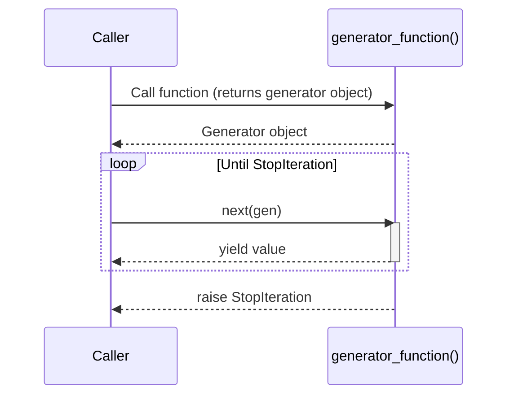

```python
from typing import Generator, List, Iterator

# List comprehension: Eager, creates the whole list in memory
squares_eager: List[int] = [x**2 for x in range(1000000)]  # Memory hit!

# Generator expression: Lazy, no memory hit
squares_lazy: Iterator[int] = (x**2 for x in range(1000000))  # Just a recipe

print(f"Eager type: {type(squares_eager)}, Lazy type: {type(squares_lazy)}")
# Output: Eager type: <class 'list'>, Lazy type: <class 'generator'>

# --- Generator function with `yield` ---
def fibonacci(n: int) -> Generator[int, None, None]:
    """Yields the first n Fibonacci numbers."""
    a, b = 0, 1
    for _ in range(n):
        yield a  # Pause and return 'a'
        a, b = b, a + b  # Resume here on next call

print("First 7 Fibonacci numbers:")
for num in fibonacci(7):
    print(num, end=" ")
# Output: 0 1 1 2 3 5 8
```

---

### The Benchmarking Interlude

This section is a practical reminder: elegant code is good, but performant code can be critical. Use the `timeit` module to test small code snippets. Remember the trade-offs:

- **Comprehensions:** Generally faster than manual `for` loops for building lists.
- **Generator Expressions:** Slightly slower to iterate through than list comprehensions, but massively more memory-efficient.
- **`map`/`filter`:** Can sometimes be slightly faster than comprehensions for simple operations, but readability must be weighed.

```python
import timeit
from typing import List

# Code snippets to benchmark
setup_code: str = "numbers = list(range(1000))"

loop_code: str = """
squares = []
for n in numbers:
    squares.append(n**2)
"""

comp_code: str = """
squares = [n**2 for n in numbers]
"""

map_code: str = """
squares = list(map(lambda x: x**2, numbers))
"""

# Benchmarking
loop_time: float = timeit.timeit(stmt=loop_code, setup=setup_code, number=10000)
comp_time: float = timeit.timeit(stmt=comp_code, setup=setup_code, number=10000)
map_time: float = timeit.timeit(stmt=map_code, setup=setup_code, number=10000)

print(f"Loop:        {loop_time:.4f}s")
print(f"Comprehension: {comp_time:.4f}s")
print(f"Map/Lambda:    {map_time:.4f}s")

# 💡 Key Takeaway
print("\n💡 Takeaway: While benchmarks differ, always prioritize readability first.")
print("   Optimize only when profiling reveals a genuine bottleneck.")
```
