# Table of Contents

## Part I: Getting Started

- [What is Python?](#what-is-python)
- [Why learn Python?](#why-learn-python)
- [Python Alternatives](#python-alternatives)
- [Understanding Python Versions](#understanding-python-versions)
- [Installation and Setup](#installation-and-setup)
- [Setting Up Python on macOS](#setting-up-python-on-macos)
- [Installing an IDE (VS Code)](#installing-an-ide-vs-code)
- [Hello World](#hello-world)
- [How Python Runs Programs](#how-python-runs-programs)
- [How You Run Programs](#how-you-run-programs)

## Part II: Fundamentals & Built-in Types

- [Understanding Data Types and Type Hints](#understanding-data-types-and-type-hints)
- [Introducing Python Object Types and Type Hints](#introducing-python-object-types-and-type-hints)
- [Working with Variables](#working-with-variables)
- [Variables Naming Conventions](#variables-naming-conventions)
- [Delete variables](#Delete variables)
- [The Dynamic Typing Interlude](#the-dynamic-typing-interlude)
- [Python Builtin Types](#python-builtin-types)
  - [None Type](#none-type)
  - [bool (Boolean)](#bool-boolean)
  - [Numeric Types](#numeric-types)
    - [int (Integer)](#int-integer)
    - [float (Floating-Point)](#float-floating-point)
    - [complex (Complex Numbers)](#complex-complex-numbers)
  - [Text Type](#text-type)
    - [str (String)](#str-string)
  - [Binary Sequence Types](#binary-sequence-types)
    - [bytes](#bytes)
    - [bytearray](#bytearray)
    - [memoryview](#memoryview)
- [Using Operators](#using-operators)
- [Special Behavior with Numbers](#special-behavior-with-numbers)
- [String Fundamentals](#string-fundamentals)
- [String Methods]()
- [Escaping Characters](#escaping-characters)
- [String interpolation]()
- [Multiline Strings]()
- [Adding Comments and Docstrings](#adding-comments-and-docstrings)
- [The Documentation Interlude](#the-documentation-interlude)
- [Variable Scope (LEGB Rule)](#variable-scope-legb-rule)
- [The input() Function](#the-input-function)

## Part III: Data Structures

- Sequence Types
  - Strings
  - List
  - Tuples
  - Dictionary
- Access Indivisual Elements of a Sequence
- Accessing Slice of a Sequence
- Getting lenth of a Sequence
- Determining if a given item is in a Sequence
- Determining How many Instances of an Item are in a Sequence
- Finding the first instance of a item in Sequence
- Merging Sequences
- Repeating Sequences
- List Methods
- Merging two List
- Iterating over Sequence
- Traditional for Loop with the range() function
- The enumerate()
- Choosing the Right Data Structure
- Comprehensions (List, Dict, Set)
- Combining Comprehensions and Conditionals
- Diving Deeper into Iterable Methods

## Part IV: Statements, Syntax & Flow Control

- [Introducing Python Statements](#introducing-python-statements)
- [Assignments, Expressions, and Prints](#assignments-expressions-and-prints)
- [if Tests and Syntax Rules](#if-tests-and-syntax-rules)
- [Boolean Operators](#boolean-operators)
- [Grouping Conditionals](#grouping-conditionals)
- [What About switch? (Match/Case)](#what-about-switch-matchcase)
- [while and for Loops](#while-and-for-loops)
- [Using else in Loops](#using-else-in-loops)
- [The range() Function](#the-range-function)
- [break and continue](#break-and-continue)
- [Iterations and Comprehensions](#iterations-and-comprehensions)
- [Iterables and Iteration Protocols](#iterables-and-iteration-protocols)

## Part V: Functions & Generators

- [Function Basics](#function-basics)
- [Default and Keyword Arguments](#default-and-keyword-arguments)
- [Understanding return](#understanding-return)
- [Arguments](#arguments)
- [Scopes](#scopes)
- [Unpacking Function Arguments](#unpacking-function-arguments)
- [Naming Conventions](#naming-conventions)
- [Nested Functions](#nested-functions)
- [Passing Function As Arguments]()
- [Anoonymous Functions & Lambda Functions](#)
- [map(), filter(), and reduce()](#map-filter-and-reduce)
- [Functions That Take a Variable Number of Arguments]()
- [Decorators](#decorators)
- [Comprehensions and Generations](#comprehensions-and-generations)

## Part VI: Modules & Packages

- [Libraries](#libraries)
- [Modules, Packages and Libraries]()
- [Modules: The Big Picture](#modules-the-big-picture)
- [What are Modules?](#what-are-modules)
- [Module Coding Basics](#module-coding-basics)
- [Creating a Module](#creating-a-module)
- [Importing Modules](#importing-modules)
- [Import Syntaxes](#import-syntaxes)
- [Module Packages](#module-packages)
- [What are Packages?](#what-are-packages)
- [The **init**.py File](#the-__init__py-file)
- [Absolute vs Relative Imports](#absolute-vs-relative-imports)
- [Controlling Exports (**all**)](#controlling-exports-__all__)
- [Advanced Module Topics](#advanced-module-topics)
- [The **name** Variable](#the-__name__-variable)
- [The **pycache** Folder](#the-__pycache__-folder)
- [Module Search Path](#module-search-path)
- [Reloading Modules](#reloading-modules)
- [Exploring the Standard Library](#exploring-the-standard-library)
- [Module Docstrings](#module-docstrings)
- [Using PyPl, the Python Package Index]()
- [Using Pip, the Python Package Installer and Commands]()

## Part VII: Object-Oriented Programming

- [OOP: The Big Picture](#oop-the-big-picture)
- [What is OOP?](#what-is-oop)
- [Class Coding Basics](#class-coding-basics)
- [Classes and Instances](#classes-and-instances)
- [Constructor & Instance Attributes](#constructor--instance-attributes)
- [Class Attributes](#class-attributes)
- [A More Realistic Example](#a-more-realistic-example)
- [Class Coding Details](#class-coding-details)
- [Instance vs Class vs Static Methods](#instance-vs-class-vs-static-methods)
- [Special Methods (Dunder Methods)](#special-methods-dunder-methods)
- [Operator Overloading](#operator-overloading)
- [Private & Public Attributes](#private--public-attributes)
- [Properties vs Attributes](#properties-vs-attributes)
- [Designing with Classes](#designing-with-classes)
- [Inheritance](#inheritance)
- [super() and MRO](#super-and-mro)
- [Composition vs Inheritance](#composition-vs-inheritance)
- [Abstract Base Classes (ABC)](#abstract-base-classes-abc)
- [Dataclasses](#dataclasses)
- [Encapsulation and Polymorphism](#encapsulation-and-polymorphism)
- [Advanced Class Topics](#advanced-class-topics)

## Part VIII: Error Handling & Debugging

- [Exception Basics](#exception-basics)
- [Understanding Error Types](#understanding-error-types)
- [Syntax Errors](#syntax-errors)
- [Runtime Errors (Exceptions)](#runtime-errors-exceptions)
- [Logical Errors](#logical-errors)
- [Finding Errors with the Debugger](#finding-errors-with-the-debugger)
- [Exception Coding Details](#exception-coding-details)
- [try, except, else, finally](#try-except-else-finally)
- [Handling Multiple Exceptions](#handling-multiple-exceptions)
- [The Exception Hierarchy](#the-exception-hierarchy)
- [Exception Objects](#exception-objects)
- [Creating Custom Exceptions](#creating-custom-exceptions)
- [Raising Exceptions](#raising-exceptions)
- [Designing with Exceptions](#designing-with-exceptions)
- [Assertions](#assertions)
- [Logging for Debugging](#logging-for-debugging)
- [Common Debugging Techniques](#common-debugging-techniques)
- [Which Errors Should You Handle?](#which-errors-should-you-handle)

## Part IX: File Handling & Serialization

- [Opening and Closing Files](#opening-and-closing-files)
- [Reading from Files](#reading-from-files)
- [Writing to Files](#writing-to-files)
- [The with Block Statement](#the-with-block-statement)
- [JSON Serialization](#json-serialization)
- [Pickle Serialization](#pickle-serialization)
- [Comparing JSON & Pickle](#comparing-json--pickle)

## Part X: Package Management & Virtual Environments

- [Python Package Index (PyPI)](#python-package-index-pypi)
- [pip: The Standard Package Installer](#pip-the-standard-package-installer)
- [Installing Packages](#installing-packages)
- [requirements.txt](#requirementstxt)
- [pyproject.toml](#pyprojecttoml)
- [Package Versioning](#package-versioning)
- [Why Virtual Environments?](#why-virtual-environments)
- [Standard venv](#standard-venv)
- [Creating & Activating venv](#creating--activating-venv)
- [uv: The Fast Modern Alternative](#uv-the-fast-modern-alternative)
- [pipenv: Python Dev Workflow](#pipenv-python-dev-workflow)
- [poetry: Dependency & Packaging](#poetry-dependency--packaging)
- [Using Anaconda](#using-anaconda)
- [Comparison and Recommendations](#comparison-and-recommendations)

## Part XI: Popular Libraries in Practice

- [Using requests Library](#using-requests-library)
- [Using hashlib](#using-hashlib)
- [Using json](#using-json)
- [Using pickle](#using-pickle)

## Part XII: Async Programming

- [Concurrency vs Parallelism](#concurrency-vs-parallelism)
- [Threading (I/O-bound Tasks)](#threading-io-bound-tasks)
- [The Global Interpreter Lock (GIL)](#the-global-interpreter-lock-gil)
- [Creating and Starting Threads](#creating-and-starting-threads)
- [Thread Synchronization](#thread-synchronization)
- [Multiprocessing (CPU-bound Tasks)](#multiprocessing-cpu-bound-tasks)
- [Process Pools](#process-pools)
- [AsyncIO](#asyncio)
- [async/await Syntax](#asyncawait-syntax)
- [Tasks and Coroutines](#tasks-and-coroutines)
- [Comparing Approaches](#comparing-approaches)

## Part XIII: Web Development & APIs

- [HTTP Requests Basics](#http-requests-basics)
- [API Endpoints / URLs](#api-endpoints--urls)
- [Setting Up Flask](#setting-up-flask)
- [Creating Routes (GET, POST)](#creating-routes-get-post)
- [Sending Requests from Python](#sending-requests-from-python)
- [Adding a User Interface](#adding-a-user-interface)

## Part XIV: Advanced Python Features

- [Unicode and Byte Strings](#unicode-and-byte-strings)
- [Managed Attributes](#managed-attributes)
- [Decorators](#decorators)
- [Decorators Deep Dive](#decorators-deep-dive)
- [Metaclasses](#metaclasses)
- [Iterators and Generators Deep Dive](#iterators-and-generators-deep-dive)
- [Context Managers Deep Dive](#context-managers-deep-dive)
- [Type Hinting and mypy](#type-hinting-and-mypy)
- [Regular Expressions](#regular-expressions)
- [C Extensions (ctypes)](#c-extensions-ctypes)

## Part XV: Ecosystem & Best Practices

- [Testing (pytest, unittest)](#testing-pytest-unittest)
- [Linting and Formatting (ruff, black)](#linting-and-formatting-ruff-black)
- [PEP 8 Style Guide](#pep-8-style-guide)
- [Building and Distributing Packages](#building-and-distributing-packages)
- [Documentation](#documentation)

## Part I: Getting Started

Welcome to your Python journey! This section lays the groundwork for everything to come. We'll explore what Python is, why it's worth your time, how to set up your environment, and write your very first program. By the end of this section, you'll understand not just _how_ to run Python code, but _what happens_ when you do. Let's begin!

### What is Python?

Python is a **high-level, interpreted, general-purpose programming language** known for its emphasis on code readability through clean, consistent syntax. It was created by **Guido van Rossum** and first released in **1991**.

At its core, Python is designed to be a language that is:

- **High-Level:** You don't manage memory, pointers, or hardware details. Python handles all that for you.
- **Interpreted:** Code is executed line-by-line by the Python interpreter, without a separate compilation step.
- **General-Purpose:** It's not tied to a specific domain. You use it for web development, data science, automation, game development, and more.
- **Multi-Paradigm:** Python supports procedural, object-oriented, and functional programming styles. You pick the right tool for the job.

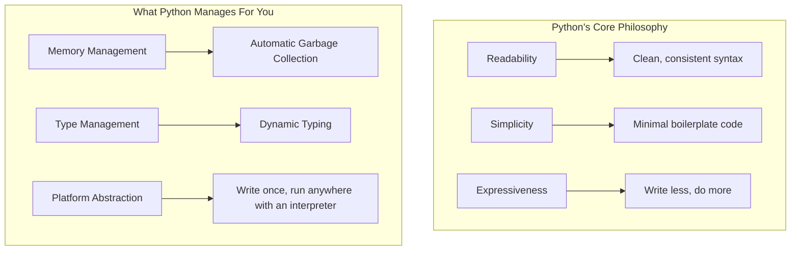

> **Fun Fact:** Python is named after the British comedy group _Monty Python_, not the snake. This is why the language's documentation and community often include playful references to their sketches.

---

### Why Learn Python?

You might be wondering: with dozens of programming languages out there, why invest your time in Python? Here are the most compelling reasons.

#### 1. Beginner-Friendly Yet Powerful

Python's syntax reads almost like English. This low barrier to entry means you spend less time wrestling with language quirks and more time solving actual problems. Don't mistake simplicity for weakness, though—Python powers some of the world's most complex systems.

#### 2. Incredible Versatility

Whatever field you're interested in, Python likely has a thriving ecosystem there:

| Domain                     | Popular Libraries/Tools             | What You Can Build                             |
| :------------------------- | :---------------------------------- | :--------------------------------------------- |
| **Web Development**        | Django, Flask, FastAPI              | Websites, REST APIs, backend services          |
| **Data Science & AI**      | NumPy, Pandas, TensorFlow, PyTorch  | Machine learning models, data analysis         |
| **Automation & Scripting** | Built-in `os`, `shutil`, `requests` | File management, web scrapers, task automation |
| **DevOps & Cloud**         | Ansible, Boto3 (AWS), Docker SDK    | Infrastructure as code, cloud management       |
| **Game Development**       | Pygame, Arcade                      | 2D games, prototypes                           |
| **Desktop Applications**   | PyQt, Tkinter, Kivy                 | Cross-platform GUI apps                        |

#### 3. High Demand and Career Opportunities

Python consistently ranks among the top programming languages in job market surveys. Companies like Google, Netflix, Instagram, and NASA use Python extensively. Roles like _Data Scientist_, _Backend Developer_, and _DevOps Engineer_ often list Python as a primary requirement.

#### 4. Large, Supportive Community

With millions of developers worldwide, Python has one of the most welcoming and helpful communities. No matter what problem you encounter, someone has likely solved it and shared the answer.

---

### Python Alternatives

No language is perfect for every situation. Understanding where Python shines—and where it doesn't—helps you become a well-rounded developer.

| Language                  | Best For                              | Comparison to Python                                                                  |
| :------------------------ | :------------------------------------ | :------------------------------------------------------------------------------------ |
| **JavaScript/TypeScript** | Web frontend, full-stack apps         | Only language that runs natively in browsers; Python dominates backend/data.          |
| **Java**                  | Enterprise systems, Android apps      | More verbose, statically typed; Python is faster to write, slower to execute.         |
| **C/C++**                 | System programming, games, embedded   | Maximum performance, manual memory control; Python is slower but far more productive. |
| **Go**                    | Cloud services, CLI tools, networking | Compiled, great concurrency; Python is more flexible and has richer libraries.        |
| **Rust**                  | Systems programming, safety-critical  | Memory safety without garbage collector; Python is easier to learn.                   |
| **Ruby**                  | Web development (Rails)               | Similar philosophy; Python has broader adoption and a larger ecosystem.               |

💡 **Key Insight:** Python excels at _developer productivity_. You'll write fewer lines of code to accomplish the same task compared to most other languages. The trade-off is raw execution speed, but that's often irrelevant for the I/O-bound and business-logic-heavy applications where Python thrives.

---

### Understanding Python Versions

This is an important topic that confuses many beginners. There are two major, actively used Python lineages:

| Version Line   | Status                           | Key Note                                                    |
| :------------- | :------------------------------- | :---------------------------------------------------------- |
| **Python 2.x** | ⚠️ End of Life (January 1, 2020) | Legacy systems only. **Do not start new projects with it.** |
| **Python 3.x** | ✅ Current, Active Development   | This is the one and only Python you should learn today.     |

**What happened?** Python 3 was released in 2008 as a major, backward-incompatible overhaul to fix fundamental design flaws. It took many years for the community to migrate, but now the transition is complete.

**Which specific Python 3 version should you install?**
Always install the **latest stable version** (e.g., Python 3.12 or 3.13 as of 2024-2025). The minor version (the second number) introduces new features every October. This cookbook uses **Python 3.6+** features, particularly type hints.

```python
import sys
print(f"I'm running Python {sys.version_info.major}.{sys.version_info.minor}")
# Ensure this starts with '3.'
```

---

### Installation and Setup

Let's get Python on your machine. The process differs slightly by operating system.

#### General Recommendation

Visit the official Python website at **[python.org/downloads](https://www.python.org/downloads/)**. The site should automatically detect your OS and suggest the correct installer. Download and run it.

⚠️ **Important (Windows):** During installation, check the box labeled **"Add Python to PATH"**. This makes the `python` command available from your terminal.

#### Verify Your Installation

Open your terminal (Terminal on macOS/Linux, Command Prompt or PowerShell on Windows) and run:

```bash
# Check Python version
python --version
# OR on some systems
python3 --version

# You should see something like:
# Python 3.12.3
```

If you see a version starting with `3`, congratulations! Python is successfully installed.

---

### Setting Up Python on macOS

macOS comes with a **system Python**, typically an older version like Python 2.7 (on very old systems) or Python 3.x. **Do not rely on this or try to modify it.** The system Python exists for internal Apple tools, and tampering with it can break your OS.

Instead, install a separate, user-controlled Python using one of these methods:

#### Method 1: Official Installer (Easiest)

1.  Go to **[python.org/downloads](https://www.python.org/downloads/)**.
2.  Download the macOS installer (`.pkg` file).
3.  Run it and follow the installation wizard.
4.  After installation, open Terminal and verify: `python3 --version`

#### Method 2: Homebrew (Preferred by Developers)

[Homebrew](https://brew.sh/) is a popular package manager for macOS. If you have it installed:

```bash
# Install the latest Python
brew install python

# Verify
python3 --version
```

#### Method 3: pyenv (For Managing Multiple Versions)

If you need to switch between different Python versions for different projects, use `pyenv`:

```bash
# Install pyenv via Homebrew
brew install pyenv

# Install a specific Python version
pyenv install 3.12.3

# Set it as the global default
pyenv global 3.12.3
```

---

### Installing an IDE (VS Code)

You can write Python in any text editor, but an **Integrated Development Environment (IDE)** greatly enhances productivity with features like syntax highlighting, autocomplete, debugging, and integrated terminal access.

**Visual Studio Code (VS Code)** is the most popular, free, and lightweight choice. Here's how to set it up:

**1. Install VS Code**
Download and install from **[code.visualstudio.com](https://code.visualstudio.com/)** .

**2. Install the Python Extension**

- Open VS Code.
- Click the Extensions icon in the left sidebar (or press `Cmd+Shift+X` / `Ctrl+Shift+X`).
- Search for **"Python"** by Microsoft.
- Click **Install**.

**3. Install the Python Debugger Extension (Recommended)**

- Search for **"Python Debugger"** by Microsoft.
- Click **Install**.

**4. Verify Your Setup**

- Create a new file, save it as `hello.py`.
- Type `print("Hello, VS Code!")`.
- Click the Play button (▶️) in the top-right corner, or right-click and select "Run Python File in Terminal."
- You should see the output in the integrated terminal.

> **Alternative IDEs:** If VS Code isn't your style, other excellent options include **PyCharm Community Edition** (free, feature-rich), **Jupyter Notebook** (great for data exploration), or even the built-in **IDLE** that ships with Python.

---

### Hello World

It's a time-honored tradition: your first program simply prints "Hello, World!" to the screen. Let's write it.

**1. Create a new file** named `hello.py` in your editor.

**2. Write the code:**

```python
# hello.py - My first Python program!
print("Hello, World!")
```

**3. Run it:**

_Using VS Code:_ Click the Run button (▶️) at the top-right.

_Using the terminal:_

```bash
# Navigate to the directory containing your file
cd path/to/your/file

# Run the script
python hello.py
# OR
python3 hello.py
```

**4. The Output:**

```
Hello, World!
```

Congratulations! You've just written and executed your first Python script. Let's break down what happens behind that one simple line.

**Structure of a Simple Python Program:**

- `# hello.py` - This is a **comment**. It's for humans; Python ignores it.
- `print(...)` - This is a **function call**. `print` is a built-in function that outputs text to the console.
- `"Hello, World!"` - This is a **string**, a sequence of characters enclosed in quotes.
- The line has no semicolon. Python uses newlines to separate statements.

---

### How Python Runs Programs

You write human-readable Python code (a `.py` file). But your computer's processor only understands machine code (binary instructions). The **Python interpreter** acts as a translator between these two worlds.

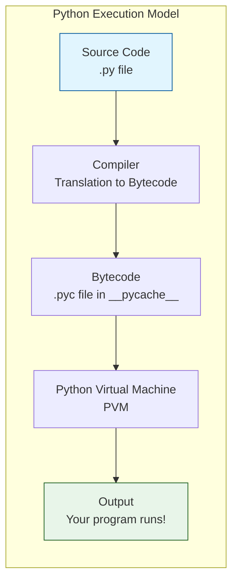

Here's a step-by-step breakdown:

1.  **Source Code:** You write your instructions in a `.py` file using Python's syntax.
2.  **Compilation to Bytecode:** When you run your program, Python's internal **compiler** (yes, Python has one!) translates your source code into an intermediate language called **bytecode**. This is a low-level, platform-independent representation of your program.
3.  **Caching (`.pyc` files):** To speed up future runs, Python saves this bytecode into `.pyc` files inside a `__pycache__` directory. If your source code hasn't changed, Python skips recompilation and loads the cached bytecode directly.
4.  **Python Virtual Machine (PVM):** The **PVM** is the runtime engine. It reads the bytecode instruction by instruction and executes them. The PVM manages memory, objects, and all the dynamic features we'll explore later.
5.  **Output:** Your program produces its output—printing to the console, writing a file, or sending data over a network.

💡 **Key Insight:** This is why Python is called an "interpreted" language: the PVM interprets bytecode at runtime. This is different from compiled languages like C or Go, where source code is compiled directly to native machine code ahead of time.

---

### How You Run Programs

There are multiple ways to run Python code, each suited for different tasks.

#### 1. Interactive REPL (Read-Eval-Print Loop)

The Python REPL is an interactive environment where you type code and see results instantly. It's perfect for quick experiments and learning.

```bash
# Start the REPL
python
# OR
python3
```

```python
>>> 2 + 2
4
>>> name = "Pythonista"
>>> print(f"Hello, {name}!")
Hello, Pythonista!
>>> exit()  # Type to leave the REPL
```

#### 2. Running Script Files (The Main Way)

This is how you run complete programs—write code in a `.py` file and execute it.

```bash
python my_script.py
```

#### 3. Running with the `-m` Flag (Modules as Scripts)

Python lets you run modules directly, which is useful for built-in tools.

```bash
# Start a simple HTTP server in the current directory
python -m http.server 8000

# Run the built-in JSON formatting tool
echo '{"name":"Alice","age":30}' | python -m json.tool

# Launch the built-in IDE
python -m idlelib.idle
```

#### 4. Using the `if __name__ == "__main__":` Pattern

This is a standard Python idiom that allows a `.py` file to serve dual purposes: it can be run as a standalone script, or it can be imported as a module into another script without its main execution code running.

```python
# File: calculator.py

def add(a: int, b: int) -> int:
    """Add two numbers."""
    return a + b

def main() -> None:
    """Main execution function."""
    print(f"3 + 4 = {add(3, 4)}")

# This block ONLY executes when you run `python calculator.py`
# It does NOT execute when you `import calculator` in another script
if __name__ == "__main__":
    main()
```

```bash
# Running as a script
$ python calculator.py
3 + 4 = 7

# In an interactive session (or another script)
>>> import calculator
>>> calculator.add(10, 20)
30
# Notice the main() function did NOT auto-execute!
```

#### 5. Inside an IDE

As seen earlier, clicking the Run button in VS Code or PyCharm executes your script in an integrated terminal, which is the most convenient method during active development.

---

## Part II: Fundamentals & Built-in Types

Welcome to the foundation of Python. This section covers the atoms of the language: data types, variables, how Python thinks about types, and the core built-in types you'll use every day. We'll explore not just the "what," but the "why" and "how" behind each concept. Let's build a rock-solid foundation.

### Understanding Data Types and Type Hints

🧠 **Concept at a Glance**
A data type is a classification that tells the computer what kind of value a piece of data represents, and more importantly, what you can _do_ with it. Think of it like ingredients in a kitchen. Flour, eggs, and sugar are all ingredients, but you treat them very differently—you can't fry an egg with flour.

- **Why they matter:** Data types define the set of possible values and the operations that can be performed on them. You can't add two words the same way you add two numbers; one concatenates, the other performs arithmetic.
- **Python's View:** In Python, everything is an **object**, and every object has a type. The type is not just a label; it determines the object's identity and behavior at runtime.

#### 💡 Type Hints: Your Code's Signpost (Python 3.6+)

Starting with Python 3.6, we have **type hints**. This is a way to _optionally_ annotate your code to indicate the expected data types of variables, function arguments, and return values.

⚠️ **Critical Distinction:** Type hints in Python are **not** like static typing in compiled languages (e.g., C++, Java, Go).

- **Static Typing:** The type check happens at _compile time_. If the types don't match, the program won't compile.
- **Python's Type Hints:** They are **just documentation** that can be checked by external tools like `mypy`. The Python interpreter **completely ignores** type hints at runtime. A type mismatch will never crash your Python program on its own. They bridge the gap between Python's dynamic nature and the safety of static analysis.

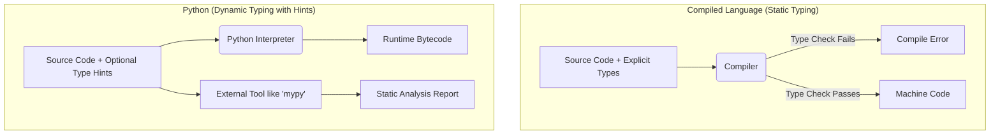

We'll use type hints throughout this cookbook. For more complex types, we tap into the `typing` module.

```python
# Python 3.6 compatible typing imports
from typing import List, Dict, Optional, Union, Any

# Without hints: ambiguous
# def process_orders(orders): ...

# With hints: clear intent!
def process_orders(orders: List[Dict[str, Union[int, str]]]) -> Optional[float]:
    """Calculates the total value of valid orders."""
    pass
```

---

### Introducing Python Object Types and Type Hints

Everything in Python is an object, from a simple `True` boolean to a complex user-defined class. We can use type hints to specify not just built-in types, but also custom ones. This means you can assign a function to a variable, pass it as an argument, or store it in a list.

Let's look at a simple function that works with different objects and see how hints document this.

```python
from typing import Union, List

# This function expects an object that can be an integer or a string
def display_id(entity: Union[int, str]) -> str:
    """Formats an entity ID, which could be a number or a code."""
    return f"Entity-{entity}"

# The function can return a list of different types
def get_user_data() -> List[Union[str, int, bool]]:
    """Returns a list of mixed data types representing a user record."""
    name: str = "Ada Lovelace"
    login_count: int = 42
    is_active: bool = True
    return [name, login_count, is_active]

# Example usage
record: List[Union[str, int, bool]] = get_user_data()
print(f"User record: {record}")
# Output: User record: ['Ada Lovelace', 42, True]
```

This flexibility is Python's strength. Type hints let us manage that flexibility with clarity.

---

### Working with Variables

#### 🧠 What is a Variable?

A variable in Python is not a box that _contains_ a value. It's a **name tag** attached to an object. The object lives somewhere in memory, and the variable is simply a reference (a pointer) to that object.

- **Creation:** A variable springs into existence the very first time you assign a value to it. There is no separate declaration step.
- **Assignment:** Assignment always copies the _reference_ (the memory address), not the underlying object itself. This is the root of understanding mutability.

```python
user_age: int = 30  # The name 'user_age' now points to the integer object 30
```

- **Mutability Matters:** If the object is mutable (like a list), changes made through one variable are visible through all other variables pointing to that _same_ object. This is a classic pitfall for newcomers.

```python
# ⚠️ Common Pitfall: Mutable objects and multiple references
original_list: List[int] = [10, 20, 30]
new_list: List[int] = original_list  # 'new_list' is a new tag for the SAME list object

new_list.append(40)  # Modifying the object through 'new_list'

print(f"original_list: {original_list}")  # Output: original_list: [10, 20, 30, 40]
print(f"new_list: {new_list}")            # Output: new_list: [10, 20, 30, 40]
# Both variables reflect the change because they point to the ONE list object.
```

---

### Variables Naming Conventions

Readability is a core Python philosophy (see `import this`). PEP 8, the official style guide, provides clear naming conventions that the community follows religiously. Consistent naming makes code feel familiar and reduces cognitive load.

| Type                  | Convention                                | Example                              |
| :-------------------- | :---------------------------------------- | :----------------------------------- |
| **Variables**         | `snake_case` (all lowercase, underscores) | `items_count`, `user_name`           |
| **Constants**         | `UPPERCASE_WITH_UNDERSCORES`              | `MAX_RETRIES = 5`, `DEFAULT_TIMEOUT` |
| **Private members**   | Leading underscore `_`                    | `_internal_state`, `_cache`          |
| **Functions/Methods** | `snake_case`                              | `calculate_total()`, `get_user()`    |
| **Classes**           | `CapWords` (PascalCase)                   | `ShoppingCart`, `UserProfile`        |

💡 **Tip:** Always choose descriptive, meaningful names. `user_name` is infinitely better than `x` or `data`. Code is read far more often than it is written.

```python
# ✅ Good: Clear, readable, follows conventions
MAX_CONNECTIONS: int = 100
_connection_pool: List[str] = []

def open_user_session(user_id: int, is_admin: bool = False) -> str:
    """Opens a session for a user."""
    # ...
    pass
```

---

### Delete Variables

Sometimes you need to explicitly remove a variable, freeing its name and potentially reducing the reference count of the object it pointed to. This is done with the `del` statement.

- **`del variable_name`:** Removes the variable from the current namespace.
- **Garbage Collection:** If the object that the variable referenced now has zero references pointing to it, it becomes eligible for garbage collection, reclaiming its memory.

```python
sensitive_data: str = "This is secret"
print(f"Before delete: {sensitive_data}")

# Delete the variable
del sensitive_data

# Trying to access it now causes an error
# print(sensitive_data)  # ❌ NameError: name 'sensitive_data' is not defined
```

---

### The Dynamic Typing Interlude

This is one of Python's most fundamental and unique features. Let's revisit the "name tag" analogy.

- **Dynamic:** The _object_ carries the type, not the variable. A variable can point to an integer, then a string, then a list, all within the same program's execution.
- **No Declaration:** You never declare a variable's type. A variable `x` simply doesn't exist until you assign something to it.

```mermaid
graph TD
    subgraph "Time: Step 1"
        V1[x] --> O1[Object: <int> 5]
    end
    subgraph "Time: Step 2"
        V2[x] --> O2[Object: <str> 'hello']
        O1x[Object: <int> 5] -- No longer referenced --> GC1(Garbage Collection);
    end
    subgraph "Time: Step 3"
        V3[x] --> O3[Object: <list> [1, 2]]
        O2x[Object: <str> 'hello'] -- No longer referenced --> GC2(Garbage Collection);
    end
```

#### 🧠 The Interpreter's "Bookkeeping"

When you execute `x = 5`, Python performs these steps internally:

1.  Creates a **PyObject** in memory (a C struct), where one field stores the **type** (`int`) and another the **value** (`5`), plus a reference counter.
2.  Creates the variable `x` in the current namespace if it doesn't exist.
3.  Points `x` to the new integer object, incrementing its reference count.

When you later do `x = "hello"`:

1.  A new string object is created in memory.
2.  `x` is simply updated to point to this new string object (decrementing the int's refcount, incrementing the string's).
3.  The integer object `5` might now have zero references, making it eligible for garbage collection.

```python
# Dynamic typing in action
data: Any = 42
print(f"Type: {type(data)}, Value: {data}")  # Type: <class 'int'>, Value: 42

data = "I'm a string now"
print(f"Type: {type(data)}, Value: {data}")  # Type: <class 'str'>, Value: I'm a string now

# This would be a compile-time error in a statically typed language!
```

---

### Python Builtin Types

Python ships with a rich set of standard data types. Here is their official hierarchy, which will be our guide for the rest of this section.

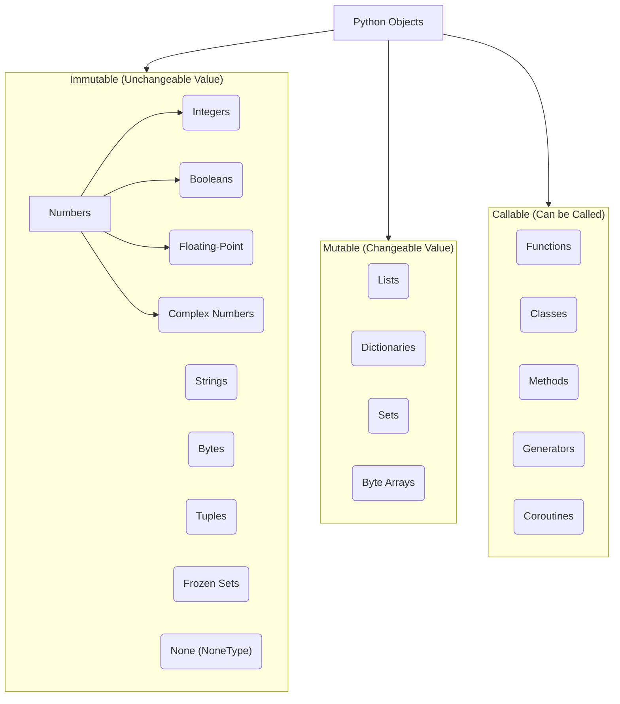

#### None Type

The `None` type has a single, immutable value: `None`. It represents the intentional absence of a value, a null state, or "nothing." It is its own singleton type (`NoneType`).

- **When to use:** Default value for function arguments (especially mutable ones), placeholder for variables yet to receive meaningful data, and the implicit return value for functions without an explicit `return`.
- **Checking for `None`:** Always use the `is` operator, not `==`. `is` directly compares object identity (memory address), which is perfectly safe and the most performant way to check for the unique `None` singleton.

```python
from typing import Optional

def find_user(user_id: int) -> Optional[str]:
    """Simulates finding a user; returns None if not found."""
    known_users: Dict[int, str] = {1: "Alice", 2: "Bob"}
    # The .get() method returns None if the key is missing
    return known_users.get(user_id)

# Correct way to check
user_3: Optional[str] = find_user(3)
if user_3 is None:
    print("User not found.")

# ⚠️ Pitfall: Don't use '=='
# if some_variable == None:  # This can be slow or behave unexpectedly
```

#### bool (Boolean)

The simplest type, representing truth values: `True` or `False`. Crucially, booleans are a subclass of integers in Python.

- `True` is essentially `1`.
- `False` is essentially `0`.
- **Truthiness/Falsiness:** Any object can be tested in a boolean context. "Falsy" values include `None`, `False`, `0`, `0.0`, `""` (empty string), `[]` (empty list), and `{}` (empty dict). Almost everything else is "Truthy."

```python
is_active: bool = True
is_admin: bool = False

# Booleans are integers!
print(f"True + True = {True + True}")    # Output: 2
print(f"Is True an int? {isinstance(True, int)}")  # Output: True

# Truthiness in action
user_list: List[str] = []
if not user_list:  # An empty list is falsy
    print("List is empty, so this runs.")
```

---

#### Numeric Types

Python has three distinct numeric types. They are all **immutable**.

##### int (Integer)

- **Unlimited Precision:** In Python, integers have arbitrary precision and will expand to accommodate however many digits are needed, bounded only by available memory. No more integer overflow errors!
- **Radix Support:** You can express integer literals in binary (`0b`), octal (`0o`), and hexadecimal (`0x`) notation.

##### float (Floating-Point)

- **IEEE 754 Doubles:** Python floats are implemented as double-precision (64-bit) floating-point numbers, giving about 15-17 decimal digits of precision.
- **Pitfall:** They suffer from the classic floating-point representation issues (e.g., `0.1 + 0.2 != 0.3`). Never use them for exact monetary calculations where every cent matters; use `Decimal` for that.

##### complex (Complex Numbers)

- **First-Class Citizen:** Python has built-in support for complex numbers using `j` or `J` as the imaginary unit. This is a delight for scientific and engineering computing.

```python
# --- int ---
huge_number: int = 10**100  # A googol, runs perfectly
binary_val: int = 0b1011    # 11
hex_val: int = 0xFF         # 255
print(f"A googol: {huge_number}")

# --- float ---
pi: float = 3.14159
avogadro: float = 6.022e23  # Scientific notation

# ⚠️ Floating-point precision pitfall
total: float = 0.1 + 0.2
print(f"0.1 + 0.2 == 0.3? {total == 0.3}")  # Output: False! (It's 0.30000000000000004)

# --- complex ---
z: complex = 2 + 3j
print(f"Complex number z: {z}")           # Output: (2+3j)
print(f"Real part: {z.real}, Imaginary: {z.imag}")  # 2.0, 3.0
```

---

#### Text Type

##### str (String)

Strings are **immutable sequences** of Unicode code points. This makes Python fantastic for working with international text. Once a string is created, it cannot be changed in place; any "modification" operation creates and returns a _new_ string object.


```python
greeting: str = "Hello"
subject: str = "World"

# Concatenation creates a new string object
message: str = greeting + " " + subject
print(f"Original greeting: '{greeting}'") # Unchanged: 'Hello'
print(f"New message: '{message}'")       # 'Hello World'

# Immutability in action
# greeting[0] = 'M'  # ❌ TypeError: 'str' object does not support item assignment
new_greeting: str = 'M' + greeting[1:]  # Creates a new string
print(f"New greeting: '{new_greeting}'")  # 'Mello'
```

---

#### Binary Sequence Types

These types handle raw binary data, like image files or network packets.

- **`bytes` (Immutable):** A sequence of integers in the range 0-255. The binary equivalent of a string.
- **`bytearray` (Mutable):** A mutable counterpart to `bytes`. You can modify its elements in place.
- **`memoryview` (A Window onto Data):** Allows accessing the internal memory of an object that supports the buffer protocol without copying. Critical for performance with large binary data.

```python
# --- bytes (Immutable) ---
data: bytes = b"hello"
print(f"Byte data: {data[0]}")  # Output: 104 (ASCII code for 'h')
# data[0] = 74  # ❌ TypeError

# --- bytearray (Mutable) ---
mutable_data: bytearray = bytearray(b"hello")
mutable_data[0] = 74  # 74 is ASCII for 'J'
print(f"After: {mutable_data}") # Output: bytearray(b'Jello')

# --- memoryview (Zero-Copy Window) ---
huge_data: bytearray = bytearray(range(256))
mv: memoryview = memoryview(huge_data)
window: memoryview = mv[0:10]  # View of first 10 elements, NO DATA COPIED
print(f"Window list: {window.tolist()}")
```

---

### Using Operators

Operators are symbols representing a computation. Python supports a rich set, and understanding precedence is key to writing correct expressions.

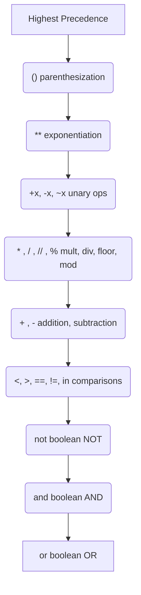

💡 **Tip:** When in doubt, use parentheses. They make your intent explicit and code more readable.

```python
a: int = 10
b: int = 3

# Arithmetic
exp: int = a ** b    # 10^3 = 1000
floor_div: int = a // b # 3 (truncates toward negative infinity)
mod: int = a % b     # 1

# Comparison Chaining (A uniquely Pythonic feature)
x: int = 5
print(1 < x <= 10)  # Output: True (same as 1 < x and x <= 10)

# Identity vs. Equality
list1: List[int] = [1, 2]
list2: List[int] = [1, 2]
print(f"list1 is list2: {list1 is list2}")  # False, different objects
print(f"list1 == list2: {list1 == list2}")  # True, same content
```

---

### Special Behavior with Numbers

Python's numeric types have some behaviors that are convenient but require awareness.

- **Integer Division (`//`):** Performs floor division. `-7 // 3` is `-3`, not `-2` (truncation toward zero).
- **Exponentiation Precedence:** `-3**2` is `-(3**2)` which is `-9`, not `(-3)**2` which is `9`.
- **Augmented Assignment:** `x += 5` works on mutable objects by modifying them in-place, but on immutable objects (like ints), it creates a new object and reassigns the variable.

```python
# Floor division vs. truncation
print(f"-13 // 4 = {-13 // 4}")   # Floor: -4
print(f"int(-13 / 4) = {int(-13 / 4)}") # Truncation: -3

# Augmented Assignment
mutable_list: List[int] = [1, 2]
mutable_list += [3]      # Mutable: modifies the list IN-PLACE
print(f"Mutable list: {mutable_list}")  # [1, 2, 3]

immutable_int: int = 5
immutable_int += 1       # Immutable: CREATES A NEW integer object
print(f"Immutable int: {immutable_int}")  # 6
```

---

### String Fundamentals

Strings are sequences, and mastering them is a core programming skill.

- **Quoting:** Single `'...'` and double `"..."` are functionally identical. Triple-quotes `'''...'''` or `"""..."""` create multiline strings.
- **Indexing & Slicing:** Access individual characters (`my_str[0]`) or sub-strings (`my_str[2:5]`). Slicing returns a new string. `my_str[start:stop:step]`.
- **Methods:** Strings have dozens of extremely useful methods like `.upper()`, `.split()`, `.strip()`, `.find()`, and `.replace()`. These all return _new_ strings because strings are immutable.

```python
filename: str = "  report_q3_2024.csv  "

# Common string methods
stripped: str = filename.strip()       # 'report_q3_2024.csv'
parts: List[str] = stripped.split("_") # ['report', 'q3', '2024.csv']

print(f"Original: '{filename}'")
print(f"Stripped: '{stripped}'")

# Slicing power
alphabet: str = "abcdefg"
print(f"First three: {alphabet[:3]}")    # abc
print(f"Reversed: {alphabet[::-1]}")     # gfedcba
```

---

### String Methods

String objects come with a vast array of methods for common text processing tasks. Here's a quick reference to the most frequently used ones. Remember, **all of these return a new string**; they never modify the original.

| Method              | Description                          | Example (`" Hello World "`)          |
| :------------------ | :----------------------------------- | :----------------------------------- |
| `strip()`           | Removes leading/trailing whitespace  | `"Hello World"`                      |
| `upper()`           | All characters uppercase             | `" HELLO WORLD "`                    |
| `lower()`           | All characters lowercase             | `" hello world "`                    |
| `split(sep)`        | Splits into a list by `sep`          | `s.split() -> ['Hello', 'World']`    |
| `join(iterable)`    | Joins iterable items with string     | `",".join(['a','b']) -> 'a,b'`       |
| `replace(old, new)` | Replaces occurrences of `old`        | `s.replace('World', 'Python')`       |
| `find(sub)`         | Returns lowest index of `sub`, or -1 | `s.find('World') -> 7`               |
| `startswith(pre)`   | Checks if string starts with `pre`   | `s.strip().startswith('He') -> True` |

```python
text: str = "  The quick brown fox jumps over the lazy dog.  "

cleaned: str = text.strip().lower()
word_list: List[str] = cleaned.split()
new_sentence: str = " ".join(word_list).capitalize()

print(f"Cleaned: '{cleaned}'")
print(f"Word list: {word_list}")
print(f"Reconstructed: '{new_sentence}'")
```

---

### Escaping Characters

Escape sequences let you embed special characters within a string. They are signaled by a backslash `\`.

| Escape Sequence | Meaning                                  |
| :-------------- | :--------------------------------------- |
| `\n`            | Newline                                  |
| `\t`            | Tab                                      |
| `\\`            | Literal backslash `\`                    |
| `\'`            | Single quote inside single-quoted string |
| `\"`            | Double quote inside double-quoted string |

- **Raw Strings:** Prefix a string with `r` to treat backslashes as literal characters. This is incredibly useful for regular expressions and Windows file paths.

```python
# Standard escaping
path_a: str = "C:\\Users\\Alice\\Documents"
print(path_a)  # C:\Users\Alice\Documents

# Raw string: Much cleaner for file paths
path_r: str = r"C:\Users\Alice\Documents"
print(path_r)  # Same output, no escaped backslashes

# Newline and tab
poem: str = "Roses are red,\n\tViolets are blue."
print(poem)
```

---

### String Interpolation / Formatting (f-strings)

String formatting is how you seamlessly weave variables and expressions into text. There are three eras:

1.  **Old `%`-formatting:** `"Hello %s" % name` (C-style, less flexible).
2.  **`str.format()`:** `"Hello {}".format(name)` (Powerful, Python 2.6+).
3.  **f-strings (Formatted String Literals):** `f"Hello {name}"` (Python 3.6+). **This is the modern, recommended way.** It's the most readable, concise, and fastest method.

```python
user_name: str = "Bob"
score: float = 95.3456

# f-strings: Clear, inline expressions
message: str = f"Player: {user_name.upper()}, Score: {score:.2f}"
print(message)  # Output: Player: BOB, Score: 95.35

# Inline calculations
width: int = 10
area_report: str = f"Area of a {width}x20 rectangle is {width * 20}."
print(area_report)  # Output: Area of a 10x20 rectangle is 200.
```

---

### Multiline Strings

For block text—like documentation, SQL queries, or long messages—you can use triple quotes `"""..."""` or `'''...'''`. The string will span multiple lines, preserving line breaks.

```python
# A multiline string using triple quotes
sql_query: str = """
SELECT user_id, username, email
FROM users
WHERE signup_date > '2024-01-01'
ORDER BY signup_date DESC;
"""

report: str = """
=== Daily Report ===

Generated on: Monday
Status: All systems operational
"""

print(sql_query)
print(report)
```

---

### Adding Comments and Docstrings

- **Comments (`#`):** Explain the _how_ and _why_ of your code logic on a granular, line-by-line basis. They are completely ignored by the Python interpreter. They are for developers.
- **Docstrings (`"""..."""`):** String literals that appear as the first statement in a function, method, class, or module. They explain the _what_—the object's purpose, parameters, and return values. Docstrings are stored as the object's `__doc__` attribute and are used by `help()` and documentation generation tools.

```python
def calculate_interest(principal: float, rate: float, time: float) -> float:
    """
    Calculates simple interest.

    The formula used is: I = P * R * T

    Args:
        principal: The initial amount of money.
        rate: The annual interest rate (as a decimal, e.g., 0.05 for 5%).
        time: The time the money is invested for in years.

    Returns:
        The simple interest earned over the time period.
    """
    # This is a regular comment explaining the calculation
    interest: float = principal * rate * time
    return interest

# Accessing the docstring
print(calculate_interest.__doc__)
```

---

### The Documentation Interlude

This short section reinforces a vital habit: **write great docstrings.**

Python's design philosophy is "executable pseudocode." The language strives for readability. Docstrings are the capstone of readable, professional code.

- **Interactive Help:** The built-in `help()` function is your best friend. It displays an object's docstring in a beautiful, formatted way. Use `help(print)`, `help(str.split)`, or `help(calculate_interest)` directly in the interpreter.
- **The `__doc__` attribute:** You can access the raw docstring string programmatically.
  ```python
  raw_doc: Optional[str] = calculate_interest.__doc__
  ```

💡 **Best Practice:** For any public function, class, or module, a clear docstring is not optional—it's a professional necessity. Your future self and your teammates will thank you.

---

### Variable Scope (LEGB Rule)

The LEGB rule is the order in which Python looks up names (variables). It's a simple, elegant system for managing namespaces and avoiding conflicts.

- **L (Local):** Names assigned within a function (`def`), and not declared global or nonlocal.
- **E (Enclosing):** Locals of enclosing functions, from inner to outer. Relevant for nested functions (closures).
- **G (Global):** Names assigned at the top-level of a module file, or explicitly declared `global` inside a function.
- **B (Built-in):** Names preassigned in the built-in names module: `print`, `len`, `open`, `True`, `Exception`, etc.

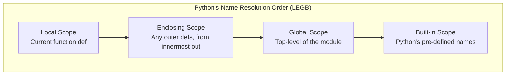

```python
# Scope demonstration
total_sum: int = 100  # Global scope

def outer_function() -> int:
    total_sum: int = 20  # Enclosing scope for inner
    def inner_function() -> int:
        total_sum: int = 5  # Local scope for inner
        return total_sum
    return inner_function() + total_sum

result: int = outer_function()  # Uses Local (5) + Enclosing (20)
print(f"Result: {result}, Global: {total_sum}")  # Result: 25, Global: 100
```

---

### The input() Function

The `input()` function is your primary way to get interactive data from a user via the keyboard (standard input). It reads an entire line as a string, stripping the trailing newline.

- **Always Returns a String:** If you expect a number, you _must_ explicitly cast the result using `int()` or `float()`.
- **Robust Input Handling:** Always wrap conversions in `try...except` blocks to gracefully handle invalid user input.

```python
# Get user's name (simple)
name: str = input("Please enter your name: ")

# Get user's age with robust error handling
try:
    age: int = int(input("Please enter your age: "))
    print(f"Hello, {name}. In 10 years, you will be {age + 10}.")
except ValueError:
    print("Error: That was not a valid integer for your age.")
```

---

## Part III: Data Structures

Data structures are the containers that organize and store data in your computer's memory. Choosing the right one is a fundamental skill that separates good programmers from great ones. Python's built-in data structures are powerful, flexible, and beautifully designed. This section draws inspiration from the clarity of the `learn-go` course, adapted for Python's unique philosophy.

### Sequence Types

In Python, a sequence is an ordered collection of items. "Ordered" means the items have a defined positional order that will not change unless you explicitly do so. All sequence types support indexing, slicing, and the `len()` function, but each has unique characteristics.

#### Strings

Strings are **immutable sequences** of Unicode code points. This is a massive advantage, making Python ideal for international text. Once a string is created, it cannot be changed in place; any "modification" actually creates a brand new string object. Think of it like a word carved in stone—you can read it, copy parts of it, but you can't alter the stone itself.

**Declaring and Initializing:**

```python
# Strings can use single, double, or triple quotes
name: str = "Python"
bio: str = 'A dynamically typed language'
multiline: str = """This string
spans multiple
lines effortlessly."""
```

**Common Operations and Pitfalls:**

```python
greeting: str = "Hello, World!"

# Indexing: Access individual characters (zero-based)
first_char: str = greeting[0]  # 'H'
last_char: str = greeting[-1]  # '!'

# Slicing: Extract a substring [start:end:step]
word: str = greeting[7:12]  # 'World'
reversed_str: str = greeting[::-1]  # '!dlroW ,olleH'

# ⚠️ Immutability Pitfall: You cannot change a string in place
# greeting[0] = 'M'  # ❌ TypeError: 'str' object does not support item assignment

# All string methods return a NEW string
new_greeting: str = greeting.replace('H', 'M')
print(f"Original: '{greeting}'")  # 'Hello, World!' (unchanged)
print(f"New: '{new_greeting}'")   # 'Mello, World!'
```

#### List

A `list` is an **ordered, mutable** sequence of objects. It's Python's workhorse container, comparable to arrays in other languages but infinitely more flexible. A single list can hold items of any type, including other lists.

- **Mutable:** You can add, remove, or change items after the list is created.
- **Dynamic:** Lists grow and shrink automatically as needed.

**Declaring and Initializing:**

```python
from typing import List, Any

# Empty list
empty: List[int] = []

# List with initial values
fruits: List[str] = ["apple", "banana", "cherry"]

# Mixed types (use sparingly, prefer type consistency)
mixed: List[Any] = [1, "hello", 3.14, True]
```

**Common Operations:**

```python
numbers: List[int] = [10, 20, 30]

# Adding elements
numbers.append(40)        # Adds to end: [10, 20, 30, 40]
numbers.insert(1, 15)     # Inserts at index 1: [10, 15, 20, 30, 40]

# Removing elements
last: int = numbers.pop() # Removes and returns last item (40)
numbers.remove(15)        # Removes first occurrence of value 15

# Modifying by index
numbers[0] = 100          # List is now [100, 20, 30]

print(f"Final list: {numbers}")
```

#### Tuples

A `tuple` is an **ordered, immutable** sequence. Once created, you cannot change its contents. This immutability is its superpower.

- **Integrity:** Perfect for data that shouldn't change, like coordinates `(x, y)` or database records.
- **Dictionary Keys:** Because they are immutable and hashable, tuples can be used as keys in dictionaries (lists cannot).
- **Performance:** Tuples are slightly faster and use less memory than lists.

**Declaring and Initializing:**

```python
from typing import Tuple

# Creating tuples
coordinates: Tuple[int, int] = (10, 20)
single_item: Tuple[str, ...] = ("hello",)  # The trailing comma is ESSENTIAL!
empty: Tuple[()] = ()

# Packing and unpacking
person: Tuple[str, int, str] = ("Ada", 28, "Engineer")
name, age, role = person  # Elegant simultaneous assignment

print(f"Name: {name}, Age: {age}, Role: {role}")
# Output: Name: Ada, Age: 28, Role: Engineer
```

#### Dictionary

A `dict` (dictionary) is a **mutable, ordered** (since Python 3.7) mapping of **unique, hashable keys** to arbitrary values. It's often called an "associative array" or "hash map" in other languages. It provides lightning-fast lookups by key rather than by position.

- **Hashing:** Keys must be hashable, meaning they must be immutable types like `str`, `int`, or `tuple` with immutable elements.

```mermaid
graph TD
    subgraph "Dictionary (Hash Table) Under the Hood"
        H[hash('name')] --> B0
        subgraph Buckets
            B0[Bucket 0] --> E0["'name': 'Alice'" ]
            B1[Bucket 1] --> Empty1[Empty]
            B2[Bucket 2: H(42)] --> E2["42: 'the answer'"]
            B3[Bucket 3] --> E3["'city': 'New York'"]
        end
    end
```

**Declaring and Initializing:**

```python
from typing import Dict, Any, Optional

# Creating dictionaries
user: Dict[str, Any] = {
    "name": "Guido van Rossum",
    "age": 68,
    "languages": ["Python", "ABC"],
    "is_benevolent_dictator": False,
}

# Safe key access with get()
# Direct access: user["height"]  # ❌ KeyError if key is missing
height: Optional[int] = user.get("height", None)  # ✅ Returns default
print(f"Height (should be None): {height}")

# Iterating elegantly
for key, value in user.items():
    print(f"  {key}: {value}")
```

---

### Accessing Individual Elements of a Sequence

Every sequence supports indexing to retrieve a single element. Python uses **zero-based indexing**, meaning the first item is at index `0`. Negative indices count backward from the end.

```python
from typing import List

tools: List[str] = ["Python", "Docker", "Git", "VS Code"]

# Standard zero-based indexing
first: str = tools[0]   # 'Python'
third: str = tools[2]   # 'Git'

# Negative indexing (counts from the end)
last: str = tools[-1]   # 'VS Code'
second_last: str = tools[-2]  # 'Git'

# ⚠️ Pitfall: IndexError if index is out of range
# missing = tools[10]  # ❌ IndexError: list index out of range
```

---

### Accessing a Slice of a Sequence

Slicing is a powerful syntax for extracting portions of sequences using the `[start:stop:step]` notation. It works on any sequence: `list`, `tuple`, `str`.

- **`start`:** The index to begin at (inclusive). Defaults to 0.
- **`stop`:** The index to end at (exclusive). Defaults to the sequence length.
- **`step`:** The interval between items. Defaults to 1.

```python
from typing import List

sample: List[int] = [0, 10, 20, 30, 40, 50, 60]

# Basic slicing
first_three: List[int] = sample[:3]    # [0, 10, 20]
last_two: List[int] = sample[-2:]      # [50, 60]
middle: List[int] = sample[2:5]        # [20, 30, 40]

# Slicing with steps
every_other: List[int] = sample[::2]   # [0, 20, 40, 60]
reverse_copy: List[int] = sample[::-1] # [60, 50, 40, 30, 20, 10, 0]

print(f"Every other: {every_other}")
print(f"Reversed: {reverse_copy}")
```

---

### Getting the Length of a Sequence

The built-in `len()` function returns the number of items in a container. It works on all built-in sequences and collections.

```python
from typing import List, Tuple, Dict

my_list: List[int] = [1, 2, 3, 4, 5]
my_tuple: Tuple[str, ...] = ("a", "b")
my_dict: Dict[str, int] = {"x": 1, "y": 2, "z": 3}
my_string: str = "Hello"

print(f"List length: {len(my_list)}")     # 5
print(f"Tuple length: {len(my_tuple)}")   # 2
print(f"Dict length: {len(my_dict)}")     # 3
print(f"String length: {len(my_string)}") # 5
```

---

### Determining if a Given Item is in a Sequence

The `in` keyword provides a clean, readable way to check for membership. For lists and tuples, it performs a linear scan (O(n) time). For dictionaries and sets, it's a lightning-fast hash lookup (O(1) average time).

```python
from typing import List, Dict

fruits: List[str] = ["apple", "banana", "cherry"]
user: Dict[str, str] = {"name": "Alice", "city": "New York"}

# Checking membership in a list (slower for large lists)
has_banana: bool = "banana" in fruits  # True

# Checking membership in a dictionary (fast, checks keys)
has_name_key: bool = "name" in user    # True
has_city_value: bool = "Alice" in user.values()  # True (checks values)

print(f"Has banana: {has_banana}")
print(f"Has 'name' key: {has_name_key}")
```

---

### Determining How Many Instances of an Item are in a Sequence

The `.count()` method, available on lists, tuples, and strings, efficiently counts the occurrences of a specific value.

```python
from typing import List

votes: List[str] = ["Alice", "Bob", "Alice", "Charlie", "Alice", "Bob"]

# Count occurrences
alice_votes: int = votes.count("Alice")  # 3
bob_votes: int = votes.count("Bob")      # 2
eve_votes: int = votes.count("Eve")      # 0 (no error)

print(f"Alice has {alice_votes} votes, Bob has {bob_votes}, Eve has {eve_votes}.")
```

---

### Finding the First Instance of an Item in a Sequence

The `.index()` method returns the index of the first occurrence of a value. It raises a `ValueError` if the item is not found, so it's often wise to check with `in` first or use it within a `try/except` block.

```python
from typing import List, Optional

colors: List[str] = ["red", "green", "blue", "green", "yellow"]

# Safe way: Check first, then find index
target: str = "green"
if target in colors:
    index: int = colors.index(target)
    print(f"First '{target}' found at index {index}.")  # Output: 1
else:
    print(f"'{target}' not found.")

# ⚠️ Pitfall: Direct call without checking
# colors.index("purple")  # ❌ ValueError: 'purple' is not in list
```

---

### Merging Sequences

You can combine (concatenate) sequences using the `+` operator. This creates a brand new sequence and leaves the original ones unchanged.

- **Lists:** `list1 + list2` returns a new combined list.
- **Tuples:** `tuple1 + tuple2` returns a new combined tuple.
- **Strings:** `str1 + str2` returns a new combined string.
- **Dictionaries:** In Python 3.5+, `{**dict1, **dict2}` creates a new merged dictionary. In 3.9+, the `|` operator works.

```python
from typing import List, Dict

# Merging lists
list_a: List[int] = [1, 2, 3]
list_b: List[int] = [4, 5]
merged_list: List[int] = list_a + list_b  # [1, 2, 3, 4, 5]

# Merging dictionaries (Python 3.5+ style)
defaults: Dict[str, str] = {"theme": "dark", "language": "en"}
prefs: Dict[str, str] = {"language": "es", "notifications": "on"}
merged_dict: Dict[str, str] = {**defaults, **prefs}
print(merged_dict)  # {'theme': 'dark', 'language': 'es', 'notifications': 'on'}
```

---

### Repeating Sequences

You can repeat a sequence using the `*` operator. This creates a new sequence by repeating the original one a given number of times.

```python
from typing import List

# Repeating a list
repeated_list: List[str] = ["Hello"] * 3  # ['Hello', 'Hello', 'Hello']

# ⚠️ Critical Pitfall with Mutable Items:
# The repetition is SHALLOW. Each copy references the SAME inner object.
matrix: List[List[int]] = [[0] * 2] * 3  # Looks like [[0,0], [0,0], [0,0]]
matrix[0][0] = 99
print(matrix)  # [[99, 0], [99, 0], [99, 0]] - ALL inner lists changed!
# This happens because each row is a reference to the SAME single inner list [0,0].
```

---

### List Methods

Lists have a rich set of methods that modify them in place (since they are mutable). This is a quick reference:

| Method                              | Description                                                          |
| :---------------------------------- | :------------------------------------------------------------------- |
| `list.append(x)`                    | Adds `x` to the end.                                                 |
| `list.extend(iterable)`             | Appends all items from `iterable`.                                   |
| `list.insert(i, x)`                 | Inserts `x` at index `i`.                                            |
| `list.remove(x)`                    | Removes the first item equal to `x`.                                 |
| `list.pop([i])`                     | Removes and returns item at index `i` (last item if `i` is omitted). |
| `list.clear()`                      | Removes all items (`lst[:] = []` is preferred).                      |
| `list.index(x[, start[, end]])`     | Returns index of first `x`.                                          |
| `list.count(x)`                     | Returns the number of occurrences of `x`.                            |
| `list.sort(key=..., reverse=False)` | Sorts the list **in place**.                                         |
| `list.reverse()`                    | Reverses the list **in place**.                                      |

```python
from typing import List

data: List[int] = [5, 2, 8, 1]

# In-place modifications (return None!)
data.sort()           # data is now [1, 2, 5, 8]
data.reverse()        # data is now [8, 5, 2, 1]

# Extending vs Appending
data.extend([10, 20]) # Appends elements: [8, 5, 2, 1, 10, 20]
data.append([30, 40]) # Appends the list as a single element: [8, 5, 2, 1, 10, 20, [30, 40]]

print(f"Final data: {data}")
```

---

### Merging Two Lists

Beyond the `+` operator, `list.extend()` is the efficient way to add elements from one list into an existing list _in place_. The `itertools.chain()` is the memory-efficient choice for iterating without creating a new list.

```python
from typing import List
from itertools import chain

list1: List[int] = [1, 2, 3]
list2: List[int] = [4, 5, 6]

# Method 1: + operator (creates a NEW list)
combined: List[int] = list1 + list2  # list1 and list2 are unchanged

# Method 2: .extend() (modifies list1 IN PLACE)
list1.extend(list2)  # list1 is now [1, 2, 3, 4, 5, 6]

# Method 3: itertools.chain() (lazy, no new list created)
lazy_merge = chain(list2, combined)
print(f"Lazy merge elements: {list(lazy_merge)}")
```

---

### Iterating Over Sequences

Python's `for` loop is the primary tool for iteration. It's versatile and reads beautifully.

- **Basic Iteration:** `for item in sequence:`
- **Index and Value with `enumerate()`:** The most Pythonic way.
- **Traditional `for` with `range()`:** When you need fine-grained index control (less Pythonic but useful).

```python
from typing import List

fruits: List[str] = ["apple", "banana", "mango"]

# 1. Basic iteration
print("Fruits available:")
for fruit in fruits:
    print(f"  - {fruit}")

# 2. Iterate with index using enumerate()
print("\nWith index:")
for i, fruit in enumerate(fruits):
    print(f"  {i}: {fruit}")

# 3. Iterate over dictionary keys, values, and items
user: dict = {"name": "Alice", "age": 30}
for key, value in user.items():
    print(f"  Key: {key}, Value: {value}")
```

---

### Traditional for Loop with the range() Function

The `range()` function generates a lazy, immutable sequence of numbers, making it perfect for C-style counting loops.

- `range(stop)`: Generates 0 to `stop-1`.
- `range(start, stop)`: Generates `start` to `stop-1`.
- `range(start, stop, step)`: Adds a step interval.

```python
from typing import List

# Classic 'do something N times' loop
print("Processing 3 batches:")
for batch_num in range(3):
    print(f"  Batch {batch_num + 1} started.")

# Using range with len() for index-based access (when you NEED the index)
items: List[str] = ["a", "b", "c"]
for i in range(len(items)):
    print(f"Index {i} has value {items[i]}")

# 💡 This pattern is usually less Pythonic than enumerate()
```

---

### The enumerate() Function

`enumerate()` is the elegant, Pythonic solution for getting both the index and the value in a loop. It yields `(index, value)` tuples.

```python
from typing import List

tasks: List[str] = ["Write tests", "Implement feature", "Refactor"]

print("Task list:")
for idx, task in enumerate(tasks):
    print(f"  {idx + 1}. {task}")

# With a custom start index
for idx, task in enumerate(tasks, start=1):
    print(f"  {idx}. {task}")  # Same output, cleaner code
```

---

### Choosing the Right Data Structure

This is a decision you'll make constantly. Here's a quick rule-of-thumb table:

| Need                           | Best Choice           | Why                                         |
| :----------------------------- | :-------------------- | :------------------------------------------ |
| Ordered, mutable collection    | `list`                | Fast appends, random access by index        |
| Ordered, immutable collection  | `tuple`               | Hashable, slight speed gain, data integrity |
| Unique, unordered items        | `set`                 | Lightning-fast membership test (`x in set`) |
| Immutable set, dictionary key  | `frozenset`           | Hashable                                    |
| Key-value lookup               | `dict`                | Instant access by key                       |
| First-in-first-out (FIFO)      | `collections.deque`   | O(1) appends and pops from both ends        |
| Last-in-first-out (LIFO)       | `list` (as stack)     | `.append()` and `.pop()` are O(1)           |
| Fixed records / simple objects | `tuple` / `dataclass` | Lightweight, clear structure                |

---

### Comprehensions (List, Dict, Set)

Comprehensions are a concise, expressive, and Pythonic way to create new data structures from existing iterables. They are often faster than equivalent `for` loops because the underlying machinery is optimized in C.

- **List Comprehensions:** `[expr for item in iterable]`
- **Dict Comprehensions:** `{key_expr: val_expr for item in iterable}`
- **Set Comprehensions:** `{expr for item in iterable}`

```python
from typing import List, Dict, Set

numbers: List[int] = [1, 2, 3, 4]

# List Comprehension: Square of numbers
squares: List[int] = [n**2 for n in numbers]
print(f"Squares: {squares}")  # [1, 4, 9, 16]

# Dict Comprehension: Number-to-square mapping
square_map: Dict[int, int] = {n: n**2 for n in numbers}
print(f"Map: {square_map}")  # {1: 1, 2: 4, 3: 9, 4: 16}

# Set Comprehension: Unique lengths of words
words: List[str] = ["hello", "world", "go", "python"]
lengths: Set[int] = {len(w) for w in words}
print(f"Lengths: {lengths}")  # {2, 5, 6}
```

---

### Combining Comprehensions and Conditionals

Comprehensions can include `if` conditions to filter input items and ternary expressions (`x if condition else y`) within the output expression. This creates highly readable data transformation pipelines.

```python
from typing import List

data: List[int] = [-5, 3, 0, 9, -2, 7]

# 1. Filtering with `if` at the end
positive_only: List[int] = [x for x in data if x > 0]
print(f"Positive: {positive_only}")  # [3, 9, 7]

# 2. Conditional expression in the output
# Transform negative to zero, leave others
transformed: List[int] = [x if x > 0 else 0 for x in data]
print(f"Transformed: {transformed}")  # [0, 3, 0, 9, 0, 7]

# 3. Combined: Filter AND transform
# Double the positive numbers only
doubled_positives: List[int] = [x * 2 for x in data if x > 0]
print(f"Doubled Positives: {doubled_positives}")  # [6, 18, 14]
```

---

### Diving Deeper into Iterable Methods

Python's iterables share a rich toolkit of methods. Knowing them makes your code more expressive and concise.

- **`enumerate()`:** Get index and value simultaneously (covered above).
- **`zip()`:** Iterate over multiple iterables in parallel, creating tuples.
- **`reversed()`:** Get a reverse iterator without modifying the original.
- **`sorted()`:** Return a new sorted list without modifying the original.
- **`.sort()` vs. `sorted()`:** `.sort()` is a list method that sorts **in place** and returns `None`. `sorted()` is a function that works on **any iterable**, returns a new list, and never mutates the original.

```python
from typing import List, Tuple

names: List[str] = ["Alice", "Bob", "Charlie"]
scores: List[int] = [85, 92, 78]

# zip: Combine two lists into pairs
paired: List[Tuple[str, int]] = list(zip(names, scores))
print(f"Zipped: {paired}")
# Output: [('Alice', 85), ('Bob', 92), ('Charlie', 78)]

# sorted vs .sort
original: List[int] = [3, 1, 2]
new_sorted: List[int] = sorted(original)  # Returns new list, original unchanged
original.sort()                           # Modifies original in place, returns None

print(f"Original (now sorted): {original}")     # [1, 2, 3]
print(f"New sorted copy: {new_sorted}")        # [1, 2, 3]
```

Functions are the fundamental building blocks of reusable code. They encapsulate logic, reduce repetition, and make programs modular. If Part IV was about the _verbs_ of Python, Part V is about packaging those verbs into powerful, reusable _actions_. Let's master the art of writing elegant, efficient functions.

### Function Basics

A function is a named block of code designed to perform one specific task. It takes inputs, processes them, and (optionally) returns an output.

- **`def` Keyword:** Functions are defined with `def`, followed by the name, parentheses for parameters, and a colon.
- **Docstrings:** A triple-quoted string immediately after the `def` line becomes the function's documentation.
- **Calling:** A function is executed only when called with parentheses `()`.

```python
from typing import Union

def greet(name: str, greeting: str = "Hello") -> str:
    """
    Generates a personalized greeting message.

    Args:
        name: The name of the person to greet.
        greeting: The greeting word to use.

    Returns:
        A formatted greeting string.
    """
    return f"{greeting}, {name}!"

# Calling the function
message: str = greet("Alice")
print(message)  # Output: Hello, Alice!

message_custom: str = greet("Bob", greeting="Good morning")
print(message_custom)  # Output: Good morning, Bob!

# Functions are first-class objects
greeter_function = greet  # Assigning the function to a variable
print(greeter_function("Charlie"))  # Output: Hello, Charlie!
```

---

### Default and Keyword Arguments

Python gives you powerful, flexible ways to pass arguments.

- **Positional Arguments:** Passed in order, matched by position.
- **Keyword Arguments:** Passed with `name=value`, matched by name. They make calls self-documenting.
- **Default Values:** Parameters can have default values. If the caller omits the argument, the default is used.

⚠️ **Critical Pitfall (Mutable Defaults):** Default values are evaluated **only once** at function definition time, not each time the function is called. Using a mutable default (like `[]` or `{}`) is a notorious source of bugs.

```python
from typing import List, Optional

# ✅ Safe pattern: Use None as the default and create the mutable object inside
def add_item(item: str, target_list: Optional[List[str]] = None) -> List[str]:
    """
    Adds an item to a list. Creates a new list if none is provided.
    """
    if target_list is None:
        target_list = []  # Fresh list created on every call
    target_list.append(item)
    return target_list

# ❌ Dangerous pattern: Mutable default argument
# def add_item_bad(item: str, target_list: List[str] = []) -> List[str]:
#     target_list.append(item)  # Mutates the SAME list across all calls!
#     return target_list

print(add_item("apple"))   # Output: ['apple']
print(add_item("banana"))  # Output: ['banana']  (Fresh list each time)
```

---

### Understanding return

The `return` statement does two things: it specifies the value to send back to the caller, and it **immediately terminates** the function. A function without an explicit `return` statement returns `None`.

- **Multiple Return Values:** Returning multiple comma-separated values actually returns a `tuple`.
- **Early Returns:** Using `return` early in a function for guard clauses makes code cleaner.

```python
from typing import Tuple, Optional

def divide(a: float, b: float) -> Optional[float]:
    """Divides a by b. Returns None for division by zero."""
    if b == 0:
        print("Error: Division by zero.")
        return None  # Early return as a guard clause
    return a / b

result1: Optional[float] = divide(10, 2)
result2: Optional[float] = divide(10, 0)
print(f"10/2 = {result1}")  # Output: 10/2 = 5.0
print(f"10/0 = {result2}")  # Output: 10/0 = None

# Multiple return values (packed into a tuple)
def min_max(numbers: List[int]) -> Tuple[int, int]:
    """Returns both the minimum and maximum of a list."""
    return min(numbers), max(numbers)

lowest: int
highest: int
lowest, highest = min_max([3, 1, 4, 1, 5, 9])
print(f"Min: {lowest}, Max: {highest}")  # Output: Min: 1, Max: 9
```

---

### Unpacking Function Arguments

Python provides the `*` and `**` operators to unpack sequences and mappings directly into function arguments. This is an elegant, powerful pattern.

- **`*args`:** Unpacks a sequence (list, tuple) into positional arguments.
- **`**kwargs`:\*\* Unpacks a dictionary into keyword arguments.

```python
from typing import List, Dict, Any

def describe_person(name: str, age: int, city: str) -> str:
    """Formats a description of a person."""
    return f"{name} is {age} years old and lives in {city}."

# --- Unpacking a list/tuple with * ---
user_data: List[Any] = ["Diana", 30, "London"]
# Without unpacking:
# describe_person(user_data[0], user_data[1], user_data[2])
# With unpacking: Clean and concise!
description: str = describe_person(*user_data)
print(description)  # Output: Diana is 30 years old and lives in London.

# --- Unpacking a dictionary with ** ---
user_dict: Dict[str, Any] = {"name": "Eve", "age": 25, "city": "Paris"}
description_dict: str = describe_person(**user_dict)
print(description_dict)  # Output: Eve is 25 years old and lives in Paris.
```

---

### Naming Conventions

Consistent naming is vital for readable code. Revisiting and reinforcing PEP 8 for functions:

| Element                 | Convention                       | Example                                      |
| :---------------------- | :------------------------------- | :------------------------------------------- |
| **Functions**           | `snake_case`                     | `calculate_total()`                          |
| **Methods**             | `snake_case` (same as functions) | `cart.add_item()`                            |
| **Parameters**          | `snake_case`                     | `user_id`, `max_retries`                     |
| **Private Helpers**     | Leading underscore `_`           | `_internal_cache()`                          |
| **Verb Choice**         | Action-oriented verbs            | `get_user()`, `build_report()`, `is_valid()` |
| **Predicate Functions** | `is_`, `has_`, `can_` prefix     | `is_authenticated`, `has_permission`         |

```python
from typing import List

# ✅ Good function names: clear, verb-first, snake_case
def get_active_users(user_list: List[str]) -> List[str]:
    """Filters and returns only active users."""
    pass

def has_admin_privileges(user_id: int) -> bool:
    """Checks if a user has admin rights."""
    return False

# ✅ Private helper function
def _log_to_file(message: str) -> None:
    """Internal helper to write a log entry."""
    print(f"[LOG] {message}")
```

---

### Lambda Functions

Lambda functions are small, anonymous functions defined with the `lambda` keyword. They are restricted to a single expression.

- **Use Cases:** Perfect for short, throwaway operations, especially as arguments to higher-order functions like `sorted()`, `map()`, and `filter()`.
- **Limit:** If your lambda spans multiple lines or contains complex logic, a standard `def` function is vastly superior.

```python
from typing import List, Tuple

# Standard function
def square(x: int) -> int:
    return x * x

# Equivalent lambda
square_lambda = lambda x: x * x

print(f"Square of 5: {square(5)}")          # Output: 25
print(f"Lambda square of 5: {square_lambda(5)}")  # Output: 25

# Most common use: Sorting with a key
users: List[Tuple[str, int]] = [("Alice", 35), ("Bob", 25), ("Charlie", 40)]

# Sort by age (the second element of the tuple) using a lambda
sorted_users: List[Tuple[str, int]] = sorted(users, key=lambda user: user[1])
print(f"Sorted by age: {sorted_users}")
# Output: [('Bob', 25), ('Alice', 35), ('Charlie', 40)]
```

---

### map(), filter(), and reduce()

These are classic functional programming tools. While comprehensions are often more Pythonic, these functions are worth knowing.

- **`map(func, iterable)`:** Applies `func` to every item of the `iterable` and returns a lazy `map` iterator.
- **`filter(func, iterable)`:** Applies `func` to every item; keeps only those where `func` returns `True`. Returns a lazy `filter` iterator.
- **`reduce(func, iterable)`:** Cumulatively applies a function to items, reducing the iterable to a single value. Housed in the `functools` module.

```python
from functools import reduce
from typing import List, Iterator

numbers: List[int] = [1, 2, 3, 4, 5]

# map: Double each number
doubled: Iterator[int] = map(lambda x: x * 2, numbers)
print(f"map doubled: {list(doubled)}")  # Output: [2, 4, 6, 8, 10]

# filter: Keep only even numbers
evens: Iterator[int] = filter(lambda x: x % 2 == 0, numbers)
print(f"filter evens: {list(evens)}")  # Output: [2, 4]

# reduce: Sum all numbers
total: int = reduce(lambda acc, x: acc + x, numbers)
print(f"reduce sum: {total}")  # Output: 15

# 💡 In modern Python, comprehensions are often cleaner:
# doubled = [x * 2 for x in numbers]
# evens = [x for x in numbers if x % 2 == 0]
```

---

### Scopes

We introduced the LEGB rule in Part II. Let's dive deeper into its practical implications within functions.

- **Reading a variable:** Python traverses L -> E -> G -> B to find it.
- **Assigning a variable:** Unless declared with `global` or `nonlocal`, an assignment _always_ creates a new local variable. This is the classic "shadowing" trap.

```python
from typing import List

# Global count
count: int = 0
tracker: List[str] = ["global_tracker"]

def update_count(inc: int) -> None:
    """Tries to update the global count (and fails without global)."""
    # Attempting to assign count here creates a NEW local variable 'count'
    # that shadows the global one. Uncommenting below causes an UnboundLocalError
    # if you try to read count first, because Python sees the local assignment
    # and treats 'count' as local everywhere in the function.
    # count += inc  # ❌ UnboundLocalError: local variable 'count' referenced before assignment

    # Correct way to modify a global immutable variable:
    global count
    count += inc

    # Mutable objects can be modified without 'global'
    # (because we're mutating the object, not reassigning the variable name)
    tracker.append(f"updated_by_{inc}")

update_count(5)
print(f"Global count: {count}")  # Output: 5
print(f"Tracker: {tracker}")     # Output: ['global_tracker', 'updated_by_5']
```

---

### Arguments

Python's argument-passing system is beautifully flexible, centered on four main types:

- **Positional:** Matched left-to-right.
- **Keyword:** Matched by name.
- **Arbitrary `*args`:** Collects any extra positional arguments into a tuple.
- **Arbitrary `**kwargs`:\*\* Collects any extra keyword arguments into a dictionary.

The full ordering is: `func(positional_args, keyword_args, *args, **kwargs)`. Modern Python also supports keyword-only arguments (after `*`) and positional-only (before `/`, Python 3.8+).

```python
from typing import Any, List, Tuple, Dict

def log_event(event_type: str, user_id: int, *details: str, **metadata: Any) -> None:
    """
    Logs an event with required, optional positional, and metadata fields.

    Args:
        event_type: The category of the event (positional-or-keyword).
        user_id: The user involved (positional-or-keyword).
        *details: Additional descriptive strings (variadic positional).
        **metadata: Arbitrary key-value data (variadic keyword).
    """
    print(f"[{event_type.upper()}] User {user_id}")
    if details:
        print(f"  Details: {', '.join(details)}")
    if metadata:
        print(f"  Metadata: {metadata}")

# All these calling conventions are valid
log_event("login", 101)
log_event("purchase", 102, "item: laptop", "price: 1200", payment="credit_card", discount=True)
# Output:
# [LOGIN] User 101
# [PURCHASE] User 102
#   Details: item: laptop, price: 1200
#   Metadata: {'payment': 'credit_card', 'discount': True}
```

---

### Advanced Function Topics

This section explores functions that create functions, functions that wrap functions, and the nature of recursion.

- **Closures:** A closure is a function "remembered" from its enclosing scope even after that enclosing scope is gone. It's a powerful way to create functions with state.
- **Decorators:** Functions that take another function as an argument and extend its behavior without modifying it. They are syntactic sugar for `wrapper = decorator(original_func)`.
- **Recursion:** A function calling itself. Elegant for tasks with a naturally recursive structure, but Python has a recursion limit (~1000 calls) and is often less efficient than iteration for simple loops.

```python
from typing import Callable

# --- Closures ---
def make_multiplier(factor: int) -> Callable[[int], int]:
    """Returns a new function that multiplies its input by a factor."""
    # The inner function 'remembers' the 'factor' from the enclosing scope
    def multiplier(number: int) -> int:
        return number * factor
    return multiplier

double: Callable[[int], int] = make_multiplier(2)
triple: Callable[[int], int] = make_multiplier(3)
print(f"Double 5: {double(5)}")  # Output: 10
print(f"Triple 5: {triple(5)}")  # Output: 15

# --- Decorators (Syntactic Sugar for Wrapper Functions) ---
def announce(func: Callable[..., Any]) -> Callable[..., Any]:
    """A decorator that announces function calls."""
    def wrapper(*args: Any, **kwargs: Any) -> Any:
        print(f"Calling {func.__name__}...")
        result = func(*args, **kwargs)
        print(f"Finished {func.__name__}.")
        return result
    return wrapper

@announce  # This is equivalent to: say_hello = announce(say_hello)
def say_hello(name: str) -> str:
    return f"Hello, {name}!"

print(say_hello("World"))
# Output:
# Calling say_hello...
# Finished say_hello.
# Hello, World!

# --- Recursion (Factorial) ---
def factorial(n: int) -> int:
    """Calculates the factorial of n recursively."""
    if n <= 1:
        return 1
    return n * factorial(n - 1)

print(f"5! = {factorial(5)}")  # Output: 120
```

---

### Comprehensions and Generations

We saw comprehensions as a concise way to build collections. Now let's focus on their lazy, memory-efficient cousin: the **Generator Expression**.

- **Generator Expression:** Uses parentheses `()` instead of brackets `[]`. It yields items one at a time on demand, not all at once. This is crucial for processing huge data streams without loading everything into memory.
- **`yield` Keyword:** Used inside a function to turn it into a **generator function**. Each call to `yield` pauses the function, returns a value, and resumes right after the `yield` on the next call.

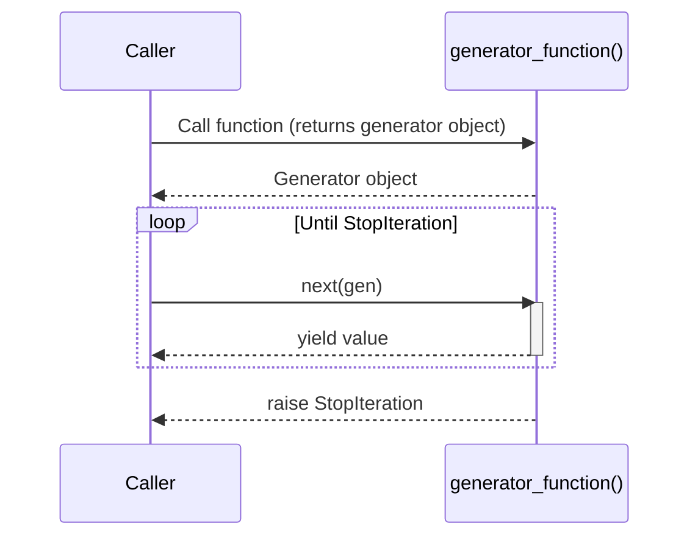

```python
from typing import Generator, List, Iterator

# List comprehension: Eager, creates the whole list in memory
squares_eager: List[int] = [x**2 for x in range(1000000)]  # Memory hit!

# Generator expression: Lazy, no memory hit
squares_lazy: Iterator[int] = (x**2 for x in range(1000000))  # Just a recipe

print(f"Eager type: {type(squares_eager)}, Lazy type: {type(squares_lazy)}")
# Output: Eager type: <class 'list'>, Lazy type: <class 'generator'>

# --- Generator function with `yield` ---
def fibonacci(n: int) -> Generator[int, None, None]:
    """Yields the first n Fibonacci numbers."""
    a, b = 0, 1
    for _ in range(n):
        yield a  # Pause and return 'a'
        a, b = b, a + b  # Resume here on next call

print("First 7 Fibonacci numbers:")
for num in fibonacci(7):
    print(num, end=" ")
# Output: 0 1 1 2 3 5 8
```

---

### The Benchmarking Interlude

This section is a practical reminder: elegant code is good, but performant code can be critical. Use the `timeit` module to test small code snippets. Remember the trade-offs:

- **Comprehensions:** Generally faster than manual `for` loops for building lists.
- **Generator Expressions:** Slightly slower to iterate through than list comprehensions, but massively more memory-efficient.
- **`map`/`filter`:** Can sometimes be slightly faster than comprehensions for simple operations, but readability must be weighed.

```python
import timeit
from typing import List

# Code snippets to benchmark
setup_code: str = "numbers = list(range(1000))"

loop_code: str = """
squares = []
for n in numbers:
    squares.append(n**2)
"""

comp_code: str = """
squares = [n**2 for n in numbers]
"""

map_code: str = """
squares = list(map(lambda x: x**2, numbers))
"""

# Benchmarking
loop_time: float = timeit.timeit(stmt=loop_code, setup=setup_code, number=10000)
comp_time: float = timeit.timeit(stmt=comp_code, setup=setup_code, number=10000)
map_time: float = timeit.timeit(stmt=map_code, setup=setup_code, number=10000)

print(f"Loop:        {loop_time:.4f}s")
print(f"Comprehension: {comp_time:.4f}s")
print(f"Map/Lambda:    {map_time:.4f}s")

# 💡 Key Takeaway
print("\n💡 Takeaway: While benchmarks differ, always prioritize readability first.")
print("   Optimize only when profiling reveals a genuine bottleneck.")
```

## Part IV: Statements, Syntax & Flow Control

Now we move from the _nouns_ (data types and structures) to the _verbs_ of Python. **Statements** are the instructions that tell Python what _actions_ to perform. They direct the flow of execution, make decisions, repeat tasks, and structure your code. Mastering them transforms static data into dynamic, intelligent programs.

### Introducing Python Statements

In Python, code is composed of **statements** and **expressions**. The distinction is simple but fundamental:

- **Expression:** A combination of values, variables, and operators that _evaluates to produce a value_. You can print it or assign it to a variable. Example: `2 + 2`, `len([1, 2, 3])`, `x > 5`.
- **Statement:** An instruction that _performs an action_ but doesn't necessarily produce a value you can capture. Statements control program flow. Example: `if`, `for`, `while`, `def`, `import`, `pass`, `break`.

Python's defining design principle is that **indentation is syntax**. While other languages use braces `{}` or keywords like `begin/end` to define code blocks, Python uses indentation level (typically 4 spaces). This enforces visually consistent, readable code.

```python
import sys
from typing import List

# --- Expressions (produce values) ---
sum_expr: int = 2 + 2           # 2 + 2 is an expression, evaluates to 4
list_len: int = len([1, 2, 3])  # len(...) evaluates to 3
is_greater: bool = sum_expr > 3 # Evaluates to True

# --- Statements (perform actions) ---
if is_greater:                  # The entire 'if' block is a statement
    print("Math still works!")  # 'print' call is a statement

for i in range(3):              # 'for' loop is a statement
    print(f"  Iteration {i}")

# ⚠️ You cannot assign a statement to a variable!
# result: ??? = if True: print("nope")  # ❌ SyntaxError!
```

---

### Assignments, Expressions, and Prints

These are the most fundamental, everyday building blocks. You'll use them constantly.

**Assignment (`=`)**
The `=` operator **binds** a name (variable) to an object in memory. It is right-associative and does **not** return a value (unlike C where assignment is an expression).

```python
from typing import Tuple

# Basic assignment: right-associative chaining
a: int
b: int
a = b = 10          # Both 'a' and 'b' point to the integer object 10
print(f"a = {a}, b = {b}")  # a = 10, b = 10

# Tuple unpacking assignment (powerful Pythonic pattern)
x: int
y: int
x, y = 5, 10        # x gets 5, y gets 10

# Elegant swap without a temporary variable!
x, y = y, x
print(f"Swapped: x = {x}, y = {y}")  # Swapped: x = 10, y = 5

# Extended unpacking (Python 3.x)
first, *middle, last = [1, 2, 3, 4, 5]
print(f"First: {first}, Middle: {middle}, Last: {last}")
# Output: First: 1, Middle: [2, 3, 4], Last: 5
```

**The `print()` Function**
`print()` sends text to the standard output stream (your console). It's the universal debugging and feedback tool.

```python
# print() details
name: str = "World"
score: float = 95.5

# Default: separated by space, ends with newline
print("Hello", name)           # Hello World

# Customize separator and end character
print("Name:", name, "Score:", score, sep=" | ", end="!\n\n")
# Output: Name: | World | Score: | 95.5!
```

---

### if Tests and Syntax Rules

The `if` statement is Python's primary decision-making tool. It evaluates a condition (any expression) and executes a block of code only if that condition is **truthy**.

**Syntax Rules:**

- The condition does **not** require parentheses (but you can use them for grouping).
- A colon `:` is **mandatory** after the condition.
- The indented block following the colon is the body. All lines in the block must have the same indentation level.

```python
from typing import Optional

temperature: int = 25

# Basic if/elif/else structure
if temperature > 30:
    advice: str = "It's hot outside, stay hydrated!"
elif temperature > 20:
    advice = "Perfect day for a walk."
elif temperature > 10:
    advice = "A bit chilly, take a jacket."
else:
    advice = "It's cold, bundle up!"

print(f"Advice: {advice}")  # Output: Advice: Perfect day for a walk.
```

⚠️ **Common Pitfall: Empty Blocks**
If you need a placeholder for code you haven't written yet, you **must** use the `pass` statement. An empty indented block is a syntax error.

```python
status: Optional[str] = None

# ❌ This causes an IndentationError:
# if status is None:
#     # TODO: implement later

# ✅ Use 'pass' as a no-op placeholder:
if status is None:
    pass  # Does nothing, syntactically valid

# Also works in functions, classes, loops:
def future_feature() -> None:
    """Will be implemented next sprint."""
    pass
```

**Ternary Expression (Conditional Expression)**
For simple inline conditionals, Python offers a concise syntax:

```python
age: int = 21
status: str = "Adult" if age >= 18 else "Minor"
print(f"Status: {status}")  # Output: Status: Adult
```

---

### Boolean Operators

Python uses **word-based** boolean operators: `and`, `or`, `not`. They are **short-circuit operators**, meaning they evaluate only as much as necessary to determine the result.

- **`and`:** If the left operand is falsy, return it immediately (don't evaluate right). Otherwise, evaluate and return the right operand.
- **`or`:** If the left operand is truthy, return it immediately. Otherwise, evaluate and return the right operand.
- **`not`:** Negates the truth value of its single operand (always returns a `bool`).

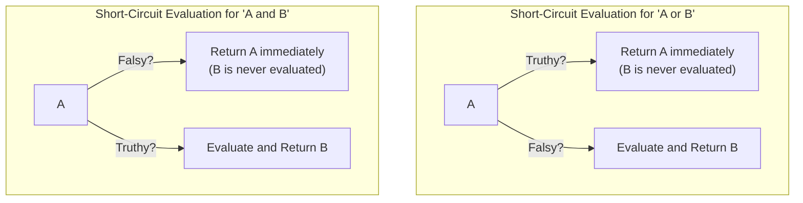

```python
from typing import Any, Optional

# Short-circuit behavior (idiomatic Python patterns)
default_name: str = "Anonymous"
user_name: Optional[str] = None

# If user_name is truthy, use it. Otherwise, fall back to default.
display_name: Any = user_name or default_name
print(f"Hello, {display_name}")  # Output: Hello, Anonymous

# 'and' as a guard clause: only access if data exists
data: Optional[dict] = {"key": "value"}
value: Optional[str] = data and data.get("key")
print(f"Value: {value}")  # Output: Value: value

data = None
value = data and data.get("key")  # Safe! No AttributeError.
print(f"Value when data is None: {value}")  # Output: None
```

⚠️ **Pitfall:** Do not confuse `and`/`or` with bitwise `&`/`|`. Using `&` where `and` is intended will not short-circuit and can produce unexpected results.

```python
# ❌ These are BITWISE, not logical:
# result = (x > 5) & (y < 10)  # Bitwise AND, works but no short-circuit

# ✅ These are LOGICAL:
# result = (x > 5) and (y < 10)  # Logical AND, short-circuits
```

---

### Grouping Conditionals

Complex logic often requires combining multiple conditions. Python gives you two elegant tools:

**1. Boolean Operators (`and`, `or`, `not`)**
Use these to combine simple conditions into compound expressions. Parentheses make precedence explicit.

```python
from typing import List, Optional

age: int = 25
income: float = 60000.0
has_credit: bool = True

# Combining conditions with parentheses for clarity
eligible: bool = (((age >= 18) and (age <= 35)) and
                   ((income > 50000) or has_credit))

print(f"Eligible: {eligible}")  # Output: Eligible: True
```

**2. Chained Comparisons (Uniquely Pythonic)**
Python allows you to chain comparison operators, making range checks read like natural language. The expression is evaluated as a series of `and` operations.

```python
score: int = 85

# Instead of: if score >= 80 and score < 90:
if 80 <= score < 90:
    print(f"Grade: B ({score})")  # Output: Grade: B (85)

# Works with any comparison operators
x: int = 5
print(0 < x <= 10 != 3)  # Output: True (x is between 0 and 10, and not equal to 3)
```

---

### What About switch? (Match/Case)

For most of Python's history, there was no built-in `switch` statement. This was intentional: the Pythonic approach uses dictionary dispatch or if/elif chains.

**However, Python 3.10 introduced `match`/`case`**, called **Structural Pattern Matching**. It's significantly more powerful than a traditional switch statement. It can match against types, destructure sequences and mappings, and extract values.

```python
from typing import Union, List

def process_command(command: str) -> str:
    """Process a command string using structural pattern matching (Python 3.10+)."""
    parts: List[str] = command.split()

    match parts:
        case ["greet", name]:           # Matches exactly 2 elements
            return f"Hello, {name}!"
        case ["greet", name, "formal"]: # Matches exactly 3 elements ending with 'formal'
            return f"Good day, {name}."
        case ["add", x, y]:             # Matches and captures two operands
            return f"Result: {float(x) + float(y)}"
        case ["quit" | "exit"]:         # OR patterns with |
            return "Goodbye!"
        case _:                          # Wildcard: matches anything (default)
            return f"Unknown command: {command}"

print(process_command("greet Alice"))         # Output: Hello, Alice!
print(process_command("greet Bob formal"))    # Output: Good day, Bob.
print(process_command("add 5 3.2"))           # Output: Result: 8.2
print(process_command("quit"))                # Output: Goodbye!
```

> **For Python < 3.10:** Use dictionary dispatch or if/elif chains for similar functionality.

---

### while and for Loops

Loops are the engines of automation. Python provides two distinct looping constructs.

**`while` Loop**
Repeats a block **as long as** a condition remains `True`. Ideal when the number of iterations is unknown beforehand.

```python
from typing import List

# while loop: Unknown number of iterations
countdown: int = 5
while countdown > 0:
    print(f"T-minus {countdown}...")
    countdown -= 1
print("🚀 Liftoff!")
# Output: T-minus 5... 4... 3... 2... 1... Liftoff!

# ⚠️ Pitfall: Infinite loops
# while True:
#     print("This runs forever! Press Ctrl+C to stop.")
```

**`for` Loop**
Iterates over every item in an **iterable** (string, list, dict, range, file, etc.). This is the workhorse for most looping tasks. It handles the iteration protocol automatically.

```python
from typing import List, Dict

# for loop over a list
fruits: List[str] = ["apple", "banana", "mango"]
for fruit in fruits:
    print(f"  Serving: {fruit}")

# for loop over a dictionary
user: Dict[str, str] = {"name": "Alice", "city": "Wonderland"}
for key, value in user.items():
    print(f"  {key}: {value}")

# for loop over a string
for char in "Python":
    print(char, end="-")  # Output: P-y-t-h-o-n-
```

---

### Using else in Loops

This is a subtle, uniquely Pythonic feature that often surprises newcomers. A loop can have an `else` clause that executes when the loop finishes **normally**—meaning it did **not** encounter a `break` statement.

- **`for...else`:** The `else` block runs after the `for` loop exhausts its iterable.
- **`while...else`:** The `else` block runs when the `while` condition becomes falsy.

💡 **Best Use Case:** Elegant searching without a "found" flag variable.

```python
from typing import List

def find_first_even(numbers: List[int]) -> None:
    """Search for an even number without a flag variable."""
    for num in numbers:
        if num % 2 == 0:
            print(f"Found even number: {num}")
            break  # Exits loop AND skips the 'else' block
    else:  # Only runs if break was NEVER executed
        print("No even number found in the list.")

find_first_even([1, 3, 5, 7])     # Output: No even number found in the list.
find_first_even([1, 3, 4, 7])     # Output: Found even number: 4

# This pattern replaces code like:
# found = False
# for num in numbers:
#     if condition:
#         found = True
#         break
# if not found:
#     handle_not_found()
```

---

### The range() Function

The `range` object represents an **immutable sequence of numbers**. It's the king of loop control, generating numbers on demand without storing them all in memory.

- `range(stop)`: Generates `0, 1, 2, ..., stop-1`.
- `range(start, stop)`: Generates from `start` to `stop-1`.
- `range(start, stop, step)`: Adds a step interval (can be negative).

```python
from typing import List

# Classic 'do something N times' loop
print("Processing 3 batches:")
for batch_num in range(3):          # 0, 1, 2
    print(f"  Batch {batch_num + 1}")

# Using range to build sequences
evens: List[int] = list(range(0, 11, 2))   # [0, 2, 4, 6, 8, 10]
countdown: List[int] = list(range(5, 0, -1))  # [5, 4, 3, 2, 1]

# range with len() for index-based loops (use enumerate() instead when possible)
items: List[str] = ["a", "b", "c"]
for i in range(len(items)):
    print(f"Index {i}: {items[i]}")
```

---

### break and continue

These two keywords give you surgical control inside a loop's execution.

- **`break`:** Immediately terminates the **entire loop**. Execution jumps to the first statement after the loop body.
- **`continue`:** Immediately terminates the **current iteration** and jumps to the top of the loop for the next iteration.

```python
from typing import List

logs: List[str] = ["OK", "OK", "WARN", "SKIP", "OK", "ERROR", "CRITICAL", "OK"]
failure_found: bool = False

print("Processing log stream:")
for i, entry in enumerate(logs):
    if entry == "SKIP":
        print(f"  [{i}] Skipping entry...")
        continue  # Skip processing this entry, go to next
    if entry == "CRITICAL":
        print(f"  [{i}] ⚠️ Critical failure! Stopping pipeline.")
        failure_found = True
        break  # Stop the entire loop immediately
    print(f"  [{i}] Processing: {entry}")

print(f"Processing complete. Failure: {failure_found}")
# Output:
#   [0] Processing: OK
#   [1] Processing: OK
#   [2] Processing: WARN
#   [3] Skipping entry...
#   [4] Processing: OK
#   [5] Processing: ERROR
#   [6] ⚠️ Critical failure! Stopping pipeline.
# Processing complete. Failure: True
```

---

### Iterations and Comprehensions

We touched on comprehensions in Part III as a way to _build_ data structures. Now let's understand them as a form of _iteration_. A comprehension is essentially a `for` loop expressed in a declarative, highly optimized single line of code.

- **Readability First:** A comprehension is elegant if immediately clear. If it becomes a complex, nested beast, a standard `for` loop is more Pythonic.
- **Speed:** Because the iteration logic is executed in C, comprehensions are often measurably faster than equivalent `for` loops that call `.append()`.

```python
from typing import List, Set, Dict

numbers: List[int] = [1, 2, 3, 4, 5]

# ---- Standard Loop vs. Comprehension ----

# Loop version: building a list manually
squares_loop: List[int] = []
for n in numbers:
    squares_loop.append(n**2)

# Comprehension version: declarative and optimized
squares_comp: List[int] = [n**2 for n in numbers]

print(f"Loop: {squares_loop}")    # [1, 4, 9, 16, 25]
print(f"Comp: {squares_comp}")    # [1, 4, 9, 16, 25]

# ---- Generator Expressions (the lazy cousin) ----
# Use () instead of [] for a generator, not a tuple.
# This is memory-efficient for huge datasets.
lazy_squares = (n**2 for n in range(10**6))  # No list created!
print(f"Generator: {lazy_squares}")           # <generator object>
print(f"First: {next(lazy_squares)}")         # 0
print(f"Second: {next(lazy_squares)}")        # 1
```

---

### Iterables and Iteration Protocols

This is the magical, underlying machinery that makes `for` loops and comprehensions work. What makes something "iterable"?

**Definitions:**

- An **iterable** is any object that can return its members one at a time. It implements the `__iter__()` method, which returns an **iterator** object.
- An **iterator** is an object that keeps track of its position during iteration. It implements `__next__()` to return the next item, and raises `StopIteration` when exhausted.

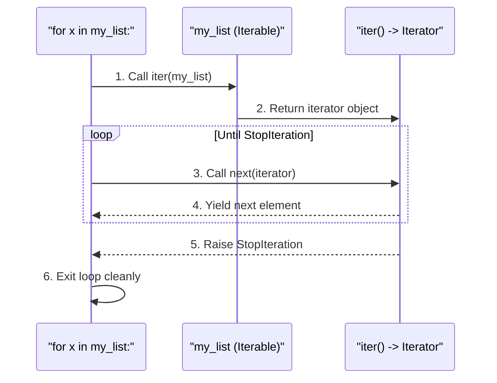

```python
from typing import Iterator, List

# Demystifying the for-loop's internal protocol
my_list: List[str] = ["a", "b", "c"]

# 1. Get an iterator from the iterable
list_iter: Iterator[str] = iter(my_list)  # calls my_list.__iter__()

# 2. Manually call next() - this is what for-loops do internally
print(next(list_iter))  # Output: a
print(next(list_iter))  # Output: b
print(next(list_iter))  # Output: c
# print(next(list_iter))  # ❌ StopIteration exception would be raised

# A for-loop handles all of this (and the StopIteration) gracefully:
print("\nStandard for-loop:")
for item in my_list:
    print(f"  {item}")
```

💡 **Key Insight:** This protocol means you can make **your own custom objects iterable** by implementing `__iter__()` and `__next__()`. It also means generator functions and expressions seamlessly plug into the `for` loop ecosystem.

---

## Part V: Functions & Generators

Functions are the fundamental building blocks of reusable, organized code. They encapsulate logic, eliminate repetition, and make programs modular and testable. If Part IV taught you the _verbs_ of Python, Part V teaches you how to package those verbs into powerful, reusable _actions_. Let's master the art of writing elegant, efficient functions.

### Function Basics

A **function** is a named block of code designed to perform one specific, well-defined task. You define a function once and can call it as many times as needed throughout your program.

**Anatomy of a Function:**

- **`def` keyword:** Signals the start of a function definition.
- **Function name:** Should be descriptive and follow `snake_case` convention.
- **Parameters:** (Optional) Variables listed in parentheses that receive input values.
- **Colon `:`:** Marks the end of the function header.
- **Docstring:** (Optional but recommended) A triple-quoted string describing what the function does.
- **Body:** Indented block containing the function's logic.
- **`return` statement:** (Optional) Sends a result back to the caller.

```python
from typing import Union

def greet(name: str, greeting: str = "Hello") -> str:
    """
    Generates a personalized greeting message.

    Args:
        name: The name of the person to greet.
        greeting: The greeting word to use (defaults to 'Hello').

    Returns:
        A formatted greeting string combining the greeting and name.
    """
    return f"{greeting}, {name}!"

# Calling (executing) the function
message: str = greet("Alice")
print(message)  # Output: Hello, Alice!

message_custom: str = greet("Bob", greeting="Good morning")
print(message_custom)  # Output: Good morning, Bob!

# Functions are first-class objects: you can assign them to variables
greeter_function = greet
print(greeter_function("Charlie"))  # Output: Hello, Charlie!
```

---

### Default and Keyword Arguments

Python provides flexible, powerful ways to pass arguments to functions.

- **Positional Arguments:** Passed in the order they appear in the definition. Order matters.
- **Keyword Arguments:** Passed with `name=value` syntax. Order doesn't matter; they are matched by name. They make calls self-documenting.
- **Default Values:** Parameters can have default values. If the caller omits that argument, the default is used. This makes parameters optional.

```python
from typing import Optional

# A function with a mix of parameter types
def create_user(name: str, age: int, city: str = "Unknown", is_admin: bool = False) -> dict:
    """Creates a user dictionary. 'city' and 'is_admin' are optional."""
    return {
        "name": name,
        "age": age,
        "city": city,
        "is_admin": is_admin,
    }

# Positional arguments (order matters)
user1: dict = create_user("Alice", 30)
print(user1)  # {'name': 'Alice', 'age': 30, 'city': 'Unknown', 'is_admin': False}

# Keyword arguments (order doesn't matter, more readable)
user2: dict = create_user(age=25, name="Bob", is_admin=True, city="New York")
print(user2)  # {'name': 'Bob', 'age': 25, 'city': 'New York', 'is_admin': True}

# Mixing: Positional must come before keyword arguments
user3: dict = create_user("Charlie", 35, is_admin=True)
print(user3)  # {'name': 'Charlie', 'age': 35, 'city': 'Unknown', 'is_admin': True}
```

⚠️ **Critical Pitfall: Mutable Default Arguments**
Default values are evaluated **only once** when the function is _defined_, not each time the function is _called_. This means a mutable default (like `[]` or `{}`) is shared across all calls, causing subtle, hard-to-find bugs.

```python
from typing import List, Optional

# ❌ DANGEROUS: Mutable default argument
# def add_item_bad(item: str, target_list: List[str] = []) -> List[str]:
#     target_list.append(item)  # Mutates the SAME list across all calls!
#     return target_list

# ✅ SAFE PATTERN: Use None as default, create mutable object inside
def add_item(item: str, target_list: Optional[List[str]] = None) -> List[str]:
    """
    Adds an item to a list. Creates a new list if none is provided.
    """
    if target_list is None:
        target_list = []  # Fresh list created on every call
    target_list.append(item)
    return target_list

list1: List[str] = add_item("apple")
list2: List[str] = add_item("banana")
print(f"List 1: {list1}")  # Output: ['apple']
print(f"List 2: {list2}")  # Output: ['banana'] (separate lists!)
```

---

### Understanding return

The `return` statement serves two purposes:

1.  It specifies the **value to send back** to the caller.
2.  It **immediately terminates** the function's execution. Any code after a `return` is unreachable.

A function without an explicit `return` statement (or one that just uses `return` with no value) implicitly returns `None`.

- **Multiple Return Values:** Returning multiple comma-separated values actually packs them into a single `tuple`. The caller can unpack this tuple.
- **Early Returns:** Using `return` early in a function for guard clauses or edge cases makes code cleaner by reducing nesting.

```python
from typing import Tuple, Optional

def safe_divide(a: float, b: float) -> Optional[float]:
    """Divides a by b. Returns None for division by zero."""
    if b == 0:
        print("Error: Division by zero is not allowed.")
        return None  # Early return as a guard clause
    return a / b

result1: Optional[float] = safe_divide(10, 2)
result2: Optional[float] = safe_divide(10, 0)
print(f"10 / 2 = {result1}")  # Output: 10 / 2 = 5.0
print(f"10 / 0 = {result2}")  # Output: 10 / 0 = None

# Multiple return values (packed into a tuple)
def min_max(numbers: List[int]) -> Tuple[int, int]:
    """Returns both the minimum and maximum of a list as a tuple."""
    return min(numbers), max(numbers)

lowest: int
highest: int
lowest, highest = min_max([3, 1, 4, 1, 5, 9])
print(f"Min: {lowest}, Max: {highest}")  # Output: Min: 1, Max: 9
```

---

### Arguments

Python's function arguments are remarkably flexible. Here is a comprehensive overview of all the ways you can define parameters.

**Parameter Types (in order of definition):**

1.  **Positional-only** (Python 3.8+): Before a `/`. Must be passed by position.
2.  **Standard (Positional-or-Keyword):** The default. Can be passed by position or keyword.
3.  **`*args` (Variadic Positional):** Collects any extra positional arguments into a tuple.
4.  **Keyword-only:** After `*` or `*args`. Must be passed by keyword.
5.  **`**kwargs` (Variadic Keyword):\*\* Collects any extra keyword arguments into a dictionary.

```python
from typing import Any

def create_profile(
    name: str,           # Standard (positional or keyword)
    age: int,            # Standard
    *hobbies: str,       # *args: collects extra positionals into a tuple
    city: str = "Unknown",  # Keyword-only (because it's after *hobbies)
    **metadata: Any      # **kwargs: collects extra keywords into a dict
) -> dict:
    """
    Creates a user profile with required, variadic, and keyword arguments.
    """
    profile = {
        "name": name,
        "age": age,
        "hobbies": list(hobbies),
        "city": city,
        "metadata": metadata,
    }
    return profile

# Usage demonstration
profile1: dict = create_profile("Alice", 30, "reading", "hiking", city="Paris", premium=True)
print(profile1)
# Output:
# {
#     'name': 'Alice', 'age': 30,
#     'hobbies': ['reading', 'hiking'],
#     'city': 'Paris',
#     'metadata': {'premium': True}
# }

# ⚠️ After *hobbies, city MUST be passed as a keyword:
# profile2 = create_profile("Bob", 25, "gaming", "London")  # ❌ TypeError!
```

**Summary Table of Argument Types:**

| Parameter Syntax | Example            | How to Pass                         |
| :--------------- | :----------------- | :---------------------------------- |
| Standard         | `def f(a, b):`     | By position or keyword              |
| Default          | `def f(a, b=10):`  | Optional; by position or keyword    |
| `*args`          | `def f(*args):`    | Any extra positional args collected |
| Keyword-only     | `def f(*, a):`     | Must use `a=value` syntax           |
| `**kwargs`       | `def f(**kwargs):` | Any extra keyword args collected    |
| Positional-only  | `def f(a, /):`     | Must pass by position only          |

---

### Scopes

When you use a variable name inside a function, Python resolves it using the **LEGB rule** (covered in Part II). Let's focus on the practical implications: **reading** vs. **assigning** variables across scopes.

- **Reading a global variable** from inside a function: This works fine. Python finds it in the Global scope.
- **Assigning to a variable** inside a function: By default, this **creates a new local variable**, even if a global variable with the same name exists. This is the classic "shadowing" behavior.
- **Modifying a global variable:** You must explicitly declare it `global` before assignment.
- **Modifying an enclosing variable (in closures):** Use the `nonlocal` keyword (Python 3+).

```python
from typing import List

# Global variable
count: int = 100
tracker: List[str] = ["global_tracker"]

def demonstrate_scope(value: int) -> None:
    """Demonstrates reading, shadowing, and modifying global variables."""

    # Reading the global: Works fine
    print(f"Inside function, count is: {count}")

    # ⚠️ Shadowing: This CREATES a new LOCAL variable named 'count'
    # It does NOT modify the global 'count' unless declared global
    local_count: int = 42

    # Modifying a MUTABLE global object: Works without 'global'
    # (We're mutating the list, not reassigning the variable 'tracker')
    tracker.append(f"updated_by_{value}")

    print(f"Local count is: {local_count}")

demonstrate_scope(5)
print(f"Global count after call: {count}")  # Still 100 (unchanged)
print(f"Tracker: {tracker}")                # ['global_tracker', 'updated_by_5']

# To modify an IMMUTABLE global, you MUST use 'global':
def reset_count() -> None:
    global count
    count = 0

reset_count()
print(f"Global count after reset: {count}")  # 0
```

---

### Unpacking Function Arguments

Python provides the `*` and `**` operators to unpack sequences and mappings directly into function arguments at the call site. This is an elegant, powerful pattern.

- **`*iterable`:** Unpacks a list, tuple, or any iterable into **positional arguments**.
- **`**dictionary`:** Unpacks a dictionary into **keyword arguments\*\*, where keys must match parameter names.

```python
from typing import List, Dict, Any

def describe_person(name: str, age: int, city: str) -> str:
    """Formats a description of a person."""
    return f"{name} is {age} years old and lives in {city}."

# --- Unpacking a list/tuple with * ---
user_data: List[Any] = ["Diana", 30, "London"]
# Without unpacking: describe_person(user_data[0], user_data[1], user_data[2])
# With unpacking: Clean and concise!
description: str = describe_person(*user_data)
print(description)  # Output: Diana is 30 years old and lives in London.

# --- Unpacking a dictionary with ** ---
user_dict: Dict[str, Any] = {"name": "Eve", "age": 25, "city": "Paris"}
description_dict: str = describe_person(**user_dict)
print(description_dict)  # Output: Eve is 25 years old and lives in Paris.

# --- The * operator in function definitions (the reverse) ---
# def func(*args):  # Collects positional arguments into a tuple
# def func(**kwargs): # Collects keyword arguments into a dictionary
```

---

### Naming Conventions

Consistent naming is vital for readable, maintainable code. Revisiting and reinforcing PEP 8 for functions:

| Element                 | Convention                       | Example                                      |
| :---------------------- | :------------------------------- | :------------------------------------------- |
| **Functions**           | `snake_case`                     | `calculate_total()`                          |
| **Methods**             | `snake_case` (same as functions) | `cart.add_item()`                            |
| **Parameters**          | `snake_case`                     | `user_id`, `max_retries`                     |
| **Private Helpers**     | Leading underscore `_`           | `_internal_cache()`                          |
| **Verb Choice**         | Action-oriented verbs            | `get_user()`, `build_report()`, `is_valid()` |
| **Predicate Functions** | `is_`, `has_`, `can_` prefix     | `is_authenticated()`, `has_permission()`     |

```python
from typing import List, Optional

# ✅ Good function names: clear, verb-first, snake_case
def get_active_users(user_list: List[str]) -> List[str]:
    """Filters and returns only active users."""
    pass

def is_admin(user_id: int) -> bool:
    """Checks if a user has administrative privileges."""
    return False

# ✅ Private helper function (not part of the public API)
def _log_to_file(message: str) -> None:
    """Internal helper to write a log entry."""
    print(f"[LOG] {message}")

# ❌ Bad function names
# def f(x): ...           # Too vague
# def getUserList(): ...  # Not snake_case
```

---

### Nested Functions

Python allows you to define a function **inside** another function. This is called a **nested function** or **inner function**. Key characteristics:

- **Encapsulation:** The inner function is only accessible within the scope of the outer function. This is great for helper logic.
- **Closure Access:** The inner function can read variables from the enclosing (outer) function's scope.
- **Factory Pattern:** The outer function can return the inner function, creating a **closure** that "remembers" the enclosing state.

```python
from typing import Callable

def make_multiplier(factor: int) -> Callable[[int], int]:
    """
    Returns a new function that multiplies its input by a fixed factor.
    This is a factory function. The returned function is a closure.
    """
    # This inner function 'remembers' the 'factor' from the enclosing scope
    def multiplier(number: int) -> int:
        print(f"Multiplying {number} by stored factor {factor}")
        return number * factor

    return multiplier  # Return the inner function itself!

# Create specific multiplier functions
double: Callable[[int], int] = make_multiplier(2)
triple: Callable[[int], int] = make_multiplier(3)

print(double(5))  # Output: Multiplying 5 by stored factor 2 \n 10
print(triple(5))  # Output: Multiplying 5 by stored factor 3 \n 15
```

---

### Passing Functions As Arguments

Because functions are **first-class objects** in Python, you can pass them as arguments to other functions. This enables powerful functional programming patterns like callbacks, strategy injection, and higher-order functions.

A **higher-order function** is a function that either takes a function as an argument, returns a function, or both.

```python
from typing import Callable, List

# A function that takes another function as a parameter
def apply_operation(numbers: List[int], operation: Callable[[int], int]) -> List[int]:
    """
    Applies a given operation to every number in the list.
    'operation' is a function that takes an int and returns an int.
    """
    return [operation(num) for num in numbers]

# Simple operations to pass in
def square(x: int) -> int:
    return x * x

def double(x: int) -> int:
    return x * 2

data: List[int] = [1, 2, 3, 4]

# Passing named functions as arguments
squares: List[int] = apply_operation(data, square)
doubles: List[int] = apply_operation(data, double)

print(f"Squares: {squares}")  # Output: [1, 4, 9, 16]
print(f"Doubles: {doubles}")  # Output: [2, 4, 6, 8]

# Built-in higher-order function: sorted() with a key function
words: List[str] = ["banana", "apple", "cherry", "date"]
sorted_by_length: List[str] = sorted(words, key=len)
print(f"Sorted by length: {sorted_by_length}")  # ['date', 'apple', 'banana', 'cherry']
```

---

### Anonymous Functions & Lambda Functions

**Lambda functions** are small, anonymous functions defined with the `lambda` keyword. They are restricted to a single expression and implicitly return its result.

- **Syntax:** `lambda arguments: expression`
- **Use Cases:** Perfect for short, throwaway operations, especially as arguments to functions like `sorted()`, `map()`, and `filter()`.
- **Limit:** If your lambda spans multiple lines or contains complex logic, use a proper `def` function instead. Readability matters more than brevity.

```python
from typing import List, Tuple, Callable

# Standard function
def add_standard(a: int, b: int) -> int:
    return a + b

# Equivalent lambda
add_lambda: Callable[[int, int], int] = lambda a, b: a + b

print(f"Standard: {add_standard(3, 5)}")  # Output: 8
print(f"Lambda: {add_lambda(3, 5)}")     # Output: 8

# Most common use: Sorting with a key function
users: List[Tuple[str, int]] = [("Alice", 35), ("Bob", 25), ("Charlie", 40)]

# Sort by age (the second element) using a lambda
sorted_by_age: List[Tuple[str, int]] = sorted(users, key=lambda user: user[1])
print(f"Sorted by age: {sorted_by_age}")
# Output: [('Bob', 25), ('Alice', 35), ('Charlie', 40)]

# Lambda in-line as argument: No need to name it
data: List[int] = [1, 2, 3, 4, 5]
even_numbers: List[int] = list(filter(lambda x: x % 2 == 0, data))
print(f"Evens: {even_numbers}")  # Output: [2, 4]
```

---

### map(), filter(), and reduce()

These are classic functional programming tools. While list comprehensions and generator expressions are often more Pythonic and readable, these functions are worth knowing, especially when working with existing codebases.

- **`map(func, iterable)`:** Applies `func` to every item and returns a lazy `map` iterator.
- **`filter(func, iterable)`:** Keeps only items where `func` returns `True`. Returns a lazy `filter` iterator.
- **`reduce(func, iterable[, initial])`:** Cumulatively applies a two-argument function, reducing the iterable to a single value. Housed in `functools`.

```python
from functools import reduce
from typing import List, Iterator

numbers: List[int] = [1, 2, 3, 4, 5]

# map: Double each number
doubled: Iterator[int] = map(lambda x: x * 2, numbers)
print(f"map doubled: {list(doubled)}")  # Output: [2, 4, 6, 8, 10]

# filter: Keep only even numbers
evens: Iterator[int] = filter(lambda x: x % 2 == 0, numbers)
print(f"filter evens: {list(evens)}")  # Output: [2, 4]

# reduce: Sum all numbers
total: int = reduce(lambda acc, x: acc + x, numbers)
print(f"reduce sum: {total}")  # Output: 15

# reduce with an initial value
total_with_initial: int = reduce(lambda acc, x: acc + x, numbers, 10)
print(f"reduce sum with initial 10: {total_with_initial}")  # Output: 25

# 💡 In modern Python, comprehensions are often preferred:
# doubled = [x * 2 for x in numbers]
# evens = [x for x in numbers if x % 2 == 0]
```

---

### Functions That Take a Variable Number of Arguments

Earlier we saw `*args` and `**kwargs` used to **define** functions that accept variable arguments. This section revisits them with a focus on the caller's perspective and practical usage.

**Defining Variadic Functions:**

- `*args`: Collects extra **positional** arguments into a `tuple`.
- `**kwargs`: Collects extra **keyword** arguments into a `dict`.

These are conventions; the names `args` and `kwargs` are just tradition. The magic is in the `*` and `**` operators.

```python
from typing import Any

def log_message(level: str, message: str, *tags: str, **metadata: Any) -> None:
    """
    Logs a formatted message with optional tags and metadata.

    Args:
        level: Log level (e.g., 'INFO', 'ERROR')
        message: The main log message
        *tags: Zero or more string tags
        **metadata: Arbitrary key-value metadata
    """
    tag_str: str = f" [Tags: {', '.join(tags)}]" if tags else ""
    meta_str: str = f" [Meta: {metadata}]" if metadata else ""

    print(f"[{level.upper()}]{tag_str} {message}{meta_str}")

# Call with required arguments only
log_message("info", "Application started")
# Output: [INFO] Application started

# Call with extra tags and metadata
log_message("error", "Database connection failed", "critical", "db", retry_count=3, timeout=30)
# Output: [ERROR] [Tags: critical, db] Database connection failed [Meta: {'retry_count': 3, 'timeout': 30}]

# A practical example: a flexible sum function
def flexible_sum(*numbers: float) -> float:
    """Sums any number of numeric arguments."""
    return sum(numbers)

print(f"Sum of 1,2,3: {flexible_sum(1, 2, 3)}")      # 6.0
print(f"Sum of nothing: {flexible_sum()}")             # 0
print(f"Sum of many: {flexible_sum(10, 20, 30, 40)}") # 100.0
```

---

### Decorators

A **decorator** is a function that takes another function and extends its behavior without explicitly modifying its code. They are a form of **metaprogramming** and are denoted with the `@decorator_name` syntax.

**Why use decorators?**

- **Logging:** Automatically log when a function is called.
- **Timing:** Measure execution time.
- **Access Control:** Check permissions before running.
- **Caching:** Memoize function results.

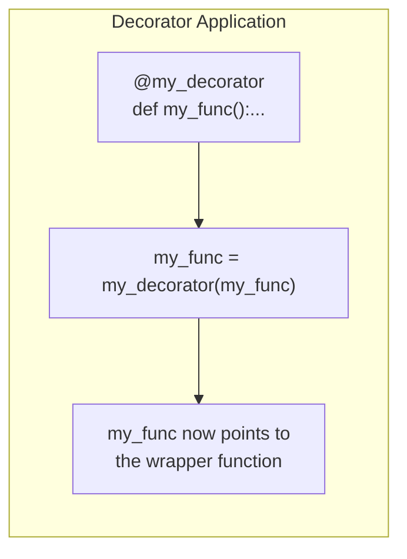

**1. Basic Decorator Structure:**

```python
import time
from typing import Callable, Any

def timer(func: Callable[..., Any]) -> Callable[..., Any]:
    """A decorator that prints the execution time of a function."""
    def wrapper(*args: Any, **kwargs: Any) -> Any:
        start_time: float = time.perf_counter()
        result: Any = func(*args, **kwargs)  # Call the original function
        end_time: float = time.perf_counter()
        print(f"  [{func.__name__}] took {end_time - start_time:.6f} seconds")
        return result
    return wrapper

# Using the decorator with @ syntax
@timer
def calculate_factorial(n: int) -> int:
    """Calculates factorial (intentionally slow for demo)."""
    result: int = 1
    for i in range(1, n + 1):
        result *= i
        time.sleep(0.001)  # Simulate work
    return result

print(f"Factorial of 10: {calculate_factorial(10)}")
# Output:
#   [calculate_factorial] took 0.011234 seconds
# Factorial of 10: 3628800
```

**2. Decorators with Arguments (Advanced):**
Sometimes you need to parameterize your decorator. This requires an extra layer of nesting.

```python
def repeat(num_times: int) -> Callable:
    """A decorator factory: returns a decorator that repeats function calls."""
    def decorator(func: Callable[..., Any]) -> Callable[..., Any]:
        def wrapper(*args: Any, **kwargs: Any) -> Any:
            result = None
            for _ in range(num_times):
                result = func(*args, **kwargs)
            return result
        return wrapper
    return decorator

@repeat(num_times=3)
def say_hello(name: str) -> str:
    print(f"Hello, {name}!")
    return f"Greeted {name}"

result: str = say_hello("World")
# Output: Hello, World! (printed 3 times)
print(f"Final result: {result}")  # Output: Greeted World
```

---

### Comprehensions and Generations

We've seen comprehensions as a concise way to build collections. Now let's consolidate the distinction between their eager and lazy variants.

- **List/Set/Dict Comprehension (Eager):** Executes immediately, creating the entire data structure in memory. Use `[]`, `{}`, or `{k:v}`.
- **Generator Expression (Lazy):** Uses `()`. Produces items one at a time on demand, without storing the entire sequence in memory. Crucial for processing huge data streams.
- **Generator Function (Lazy):** A function that uses `yield` instead of `return`. Each call to `yield` pauses the function, returns a value, and resumes execution from that point on the next call.


```python
from typing import Generator, Iterator, List
import sys

# ----- Eager vs Lazy -----
numbers: range = range(1_000_000)

# List comprehension: Creates the ENTIRE list in memory (uses lots of RAM)
squares_list: List[int] = [x**2 for x in numbers]
print(f"List memory: {sys.getsizeof(squares_list):,} bytes")  # ~8 million bytes

# Generator expression: Just a recipe, almost no memory used
squares_gen: Iterator[int] = (x**2 for x in numbers)
print(f"Generator size: {sys.getsizeof(squares_gen)} bytes")  # ~200 bytes

print(f"First from generator: {next(squares_gen)}")  # 0
print(f"Second from generator: {next(squares_gen)}") # 1

# ----- Generator Function with yield -----
def fibonacci(limit: int) -> Generator[int, None, None]:
    """Generates Fibonacci numbers up to the given limit."""
    a, b = 0, 1
    count: int = 0
    while count < limit:
        yield a  # Pause and return 'a', then wait for next call
        a, b = b, a + b
        count += 1
    # Function ends here; StopIteration is raised automatically

print("\nFirst 7 Fibonacci numbers:")
for num in fibonacci(7):
    print(num, end=" ")  # Output: 0 1 1 2 3 5 8
print()

# Generator functions are stateful: they remember where they paused
gen: Generator[int, None, None] = fibonacci(3)
print(next(gen))  # 0
print(next(gen))  # 1
print(next(gen))  # 1
# print(next(gen))  # ❌ StopIteration (limit reached)
```

💡 **When to use what:**

- **List Comprehension:** When you need the full list in memory for random access, multiple passes, or the data is small.
- **Generator Expression/Function:** When processing large streams, infinite sequences, or when you only need to iterate once. They are memory champions.

---

## Part VI: Modules & Packages

As your programs grow beyond a single file, you need ways to organize, reuse, and share code. **Modules** and **packages** are Python's answer to this. They let you split code into logical units, avoid naming conflicts, and tap into a vast ecosystem of third-party libraries. This section covers everything from creating your first module to understanding how Python finds and loads them.

### Libraries, Modules, and Packages: The Hierarchy

Before diving deep, let's clarify the terminology. These terms form a hierarchy of code organization:

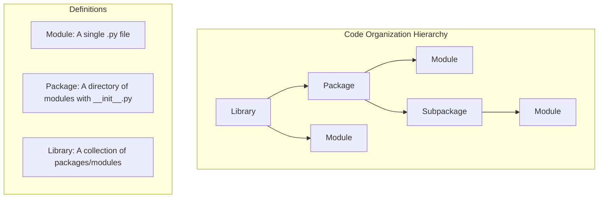

| Term        | Definition                                                               | Example                                 |
| :---------- | :----------------------------------------------------------------------- | :-------------------------------------- |
| **Module**  | A single `.py` file containing Python code.                              | `math_utils.py`                         |
| **Package** | A directory containing an `__init__.py` file and other modules/packages. | `my_package/`                           |
| **Library** | A generic term for a collection of related modules and packages.         | The Python Standard Library, `requests` |

---

### Modules: The Big Picture

Modules are Python's primary code organization tool. They serve several critical purposes:

- **Code Reuse:** Write a function once in a module, import it anywhere.
- **Namespace Management:** Each module has its own global namespace, preventing variable name collisions.
- **Logical Organization:** Group related functions, classes, and variables together.
- **Distribution:** Modules are the unit of sharing code with others.

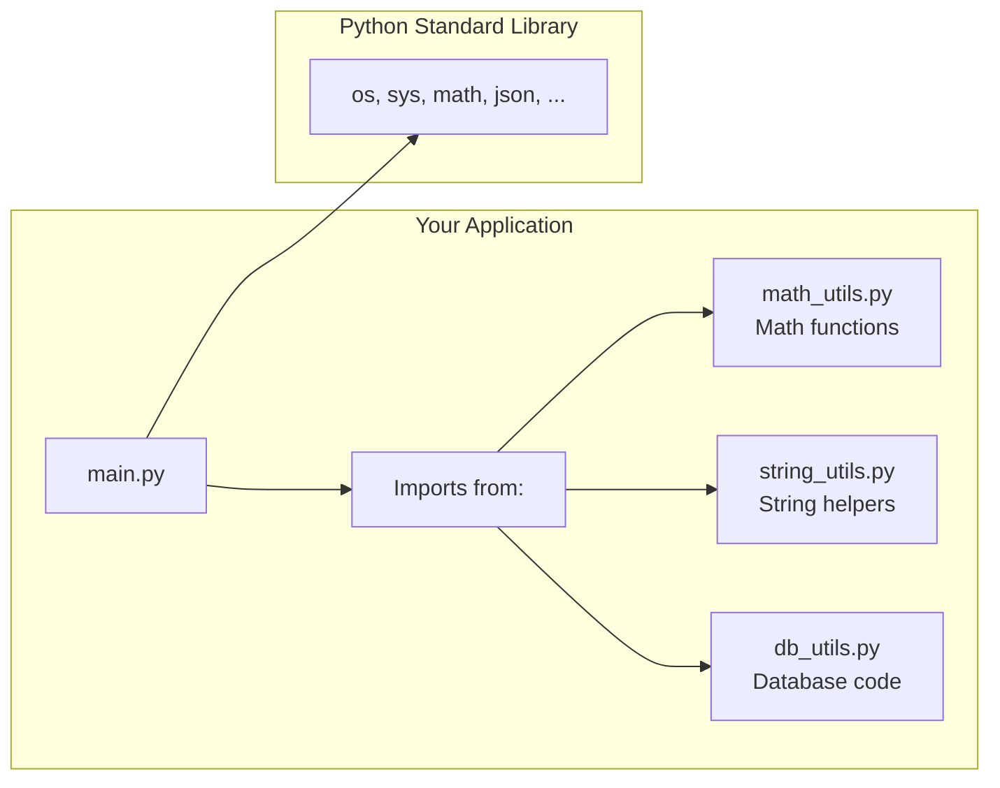

---

### What are Modules?

A **module** is simply a Python file (`.py`) containing definitions and statements. The file name becomes the module name (minus the `.py` extension). For example, a file named `calculator.py` is a module called `calculator`.

Any Python file you create is automatically a module. When you run a script, Python treats it as the top-level module `__main__`. When you import a file, Python loads it as a module with its filename as the module name.

---

### Module Coding Basics

Let's create and use a simple module to understand the fundamentals.

**Step 1: Create the module file**

```python
# File: greetings.py
"""
A simple module for generating greeting messages.

This module provides functions to create personalized greetings
in different formats and styles.
"""

# Module-level variable
DEFAULT_GREETING: str = "Hello"

def say_hello(name: str) -> str:
    """Generate a simple greeting."""
    return f"{DEFAULT_GREETING}, {name}!"

def say_goodbye(name: str) -> str:
    """Generate a farewell message."""
    return f"Goodbye, {name}. See you later!"

# Private helper (convention: leading underscore)
def _format_name(name: str) -> str:
    """Internal helper to capitalize names."""
    return name.strip().title()
```

**Step 2: Use the module in another file**

```python
# File: main.py
import greetings

# Access functions using dot notation
message1: str = greetings.say_hello("Alice")
message2: str = greetings.say_goodbye("Bob")

print(message1)  # Output: Hello, Alice!
print(message2)  # Output: Goodbye, Bob. See you later!

# Access module-level variables
print(f"Default greeting: {greetings.DEFAULT_GREETING}")  # Output: Default greeting: Hello
```

---

### Creating a Module

Creating a module is as simple as saving Python code in a `.py` file. However, well-crafted modules follow certain conventions:

```python
# File: data_validator.py
"""
Data validation utilities for user input.

This module provides reusable functions for validating
common data types: emails, phone numbers, and dates.

Usage:
    import data_validator
    is_valid: bool = data_validator.is_valid_email("user@example.com")
"""

import re
from typing import Optional, List

# Module-level constants
EMAIL_PATTERN: str = r'^[a-zA-Z0-9._%+-]+@[a-zA-Z0-9.-]+\.[a-zA-Z]{2,}$'
PHONE_PATTERN: str = r'^\d{10,11}$'

# Module-level variable (state)
_validation_errors: List[str] = []

def is_valid_email(email: str) -> bool:
    """Check if the email matches the expected pattern."""
    if re.match(EMAIL_PATTERN, email):
        return True
    _validation_errors.append(f"Invalid email: {email}")
    return False

def is_valid_phone(phone: str) -> bool:
    """Check if the phone number is exactly 10 or 11 digits."""
    if re.match(PHONE_PATTERN, phone):
        return True
    _validation_errors.append(f"Invalid phone: {phone}")
    return False

def get_errors() -> List[str]:
    """Return all accumulated validation errors."""
    return _validation_errors.copy()

def clear_errors() -> None:
    """Reset the error log."""
    _validation_errors.clear()
```

---

### Importing Modules

The `import` statement loads a module and makes its contents available. On first import, Python executes all the module's top-level code and creates a module object.

```python
# Basic import: loads the entire module
import math

# Access contents with dot notation
result: float = math.sqrt(25)
print(f"Square root of 25: {result}")  # Output: 5.0
```

**What happens during an import?**

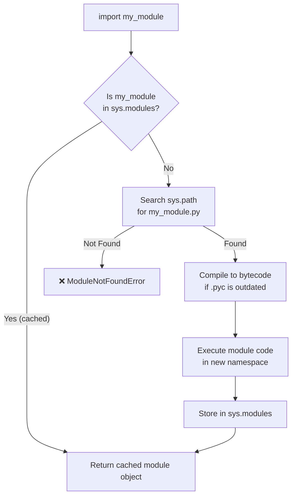

---

### Import Syntaxes

Python offers several import styles, each suited to different situations.

| Syntax                             | Description                    | When to Use                              |
| :--------------------------------- | :----------------------------- | :--------------------------------------- |
| `import module`                    | Imports entire module          | General use, maintains clear namespace   |
| `import module as alias`           | Imports with a short alias     | Long module names (`import numpy as np`) |
| `from module import name`          | Imports specific item(s)       | When you only need a few things          |
| `from module import name as alias` | Imports with alias             | Avoiding name conflicts                  |
| `from module import *`             | Imports everything (⚠️ avoid!) | Quick scripts only; pollutes namespace   |

```python
import math
import numpy as np
from datetime import datetime, timedelta
from collections import defaultdict as dd
from os.path import join, dirname

# Style 1: Module prefix (clearest origin)
result1: float = math.pi * 2

# Style 2: Aliased module
array = np.array([1, 2, 3])

# Style 3: Direct import (use sparingly)
now = datetime.now()

# Style 4: Aliased import (avoiding conflicts)
users = dd(list)

# ⚠️ Style 5: Wildcard (generally discouraged)
# from math import *  # Pollutes namespace with all math functions
```

---

### Module Packages

As your project grows, you'll want to organize related modules into directories. This is where **packages** come in.

### What are Packages?

A **package** is a directory that contains Python modules and a special `__init__.py` file (which can be empty). Packages can contain subpackages, creating a hierarchical namespace.

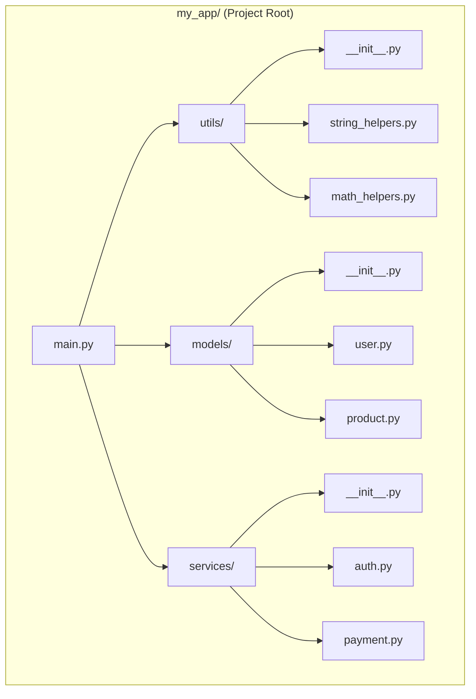

```python
# Directory structure:
# my_app/
# ├── main.py
# └── utils/
#     ├── __init__.py
#     ├── string_helpers.py
#     └── math_helpers.py

# File: utils/math_helpers.py
def add(a: int, b: int) -> int:
    return a + b

def multiply(a: int, b: int) -> int:
    return a * b

# File: main.py
# Import using dot notation for packages
import utils.math_helpers

result: int = utils.math_helpers.add(5, 3)
print(f"5 + 3 = {result}")  # Output: 5 + 3 = 8

# Alternative: from package.module import function
from utils.math_helpers import multiply
print(f"5 * 3 = {multiply(5, 3)}")  # Output: 5 * 3 = 15
```

---

### The `__init__.py` File

The `__init__.py` file serves three key purposes:

1.  **Package Marker:** Its presence tells Python that the directory is a package. (In Python 3.3+, it's technically optional for _namespace packages_, but including it is still best practice for regular packages.)
2.  **Initialization Code:** Any code in `__init__.py` runs when the package is first imported. Use it for package-level setup.
3.  **Controlling the Public API:** It defines what `from package import *` brings in.

```python
# File: utils/__init__.py
"""
Utility package for common helper functions.

This package aggregates string and math utilities
for convenient importing.
"""

# Package-level initialization
print("Initializing utils package...")

# Re-import key functions to make them available at package level
from utils.string_helpers import capitalize_words, truncate
from utils.math_helpers import add, multiply

# Control what 'from utils import *' exposes
__all__ = ["capitalize_words", "truncate", "add", "multiply"]

# Package version
__version__ = "1.0.0"
```

Now users can import from the package directly:

```python
# Shorter import path thanks to __init__.py re-exports
from utils import add, capitalize_words

print(add(10, 20))  # Output: 30
```

---

### Absolute vs Relative Imports

Within packages, you have two ways to reference other modules:

- **Absolute Imports:** Specify the complete path from the project root. Clear, readable, and **recommended** for most situations.
- **Relative Imports:** Use `.` and `..` to refer to modules relative to the current position. Useful for deeply nested packages that might be renamed.

```python
# Directory structure:
# my_package/
# ├── __init__.py
# ├── core.py
# └── sub/
#     ├── __init__.py
#     ├── helpers.py
#     └── utils.py

# File: my_package/sub/utils.py

# ── Absolute Import (Recommended) ──
# Clear origin, works anywhere
from my_package.core import CoreClass
from my_package.sub.helpers import helper_function

# ── Relative Imports ──
# .    = current directory (my_package/sub/)
# ..   = parent directory (my_package/)
# ...  = grandparent directory (project root/)

from .helpers import helper_function   # Same directory
from ..core import CoreClass           # One level up

# ⚠️ Relative imports only work inside packages,
# not in top-level scripts.
```

---

### Controlling Exports (`__all__`)

The `__all__` variable is a list of strings defining the module's **public API**. It controls what gets imported when someone uses `from module import *`.

```python
# File: data_processor.py
"""Data processing module with controlled public API."""

__all__ = ["process_data", "validate_input", "DataProcessor"]

# These are PUBLIC (listed in __all__)
def process_data(data: list) -> list:
    """Public: Process the input data."""
    return _clean(data)

class DataProcessor:
    """Public: Main processing class."""
    pass

def validate_input(data: list) -> bool:
    """Public: Validate input data."""
    return len(data) > 0 and _is_supported_format(data)

# These are PRIVATE (not in __all__, but still importable by name)
def _clean(data: list) -> list:
    """Internal helper: Clean up data."""
    return [item.strip() for item in data]

def _is_supported_format(data: list) -> bool:
    """Internal helper: Check data format."""
    return all(isinstance(item, str) for item in data)

# This is also private (not in __all__)
DEBUG_MODE: bool = False
```

```python
# Using the module:
from data_processor import *  # Only imports: process_data, validate_input, DataProcessor

# _clean, _is_supported_format, and DEBUG_MODE are NOT imported
# But can still be explicitly imported:
# from data_processor import _clean  # Works, but not recommended
```

---

### Advanced Module Topics

Now let's explore some deeper mechanics of how Python handles modules.

### The `__name__` Variable

Every module has a built-in `__name__` attribute:

- When the file is **run directly** (e.g., `python script.py`), `__name__` is set to `"__main__"`.
- When the file is **imported** as a module, `__name__` is set to the module's actual name.

This is the foundation of the famous `if __name__ == "__main__":` guard.

```python
# File: my_module.py
"""A module demonstrating the __name__ variable."""

def greet(name: str) -> str:
    return f"Hello, {name}!"

def main() -> None:
    """Main function: only runs when script is executed directly."""
    print("Running as main script!")
    print(greet("World"))

# This block runs ONLY when executed directly
if __name__ == "__main__":
    main()
else:
    # This runs when imported
    print(f"Module '{__name__}' has been imported.")
```

```bash
# Running directly:
$ python my_module.py
Running as main script!
Hello, World!

# Importing from another file:
>>> import my_module
Module 'my_module' has been imported.
>>> my_module.greet("Alice")
'Hello, Alice!'
```

---

### The `__pycache__` Folder

You may notice a `__pycache__` directory appearing when you run Python programs. This is Python's bytecode cache.

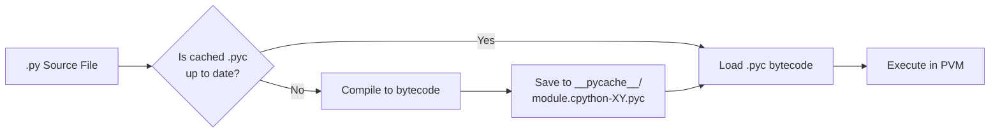

- **Purpose:** Speeds up subsequent imports by avoiding recompilation.
- **Location:** `__pycache__/` directory next to the `.py` file.
- **Naming:** `module.cpython-312.pyc` (includes Python version).
- **Automatic:** Python manages this entirely; you never need to touch it.
- **Git Ignore:** Add `__pycache__/` to your `.gitignore` file.

```bash
# Typical .gitignore entry
__pycache__/
*.pyc
*.pyo
```

---

### Module Search Path

When you `import` a module, Python searches for it in a specific order, defined by `sys.path`:

```python
import sys
from typing import List

paths: List[str] = sys.path
for i, path in enumerate(paths):
    print(f"{i}: {path}")
```

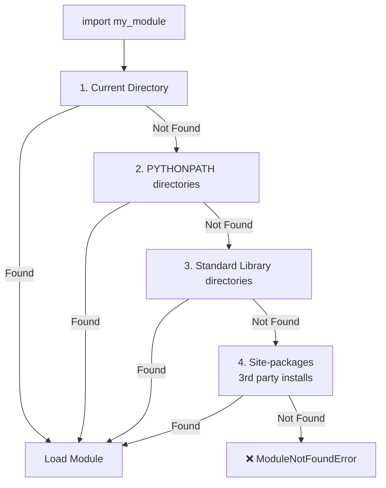

**Modifying the search path (when needed):**

```python
import sys
import os

# Add a custom directory to the search path
project_root: str = os.path.dirname(os.path.abspath(__file__))
custom_modules_path: str = os.path.join(project_root, "lib")
sys.path.insert(0, custom_modules_path)  # Insert at beginning for priority

# Now you can import modules from that directory
import my_custom_module
```

---

### Reloading Modules

Once imported, a module is cached in `sys.modules`. Subsequent imports reuse the cached version, which is efficient but means code changes aren't picked up. For interactive development, you can force a reload:

```python
import importlib
import my_module

# Make changes to my_module.py...

# Reload to pick up changes (useful in interactive sessions)
importlib.reload(my_module)

# ⚠️ Reloading has caveats:
# - Old instances of classes are NOT updated
# - Module-level state may not reset cleanly
# - Best used only in development/debugging
```

---

### Exploring the Standard Library

Python ships with a rich **standard library**—modules that come pre-installed with every Python distribution. These are battle-tested, well-documented, and cover many common tasks.

| Category        | Modules                                   | Purpose                        |
| :-------------- | :---------------------------------------- | :----------------------------- |
| **System**      | `os`, `sys`, `platform`                   | OS interaction, system info    |
| **File I/O**    | `pathlib`, `shutil`, `glob`               | File and directory operations  |
| **Data**        | `json`, `csv`, `sqlite3`, `pickle`        | Data serialization and storage |
| **Networking**  | `urllib`, `http`, `socket`, `email`       | Web and network communication  |
| **Time**        | `datetime`, `time`, `calendar`            | Date and time manipulation     |
| **Math**        | `math`, `statistics`, `random`, `decimal` | Mathematical operations        |
| **Development** | `unittest`, `logging`, `pdb`, `traceback` | Testing, debugging, logging    |
| **Concurrency** | `threading`, `multiprocessing`, `asyncio` | Parallel and async execution   |

```python
# Quick tour of useful standard library modules
from datetime import datetime, timedelta
from pathlib import Path
import json
import random

# datetime: Work with dates and times
today: datetime = datetime.now()
next_week: datetime = today + timedelta(days=7)
print(f"Today: {today:%B %d, %Y}")

# pathlib: Modern file path handling (Python 3.4+)
home: Path = Path.home()
config_file: Path = home / ".config" / "my_app" / "settings.json"
print(f"Config path: {config_file}")

# json: Serialize and deserialize data
data: dict = {"name": "Python", "version": "3.12"}
json_string: str = json.dumps(data, indent=2)
parsed: dict = json.loads(json_string)
print(f"JSON: {json_string}")

# random: Generate random values
random_number: int = random.randint(1, 100)
random_choice: str = random.choice(["apple", "banana", "cherry"])
print(f"Random number: {random_number}, Choice: {random_choice}")
```

---

### Module Docstrings

Just like functions and classes, modules benefit greatly from **docstrings**. Place a triple-quoted string at the very top of your module file (before any imports or code):

```python
"""
Data processing and analysis utilities.

This module provides functions for loading, cleaning, transforming,
and validating data from various sources. It is designed to be the
entry point for all data pipeline operations.

Typical usage:
    from data_tools import load_csv, clean_data

    raw_data = load_csv("data.csv")
    clean_data = clean_data(raw_data)

Available Functions:
    load_csv(filepath)      - Load data from a CSV file
    clean_data(data)        - Remove duplicates and normalize values
    transform_data(data)    - Apply standard transformations

Author: Your Name
Version: 2.1.0
Last Updated: 2024-11-15
"""

import csv
from typing import List, Dict, Any

# Module code follows...
```

The docstring is accessible via `help()` and the `__doc__` attribute:

```python
import data_tools
print(data_tools.__doc__)
help(data_tools)
```

---

### Using PyPI, the Python Package Index

[**PyPI**](https://pypi.org/) (the Python Package Index, pronounced "pie-pee-eye") is the official repository of third-party Python packages. With over 500,000 projects, it's one of the largest software repositories in the world. Whenever you need functionality that isn't in the standard library, PyPI is your first stop.

```mermaid
graph LR
    A[You: pip install requests] --> B[pip tool];
    B --> C[PyPI.org<br>Package Index];
    C --> D[Download package files];
    D --> E[Install into<br>site-packages/];
    E --> F["import requests<br>in your code"];
```

### Using pip, the Python Package Installer

`pip` is the standard package installer for Python. It connects to PyPI, downloads packages, resolves dependencies, and installs everything into your Python environment.

**Essential pip Commands:**

| Command                           | Description                                            |
| :-------------------------------- | :----------------------------------------------------- |
| `pip install <package>`           | Install a package                                      |
| `pip install <package>==1.2.3`    | Install a specific version                             |
| `pip install -r requirements.txt` | Install all packages listed in a file                  |
| `pip list`                        | List all installed packages                            |
| `pip show <package>`              | Show details about a package                           |
| `pip uninstall <package>`         | Remove a package                                       |
| `pip freeze > requirements.txt`   | Save current packages to a file                        |
| `pip install --upgrade <package>` | Upgrade a package to the latest version                |
| `pip check`                       | Verify installed packages have compatible dependencies |

```bash
# Common pip workflow
# 1. Install a package
pip install requests

# 2. Check what's installed
pip list
# Package    Version
# ---------- -------
# requests   2.31.0
# ...

# 3. Get details
pip show requests
# Name: requests
# Version: 2.31.0
# Summary: Python HTTP for Humans.
# ...

# 4. Save dependencies for your project
pip freeze > requirements.txt

# 5. Later, install from the requirements file
pip install -r requirements.txt

# 6. Uninstall if no longer needed
pip uninstall requests
```

**Virtual Environments (Critical Best Practice):**

Always use **virtual environments** to isolate project dependencies:

```bash
# Create a virtual environment
python -m venv my_project_env

# Activate it:
# macOS/Linux:
source my_project_env/bin/activate
# Windows:
my_project_env\Scripts\activate

# Now pip installs packages only in this environment
pip install requests

# Deactivate when done
deactivate
```

**Example `requirements.txt`:**

```
# requirements.txt - Project dependencies
requests>=2.28.0,<3.0.0
numpy==1.26.0
pandas~=2.1.0  # Compatible release: >=2.1.0, <2.2.0
flask
```

---

## Part VII: Object-Oriented Programming

Object-Oriented Programming (OOP) is a programming paradigm that organizes code around **objects**—self-contained entities that bundle data and behavior together. Python is a multi-paradigm language, and its OOP support is both powerful and pragmatic. This section takes you from class basics to advanced patterns, showing not just the syntax but the _why_ behind each concept.

### OOP: The Big Picture

Before diving into Python syntax, let's understand OOP as a design philosophy. At its heart, OOP models real-world entities as objects that have:

- **Attributes (State):** Data that describes the object (e.g., a car's color, speed, fuel level).
- **Methods (Behavior):** Functions that define what the object can do (e.g., accelerate, brake, refuel).
- **Identity:** Each object is a unique instance, even if it has the same attributes as another.

```mermaid
graph TD
    subgraph "Object-Oriented Thinking"
        A[Class: Blueprint/Template] --> B[Instance: Concrete Object]
        C[Attributes: What it HAS] --> B
        D[Methods: What it DOES] --> B
    end

    subgraph "Example: Car"
        E[Car Class] --> F[my_car: Car Instance]
        G[Attributes:<br>color='red'<br>speed=0<br>fuel=100] --> F
        H[Methods:<br>accelerate()<br>brake()<br>refuel()] --> F
    end
```

**Why Use OOP?**

- **Encapsulation:** Bundle related data and behavior together, hiding internal complexity.
- **Reusability:** Create classes once, instantiate them many times. Extend through inheritance.
- **Maintainability:** Well-designed objects are modular, testable, and easier to change.
- **Modeling Reality:** Maps naturally to how we think about the world—as interacting objects.

---

### What is OOP?

Object-Oriented Programming is built on four fundamental pillars:

| Pillar            | Definition                                                              | Python Implementation                                       |
| :---------------- | :---------------------------------------------------------------------- | :---------------------------------------------------------- |
| **Encapsulation** | Bundling data and methods; restricting direct access to internal state  | Naming conventions (`_protected`, `__private`), `@property` |
| **Inheritance**   | Creating new classes from existing ones; reusing and extending behavior | `class Child(Parent):` syntax, `super()`                    |
| **Polymorphism**  | Different classes responding to the same interface in their own way     | Duck typing, method overriding, ABCs                        |
| **Abstraction**   | Hiding complex implementation details; exposing only essential features | Abstract Base Classes, clean public APIs                    |

> 📖 For the official language reference on classes, see: [Python Classes Documentation](https://docs.python.org/3/tutorial/classes.html)

---

### Class Coding Basics

A **class** is a blueprint for creating objects. It defines the attributes and methods that its instances will have.

**Basic Syntax:**

```python
class ClassName:
    """Docstring describing the class."""

    # Class body: attributes and methods
    pass
```

**Key Rules:**

- Class names follow `PascalCase` (CapWords) convention.
- The class body is indented.
- A docstring immediately after the class header is good practice.

---

### Classes and Instances

Let's start with the simplest possible example to understand the distinction between a class and its instances.

- **Class:** The template or blueprint (`Dog`).
- **Instance:** A specific object created from that template (`my_dog`, `your_dog`).

```python
from typing import Any

class Dog:
    """A simple representation of a dog."""

    # A class attribute (shared by all instances)
    species: str = "Canis familiaris"

    def bark(self) -> str:
        """All dogs can bark."""
        return "Woof!"

# Creating instances (instantiation)
my_dog: Dog = Dog()
your_dog: Dog = Dog()

# Each instance is a distinct object
print(f"Are they the same object? {my_dog is your_dog}")  # Output: False
print(f"Same type? {type(my_dog) is type(your_dog)}")     # Output: True

# Accessing methods
print(my_dog.bark())    # Output: Woof!
print(your_dog.bark())  # Output: Woof!

# Accessing class attribute (shared)
print(my_dog.species)   # Output: Canis familiaris
```

**What is `self`?**
`self` refers to the **specific instance** on which a method is called. When you write `my_dog.bark()`, Python internally translates this to `Dog.bark(my_dog)`. The `self` parameter receives the instance automatically.

```mermaid
sequenceDiagram
    participant Code as "my_dog.bark()"
    participant Python as "Python Runtime"
    Code->>Python: Call bark() on my_dog
    Python->>Python: Look up Dog.bark
    Python->>Python: Pass my_dog as 'self'
    Python->>Python: Execute bark logic
    Python-->>Code: Return result
```

---

### Constructor & Instance Attributes

The `__init__` method is the **constructor** (more precisely, the initializer). It runs automatically when a new instance is created and sets up the instance's initial state.

**Instance attributes** are data specific to each object, defined inside `__init__` using `self.attribute_name`.

```python
from typing import List, Optional

class Student:
    """Represents a student with a name, ID, and courses."""

    def __init__(self, name: str, student_id: int) -> None:
        """
        Initialize a new Student instance.

        Args:
            name: The student's full name.
            student_id: The unique student identifier.
        """
        # Instance attributes: unique to each student
        self.name: str = name
        self.student_id: int = student_id
        self.courses: List[str] = []  # Start with an empty course list
        self.gpa: Optional[float] = None

    def enroll(self, course: str) -> None:
        """Enroll the student in a course."""
        self.courses.append(course)
        print(f"{self.name} enrolled in {course}.")

    def describe(self) -> str:
        """Return a description of the student."""
        course_count: int = len(self.courses)
        return f"Student {self.name} (ID: {self.student_id}) is taking {course_count} course(s)."

# Creating instances with different data
alice: Student = Student("Alice Johnson", 1001)
bob: Student = Student("Bob Smith", 1002)

# Each instance has its own attributes
alice.enroll("Python Programming")
alice.enroll("Data Structures")
bob.enroll("Calculus")

print(alice.describe())
# Output: Student Alice Johnson (ID: 1001) is taking 2 course(s).
print(bob.describe())
# Output: Student Bob Smith (ID: 1002) is taking 1 course(s).
```

---

### Class Attributes

**Class attributes** are variables shared across _all_ instances of a class. They are defined directly in the class body, outside any method.

- **Use them for:** Constants, default values, shared counters, or configuration that applies to all instances.
- **Access them via:** `ClassName.attribute` or `self.attribute`.
- ⚠️ **Pitfall:** Modifying a class attribute through `self` creates an instance attribute that _shadows_ the class attribute.

```python
from typing import List

class BankAccount:
    """Represents a bank account."""

    # Class attributes
    bank_name: str = "PyBank International"
    interest_rate: float = 0.05  # 5%
    total_accounts: int = 0      # Shared counter

    def __init__(self, owner: str, initial_balance: float = 0.0) -> None:
        self.owner: str = owner
        self.balance: float = initial_balance
        # Increment the shared counter
        BankAccount.total_accounts += 1

    @classmethod
    def get_bank_info(cls) -> str:
        """Class method: returns bank information."""
        return f"Welcome to {cls.bank_name}. Current rate: {cls.interest_rate * 100}%"

# Accessing class attributes
print(BankAccount.bank_name)  # Output: PyBank International

# Creating accounts increments the shared counter
acc1: BankAccount = BankAccount("Alice", 1000.0)
acc2: BankAccount = BankAccount("Bob", 500.0)

print(f"Total accounts opened: {BankAccount.total_accounts}")  # Output: 2
print(BankAccount.get_bank_info())
```

---

### A More Realistic Example

Let's bring these concepts together with a more substantial example—a simple e-commerce system.

```python
from typing import List, Dict, Optional
from datetime import datetime

class Product:
    """Represents a product in the store."""

    def __init__(self, name: str, price: float, sku: str) -> None:
        self.name: str = name
        self.price: float = price
        self.sku: str = sku  # Stock Keeping Unit

    def __str__(self) -> str:
        return f"{self.name} (${self.price:.2f})"

class ShoppingCart:
    """Represents a shopping cart containing products."""

    max_items: int = 50  # Class attribute: cart limit

    def __init__(self, customer_name: str) -> None:
        self.customer_name: str = customer_name
        self.items: Dict[str, int] = {}  # sku -> quantity
        self.created_at: datetime = datetime.now()

    def add_item(self, product: Product, quantity: int = 1) -> bool:
        """Add a product to the cart. Returns False if cart is full."""
        current_total: int = sum(self.items.values())
        if current_total + quantity > self.max_items:
            print(f"Cannot add {quantity} items. Cart limit is {self.max_items}.")
            return False

        self.items[product.sku] = self.items.get(product.sku, 0) + quantity
        print(f"Added {quantity}x {product.name} to cart.")
        return True

    def total_items(self) -> int:
        """Return the total number of items in the cart."""
        return sum(self.items.values())

    def summary(self) -> str:
        return f"{self.customer_name}'s cart: {self.total_items()} items"

# Using the classes
laptop: Product = Product("Laptop Pro", 1299.99, "LP-001")
mouse: Product = Product("Wireless Mouse", 49.99, "WM-002")

cart: ShoppingCart = ShoppingCart("Alice")
cart.add_item(laptop)
cart.add_item(mouse, 2)

print(cart.summary())
# Output:
# Added 1x Laptop Pro to cart.
# Added 2x Wireless Mouse to cart.
# Alice's cart: 3 items
```

---

### Class Coding Details

Let's formalize the terminology and structure of Python classes.

```python
class MyClass(ParentClass):
    """
    Docstring: What this class represents.
    """

    # Class attributes (shared by all instances)
    class_attr: str = "shared value"

    def __init__(self, param1: int, param2: str) -> None:
        """
        Initializer/Constructor.
        Sets up instance attributes.
        """
        self.param1: int = param1      # Public instance attribute
        self._param2: str = param2     # Protected (convention)
        self.__secret: bool = False    # Private (name mangled)

    def instance_method(self) -> str:
        """Regular method: receives self (the instance)."""
        return f"param1 is {self.param1}"

    @classmethod
    def class_method(cls) -> str:
        """Class method: receives cls (the class)."""
        return f"Class attribute: {cls.class_attr}"

    @staticmethod
    def static_method(value: int) -> int:
        """Static method: no automatic self or cls."""
        return value * 2
```

| Term                   | Definition                             | Access Via                 |
| :--------------------- | :------------------------------------- | :------------------------- |
| **Class**              | A blueprint for creating objects       | `MyClass`                  |
| **Instance**           | A concrete object created from a class | `obj = MyClass(1, "a")`    |
| **Instance Attribute** | Data unique to each instance           | `self.name` inside methods |
| **Class Attribute**    | Data shared across all instances       | `MyClass.class_attr`       |
| **Instance Method**    | Behavior tied to an instance           | `obj.method()`             |
| **Class Method**       | Behavior tied to the class             | `MyClass.class_method()`   |
| **Static Method**      | Utility function in class namespace    | `MyClass.static_method()`  |

---

### Instance vs Class vs Static Methods

Understanding when to use each method type is crucial for clean class design.

| Method Type  | First Parameter       | When to Use                                                          | Decorator       |
| :----------- | :-------------------- | :------------------------------------------------------------------- | :-------------- |
| **Instance** | `self` (the instance) | Needs access to instance data                                        | (default)       |
| **Class**    | `cls` (the class)     | Needs access to class data; alternative constructors                 | `@classmethod`  |
| **Static**   | Nothing automatic     | Utility function related to the class; no instance/class data needed | `@staticmethod` |

```python
from typing import List
from datetime import date

class Person:
    """Demonstrates all three method types."""

    species: str = "Homo sapiens"  # Class attribute

    def __init__(self, name: str, birth_year: int) -> None:
        self.name: str = name
        self.birth_year: int = birth_year

    # ── Instance Method ──
    def calculate_age(self) -> int:
        """Uses instance data (birth_year)."""
        return date.today().year - self.birth_year

    # ── Class Method ──
    @classmethod
    def get_species(cls) -> str:
        """Uses class data (species)."""
        return cls.species

    @classmethod
    def from_birth_date_string(cls, info: str) -> "Person":
        """
        Alternative constructor.
        Parses a string like 'Alice-1990' into a Person.
        """
        name, year_str = info.split("-")
        return cls(name, int(year_str))

    # ── Static Method ──
    @staticmethod
    def is_adult_age(age: int) -> bool:
        """Utility function: no self or cls needed."""
        return age >= 18

# Using each method type
person: Person = Person("Alice", 1990)

# Instance method
print(f"Age: {person.calculate_age()}")  # Output: Age: 34 (varies by current year)

# Class method
print(f"Species: {Person.get_species()}")  # Output: Species: Homo sapiens

# Class method as alternative constructor
bob: Person = Person.from_birth_date_string("Bob-1985")
print(f"Bob's birth year: {bob.birth_year}")  # Output: Bob's birth year: 1985

# Static method
print(f"Is 20 an adult age? {Person.is_adult_age(20)}")  # Output: True
```

---

### Special Methods (Dunder Methods)

**Special methods** (also called "dunder" methods because of **d**ouble **under**scores) allow your classes to integrate with Python's built-in behaviors. When you define `__str__`, `__len__`, `__eq__`, etc., your objects can be printed, compared, iterated over, and more—just like built-in types.

```python
from typing import List, Any

class Book:
    """A book with special method implementations."""

    def __init__(self, title: str, author: str, pages: int, rating: float = 0.0) -> None:
        self.title: str = title
        self.author: str = author
        self.pages: int = pages
        self.rating: float = rating

    # ── String Representation ──
    def __str__(self) -> str:
        """User-friendly string: used by print() and str()."""
        return f"'{self.title}' by {self.author}"

    def __repr__(self) -> str:
        """Developer-friendly string: used in debugger, repr()."""
        return f"Book(title='{self.title}', author='{self.author}', pages={self.pages})"

    # ── Length ──
    def __len__(self) -> int:
        """Makes len(book) work."""
        return self.pages

    # ── Comparison ──
    def __eq__(self, other: object) -> bool:
        """Equality: book == other_book."""
        if not isinstance(other, Book):
            return NotImplemented
        return (self.title == other.title and
                self.author == other.author)

    def __lt__(self, other: "Book") -> bool:
        """Less than: book < other_book (by rating)."""
        return self.rating < other.rating

    # ── Container-like ──
    def __contains__(self, keyword: str) -> bool:
        """Supports: 'keyword' in book."""
        return keyword.lower() in self.title.lower()

# Using special methods
book1: Book = Book("Python Crash Course", "Eric Matthes", 544, 4.7)
book2: Book = Book("Automate the Boring Stuff", "Al Sweigart", 592, 4.5)
book3: Book = Book("Python Crash Course", "Eric Matthes", 544, 4.7)

# __str__ and __repr__
print(book1)          # Output: 'Python Crash Course' by Eric Matthes
print(repr(book1))    # Output: Book(title='Python Crash Course', author='Eric Matthes', pages=544)

# __len__
print(f"Pages: {len(book1)}")  # Output: Pages: 544

# __eq__ and __lt__
print(f"Same content? {book1 == book3}")   # Output: True
print(f"book1 < book2? {book1 < book2}")   # Output: False (4.7 > 4.5)

# __contains__
print(f"'Crash' in book1? {'Crash' in book1}")  # Output: True
```

---

### Operator Overloading

Operator overloading is a special case of special methods. By implementing specific dunder methods, you can define how operators like `+`, `-`, `*`, `[]`, and `()` behave with your custom objects.

| Operator    | Dunder Method                   | Example          |
| :---------- | :------------------------------ | :--------------- |
| `+`         | `__add__(self, other)`          | `a + b`          |
| `-`         | `__sub__(self, other)`          | `a - b`          |
| `*`         | `__mul__(self, other)`          | `a * b`          |
| `/`         | `__truediv__(self, other)`      | `a / b`          |
| `[]` (get)  | `__getitem__(self, key)`        | `a[key]`         |
| `[]` (set)  | `__setitem__(self, key, value)` | `a[key] = value` |
| `()`        | `__call__(self, *args)`         | `a()`            |
| `+` (right) | `__radd__(self, other)`         | `5 + a`          |

```python
from typing import List, Union

class Vector:
    """A 2D vector with operator overloading."""

    def __init__(self, x: float, y: float) -> None:
        self.x: float = x
        self.y: float = y

    def __repr__(self) -> str:
        return f"Vector({self.x}, {self.y})"

    # ── Arithmetic Operators ──
    def __add__(self, other: "Vector") -> "Vector":
        """Vector addition: v1 + v2."""
        return Vector(self.x + other.x, self.y + other.y)

    def __sub__(self, other: "Vector") -> "Vector":
        """Vector subtraction: v1 - v2."""
        return Vector(self.x - other.x, self.y - other.y)

    def __mul__(self, scalar: float) -> "Vector":
        """Scalar multiplication: v * 3."""
        return Vector(self.x * scalar, self.y * scalar)

    # Right multiplication for commutativity: 3 * v
    def __rmul__(self, scalar: float) -> "Vector":
        return self.__mul__(scalar)

    # ── Container-like ──
    def __getitem__(self, index: int) -> float:
        """Access coordinates by index: v[0], v[1]."""
        if index == 0:
            return self.x
        elif index == 1:
            return self.y
        raise IndexError("Vector index out of range (0 or 1 only)")

    # ── Callable ──
    def __call__(self) -> float:
        """Calling the vector returns its magnitude."""
        return (self.x ** 2 + self.y ** 2) ** 0.5

# Using overloaded operators
v1: Vector = Vector(3, 4)
v2: Vector = Vector(1, 2)

print(f"v1 + v2 = {v1 + v2}")     # Output: Vector(4, 6)
print(f"v1 - v2 = {v1 - v2}")     # Output: Vector(2, 2)
print(f"v1 * 2 = {v1 * 2}")       # Output: Vector(6, 8)
print(f"2 * v1 = {2 * v1}")       # Output: Vector(6, 8)  (via __rmul__)
print(f"v1[0] = {v1[0]}")         # Output: v1[0] = 3.0
print(f"Magnitude of v1: {v1()}") # Output: 5.0
```

---

### Private & Public Attributes

Python doesn't have true "private" attributes like Java or C++. Instead, it relies on **convention** and a lightweight mechanism called **name mangling**.

| Convention    | Syntax        | Meaning                                | Accessibility                 |
| :------------ | :------------ | :------------------------------------- | :---------------------------- |
| **Public**    | `self.name`   | Part of the public API                 | Accessible everywhere         |
| **Protected** | `self._name`  | Internal use; "touch at your own risk" | Accessible but discouraged    |
| **Private**   | `self.__name` | Name-mangled to `_ClassName__name`     | Harder to access accidentally |

```python
class Employee:
    """Demonstrates access levels."""

    def __init__(self, name: str, salary: float) -> None:
        self.name: str = name            # Public
        self._department: str = "General" # Protected (convention)
        self.__salary: float = salary    # Private (name mangled)

    def get_salary(self) -> float:
        """Public method to access private attribute."""
        return self.__salary

    def _internal_calculation(self) -> float:
        """Protected method: for internal/subclass use."""
        return self.__salary * 0.1

# Usage
emp: Employee = Employee("Alice", 75000.0)

# Public: Access freely
print(emp.name)  # Output: Alice

# Protected: Accessible but warned against
print(emp._department)  # Works, but IDE gives a warning

# Private: Name mangled but still accessible if you know how
# print(emp.__salary)           # ❌ AttributeError
# print(emp._Employee__salary)  # ⚠️ Works but DON'T do this!
print(emp.get_salary())         # ✅ Proper way: use public method
```

---

### Properties vs Attributes

**Properties** allow you to attach getter, setter, and deleter logic to what _looks_ like a simple attribute access. They let you start with simple attributes and add validation or computed behavior later without changing the public API.

```python
class Temperature:
    """Temperature with validated property."""

    def __init__(self, celsius: float) -> None:
        self._celsius: float = celsius  # Internal storage

    # ── Property: celsius ──
    @property
    def celsius(self) -> float:
        """Get the temperature in Celsius."""
        print("Getting celsius...")
        return self._celsius

    @celsius.setter
    def celsius(self, value: float) -> None:
        """Set Celsius with validation."""
        if value < -273.15:
            raise ValueError("Temperature cannot be below absolute zero (-273.15°C)")
        print(f"Setting celsius to {value}")
        self._celsius = value

    # ── Computed Property: fahrenheit ──
    @property
    def fahrenheit(self) -> float:
        """Get Fahrenheit (computed, no storage needed)."""
        return (self._celsius * 9/5) + 32

    @fahrenheit.setter
    def fahrenheit(self, value: float) -> None:
        """Set using Fahrenheit (converts to Celsius)."""
        self.celsius = (value - 32) * 5/9  # Uses the validated celsius setter!

# Using properties (looks like simple attribute access)
temp: Temperature = Temperature(25)
print(f"Celsius: {temp.celsius}°C")        # Output: Getting celsius... \n Celsius: 25°C
print(f"Fahrenheit: {temp.fahrenheit}°F")  # Output: Fahrenheit: 77.0°F

temp.celsius = 30  # Uses setter with validation
print(f"Updated: {temp.celsius}°C")        # Output: Setting celsius to 30 \n Updated: 30°C

# temp.celsius = -500  # ❌ ValueError: Temperature cannot be below absolute zero
```

---

### Designing with Classes

Good OOP design isn't just about syntax—it's about creating clear, maintainable structures. Here are key principles:

```mermaid
graph TD
    subgraph "SOLID Principles (Summarized for Python)"
        S[Single Responsibility<br>One class, one job]
        O[Open/Closed<br>Open for extension, closed for modification]
        L[Liskov Substitution<br>Subclass must be substitutable for base]
        I[Interface Segregation<br>Keep interfaces focused and small]
        D[Dependency Inversion<br>Depend on abstractions, not concretions]
    end
```

**Practical Design Tips:**

- Keep classes focused on a single responsibility.
- Prefer composition over inheritance where it makes sense.
- Use properties to maintain a clean public API.
- Write docstrings for classes and public methods.
- Follow naming conventions (`PascalCase` for classes, `snake_case` for methods/attributes).

---

### Inheritance

**Inheritance** allows a class to inherit attributes and methods from a parent (base) class, promoting code reuse and establishing hierarchical relationships.

```python
from typing import List, Optional

# ── Base Class ──
class Animal:
    """Base class for all animals."""

    def __init__(self, name: str, age: int) -> None:
        self.name: str = name
        self.age: int = age
        self._hunger_level: int = 50

    def eat(self, food_amount: int = 10) -> None:
        """Reduce hunger by eating."""
        self._hunger_level = max(0, self._hunger_level - food_amount)
        print(f"{self.name} ate. Hunger: {self._hunger_level}")

    def make_sound(self) -> str:
        """Generic sound (to be overridden)."""
        return "Some generic animal sound"

# ── Derived Classes ──
class Dog(Animal):
    """Dog class, inherits from Animal."""

    def __init__(self, name: str, age: int, breed: str) -> None:
        super().__init__(name, age)  # Call parent constructor
        self.breed: str = breed      # Dog-specific attribute

    def make_sound(self) -> str:
        """Override the parent method."""
        return "Woof!"

    def fetch(self) -> str:
        """Dog-specific method."""
        return f"{self.name} fetches the ball!"

class Cat(Animal):
    """Cat class, inherits from Animal."""

    def __init__(self, name: str, age: int, indoor_only: bool = True) -> None:
        super().__init__(name, age)
        self.indoor_only: bool = indoor_only

    def make_sound(self) -> str:
        return "Meow!"

# Using inheritance
dog: Dog = Dog("Buddy", 3, "Golden Retriever")
cat: Cat = Cat("Whiskers", 2)

# Inherited method
dog.eat(20)  # Output: Buddy ate. Hunger: 30

# Overridden method
print(f"Dog says: {dog.make_sound()}")  # Output: Dog says: Woof!
print(f"Cat says: {cat.make_sound()}")  # Output: Cat says: Meow!

# Dog-specific method
print(dog.fetch())  # Output: Buddy fetches the ball!

# isinstance checks
print(f"Dog is Animal? {isinstance(dog, Animal)}")  # True
print(f"Cat is Dog? {isinstance(cat, Dog)}")        # False
```

---

### super() and MRO

`super()` lets you call methods on a parent class without explicitly naming it. It works with the **Method Resolution Order (MRO)**—the order in which Python searches for methods in a class hierarchy.

```mermaid
graph TD
    subgraph "MRO for D(B, C) with A as Base"
        D --> B
        D --> C
        B --> A
        C --> A
    end
    subgraph "Search Order (D -> B -> C -> A -> object)"
        O1[D] --> O2[B] --> O3[C] --> O4[A] --> O5[object]
    end
```

```python
class A:
    def method(self) -> str:
        return "A.method"

class B(A):
    def method(self) -> str:
        return f"B.method -> {super().method()}"

class C(A):
    def method(self) -> str:
        return f"C.method -> {super().method()}"

class D(B, C):
    def method(self) -> str:
        return f"D.method -> {super().method()}"

# Check the MRO
print(f"MRO of D: {[cls.__name__ for cls in D.__mro__]}")
# Output: ['D', 'B', 'C', 'A', 'object']

d: D = D()
print(d.method())
# Output: D.method -> B.method -> C.method -> A.method
```

---

### Composition vs Inheritance

Both patterns let you reuse code, but they serve different purposes. The general guideline: **"Composition over Inheritance."**

| Pattern         | Relationship | When to Use                        |
| :-------------- | :----------- | :--------------------------------- |
| **Inheritance** | "IS-A"       | Clear hierarchical relationship    |
| **Composition** | "HAS-A"      | Using another class as a component |

```python
from typing import List

# ── Composition Example: Car HAS-A Engine ──
class Engine:
    """An engine component."""

    def __init__(self, horsepower: int, fuel_type: str) -> None:
        self.horsepower: int = horsepower
        self.fuel_type: str = fuel_type
        self.is_running: bool = False

    def start(self) -> str:
        self.is_running = True
        return "Engine started."

    def stop(self) -> str:
        self.is_running = False
        return "Engine stopped."

class Car:
    """A car COMPOSED OF an engine (composition)."""

    def __init__(self, make: str, model: str, engine: Engine) -> None:
        self.make: str = make
        self.model: str = model
        self.engine: Engine = engine  # Composition: Car HAS-A Engine

    def start(self) -> str:
        return f"{self.make} {self.model}: {self.engine.start()}"

    def stop(self) -> str:
        return f"{self.make} {self.model}: {self.engine.stop()}"

# The Engine can exist independently or be reused
v8_engine: Engine = Engine(400, "petrol")
electric_motor: Engine = Engine(300, "electric")

sports_car: Car = Car("Ferrari", "F8", v8_engine)
electric_car: Car = Car("Tesla", "Model 3", electric_motor)

print(sports_car.start())   # Output: Ferrari F8: Engine started.
print(electric_car.start()) # Output: Tesla Model 3: Engine started.
```

---

### Abstract Base Classes (ABC)

**Abstract Base Classes** define an **interface**—a contract that subclasses must fulfill. They can't be instantiated directly. Use them when you want to enforce that subclasses implement specific methods.

```python
from abc import ABC, abstractmethod
import math
from typing import List

class Shape(ABC):
    """Abstract base class for all shapes."""

    @abstractmethod
    def area(self) -> float:
        """Calculate the area. MUST be implemented by subclasses."""
        pass

    @abstractmethod
    def perimeter(self) -> float:
        """Calculate the perimeter. MUST be implemented by subclasses."""
        pass

    def describe(self) -> str:
        """Concrete method: works for all shapes."""
        return f"Shape with area={self.area():.2f}, perimeter={self.perimeter():.2f}"

class Circle(Shape):
    """Concrete implementation of Shape."""

    def __init__(self, radius: float) -> None:
        self.radius: float = radius

    def area(self) -> float:
        return math.pi * self.radius ** 2

    def perimeter(self) -> float:
        return 2 * math.pi * self.radius

class Rectangle(Shape):
    """Concrete implementation of Shape."""

    def __init__(self, width: float, height: float) -> None:
        self.width: float = width
        self.height: float = height

    def area(self) -> float:
        return self.width * self.height

    def perimeter(self) -> float:
        return 2 * (self.width + self.height)

# ❌ Cannot instantiate abstract class:
# shape = Shape()  # TypeError: Can't instantiate abstract class Shape

# ✅ Concrete classes work:
circle: Circle = Circle(5)
rect: Rectangle = Rectangle(4, 6)

print(circle.describe())
print(rect.describe())

# ✅ Abstract class as type hint:
def print_shape_info(shapes: List[Shape]) -> None:
    for shape in shapes:
        print(f"  {shape.describe()}")

print_shape_info([circle, rect])
```

---

### Dataclasses

Introduced in Python 3.7, `dataclasses` provide a decorator and functions for automatically adding special methods like `__init__`, `__repr__`, and `__eq__` to classes. They're perfect for classes that primarily hold data.

```python
from dataclasses import dataclass, field
from typing import List

@dataclass
class Point:
    """A 2D point dataclass."""
    x: float
    y: float

    def distance_from_origin(self) -> float:
        """Custom method alongside auto-generated ones."""
        return (self.x ** 2 + self.y ** 2) ** 0.5

@dataclass
class Student:
    """Student dataclass with defaults and mutable fields."""
    name: str
    age: int
    grades: List[float] = field(default_factory=list)  # Mutable default
    active: bool = True

    @property
    def average_grade(self) -> float:
        """Computed property from grades."""
        if not self.grades:
            return 0.0
        return sum(self.grades) / len(self.grades)

# Auto-generated __init__
p1: Point = Point(3, 4)
p2: Point = Point(3, 4)

# Auto-generated __repr__
print(p1)  # Output: Point(x=3, y=4)

# Auto-generated __eq__
print(f"p1 == p2? {p1 == p2}")  # Output: True

# Custom method
print(f"Distance: {p1.distance_from_origin()}")  # Output: 5.0

# Student with mutable default (each instance gets its OWN list)
s1: Student = Student("Alice", 20, [85, 92, 78])
s2: Student = Student("Bob", 22)  # Empty list from default_factory

s1.grades.append(95)
print(f"Alice's grades: {s1.grades}")  # [85, 92, 78, 95]
print(f"Bob's grades: {s2.grades}")    # [] (separate list!)
```

> 📖 More details: [Python Dataclasses Documentation](https://docs.python.org/3/library/dataclasses.html)

---

### Encapsulation and Polymorphism

These two pillars of OOP work beautifully together in Python.

**Encapsulation** hides internal implementation details and exposes a clean public API. In Python, this is achieved through conventions (`_protected`, `__private`) and properties.

**Polymorphism** lets different classes be treated uniformly through a common interface. Python achieves this through **duck typing** ("if it walks like a duck and quacks like a duck, it's a duck") and abstract base classes.

```python
from typing import List

# ── Polymorphism Example ──
class EmailNotifier:
    def send(self, message: str, recipient: str) -> str:
        return f"📧 Email to {recipient}: {message}"

class SMSNotifier:
    def send(self, message: str, recipient: str) -> str:
        return f"📱 SMS to {recipient}: {message}"

class PushNotifier:
    def send(self, message: str, recipient: str) -> str:
        return f"🔔 Push to {recipient}: {message}"

# Polymorphic function: works with ANY object that has a .send() method
def send_notification(notifier, message: str, recipient: str) -> str:
    """
    Send a notification using any notifier.
    Polymorphism: we don't care about the type, just the interface.
    """
    return notifier.send(message, recipient)

# All notifiers work the same way
email: EmailNotifier = EmailNotifier()
sms: SMSNotifier = SMSNotifier()
push: PushNotifier = PushNotifier()

print(send_notification(email, "Hello!", "alice@example.com"))
print(send_notification(sms, "Hello!", "+1234567890"))
print(send_notification(push, "Hello!", "device_123"))
```

---

### Advanced Class Topics

Here's a quick tour of more advanced OOP features available in Python.

**1. `__slots__` for Memory Optimization**
`__slots__` restricts the attributes an instance can have, reducing memory overhead when you create millions of instances.

```python
class RegularPoint:
    def __init__(self, x: float, y: float) -> None:
        self.x = x
        self.y = y

class SlottedPoint:
    __slots__ = ['x', 'y']  # No __dict__, saves memory

    def __init__(self, x: float, y: float) -> None:
        self.x = x
        self.y = y

# SlottedPoint uses ~45% less memory (significant at scale)
# But you can't dynamically add attributes:
p: SlottedPoint = SlottedPoint(1, 2)
# p.z = 3  # ❌ AttributeError: 'SlottedPoint' object has no attribute 'z'
```

**2. Metaclasses (Classes that Create Classes)**
Metaclasses are the "classes of classes." They control how classes are created. Most developers never need them directly.

```python
# A simple metaclass example
class SingletonMeta(type):
    """Metaclass that implements the Singleton pattern."""
    _instances: dict = {}

    def __call__(cls, *args, **kwargs):
        if cls not in cls._instances:
            cls._instances[cls] = super().__call__(*args, **kwargs)
        return cls._instances[cls]

class Database(metaclass=SingletonMeta):
    """A database connection that can only have one instance."""
    def __init__(self, connection_string: str = "default") -> None:
        self.connection_string: str = connection_string

# Both variables point to the SAME instance
db1: Database = Database("postgres://...")
db2: Database = Database("mysql://...")

print(f"Same instance? {db1 is db2}")                # Output: True
print(f"Connection: {db1.connection_string}")         # Still "postgres://..."
```

**3. `__new__` vs `__init__`**

- `__new__` is a static method that **creates** the instance (called first).
- `__init__` **initializes** the created instance (called second).

```python
class UpperCaseName:
    """Class that transforms names to uppercase using __new__."""

    def __new__(cls, name: str, *args, **kwargs):
        """Create the instance (runs before __init__)."""
        instance = super().__new__(cls)
        instance._original_name = name
        return instance

    def __init__(self, name: str) -> None:
        # __new__ already processed the name
        self.name: str = name.upper()

    @property
    def original_name(self) -> str:
        return self._original_name

obj: UpperCaseName = UpperCaseName("hello")
print(f"Name: {obj.name}")           # Output: Name: HELLO
print(f"Original: {obj.original_name}")  # Output: Original: hello
```

---

I have the information from both the `learn-go` repository (for style and structure) and the official Python documentation. I can now create Part VIII for you.

Based on my analysis of the `learn-go` repository, the style to replicate is:

- **Direct and concise:** Explanations get straight to the point.
- **Code-focused:** Every concept is immediately demonstrated with a code snippet, followed by its output.
- **Incremental:** Simple examples are built upon step-by-step.
- **Conversational:** The tone is friendly and accessible, like a tutor guiding you.
- **Well-structured:** Clear headings and short, focused sections.

Here is Part VIII, written following that `learn-go` style and structure.

---

## Part VIII: Error Handling & Debugging

In this part, we will learn how to make our Python programs more robust by handling errors gracefully and how to find and fix bugs effectively. Let's start by understanding what exceptions are.

### Exception Basics

An exception is an event that occurs during the execution of a program that disrupts the normal flow of instructions. Instead of crashing, we can write code to handle these events.

Think of it like a safety net for your code.

```python
# A simple example of an exception: division by zero
# numerator = 10
# denominator = 0
# result = numerator / denominator  # This will raise a ZeroDivisionError
```

We handle exceptions using `try` and `except` blocks.

```python
try:
    # Code that might cause an error
    result = 10 / 0
except ZeroDivisionError:
    # Code to run if a ZeroDivisionError occurs
    print("Error: You can't divide by zero!")
```

### Understanding Error Types

In Python, errors can be broadly classified into three main types.

- **Syntax Errors**: Mistakes in the language's grammar.
- **Runtime Errors (Exceptions)**: Errors that occur during program execution.
- **Logical Errors**: The program runs without crashing but produces an incorrect result.

#### Syntax Errors

Syntax errors occur when the parser detects a grammatically incorrect statement. The program will not run at all.

```python
# Example of a syntax error: missing colon
# if True
#     print("Hello")  # SyntaxError: expected ':'

# Another example: mismatched brackets
# print("Hello"  # SyntaxError: unexpected EOF while parsing
```

#### Runtime Errors (Exceptions)

These errors pop up while your program is running, even if the syntax is perfect. They happen due to various reasons like invalid input, missing files, or issues with resources.

Here are a few common examples:

```python
# NameError: Trying to use a variable that hasn't been defined
# print(unknown_variable)  # NameError: name 'unknown_variable' is not defined

# TypeError: Performing an operation on incompatible types
# result = "5" + 5  # TypeError: can only concatenate str (not "int") to str

# ValueError: A function gets an argument with the right type but an inappropriate value
# number = int("hello")  # ValueError: invalid literal for int() with base 10: 'hello'

# IndexError: Trying to access an index that doesn't exist in a list
# my_list = [1, 2, 3]
# item = my_list[5]  # IndexError: list index out of range

# KeyError: Trying to access a dictionary key that doesn't exist
# my_dict = {"name": "Go"}
# value = my_dict["age"]  # KeyError: 'age'

# FileNotFoundError: Trying to open a file that doesn't exist
# with open("nonexistent_file.txt", "r") as f:
#     content = f.read()  # FileNotFoundError: [Errno 2] No such file or directory
```

#### Logical Errors

Logical errors are the trickiest because the code runs without any errors but produces a wrong output. The problem is in your logic or algorithm.

```python
# A function to calculate the average of a list
def calculate_average(numbers):
    # Logical error: We're returning the sum, not the average
    total = 0
    for num in numbers:
        total += num
    return total # Should be: return total / len(numbers)

# This runs fine but gives the wrong answer
print(f"Result: {calculate_average([10, 20, 30])}")  # Output: 60 (Expected: 20)
```

### Finding Errors with the Debugger

A debugger is a tool that lets you pause your program, inspect variables, and step through code line by line. It's much more powerful than using `print()` statements.

Python has a built-in debugger called `pdb`, but you'll often use the visual debugger built into your IDE (like VS Code).

**A simple `pdb` example:**

```python
import pdb

def buggy_function(a, b):
    result = a / b
    pdb.set_trace()  # The program will pause here
    return result

# buggy_function(10, 2)
```

When the code hits `pdb.set_trace()`, you'll get an interactive prompt where you can type:

- `p a` (print the value of `a`)
- `n` (go to the next line)
- `c` (continue execution)
- `q` (quit)

> 📖 For more on the built-in debugger, see the official [pdb documentation](https://docs.python.org/3/library/pdb.html).

### Exception Coding Details

Now, let's go deeper into the structure of exception handling.

#### try, except, else, finally

The full exception handling flow can be seen with `try`, `except`, `else`, and `finally`.

```python
def process_file(filename):
    try:
        f = open(filename, "r")  # Try to open the file
    except FileNotFoundError:
        print(f"Error: The file '{filename}' was not found.")
    else:
        # Runs ONLY if no exception occurred in the try block
        content = f.read()
        print(f"File content: {content}")
        f.close()
    finally:
        # Runs ALWAYS, regardless of whether an exception occurred
        print("Finished file processing attempt.")

# process_file("my_file.txt")
# process_file("nonexistent.txt")
```

#### Handling Multiple Exceptions

You can handle different exceptions in different ways by having multiple `except` blocks.

```python
try:
    # Some code that might raise different errors
    value = int(input("Enter an integer: "))  # Could raise ValueError
    result = 10 / value                       # Could raise ZeroDivisionError
except ValueError:
    print("That's not a valid integer!")
except ZeroDivisionError:
    print("You can't divide by zero!")
except Exception as e:
    # A catch-all for any other kind of exception
    print(f"An unexpected error occurred: {e}")
```

#### The Exception Hierarchy

All built-in exceptions in Python are organized in a class hierarchy. `BaseException` is at the top, but user-defined exceptions and all built-in runtime errors inherit from `Exception`.

A simplified view looks like this:

```mermaid
graph TD
    BaseException --> SystemExit;
    BaseException --> KeyboardInterrupt;
    BaseException --> GeneratorExit;
    BaseException --> Exception;

    Exception --> ArithmeticError;
    ArithmeticError --> ZeroDivisionError;
    ArithmeticError --> OverflowError;

    Exception --> LookupError;
    LookupError --> IndexError;
    LookupError --> KeyError;

    Exception --> OSError;
    OSError --> FileNotFoundError;
    OSError --> PermissionError;

    Exception --> ValueError;
    Exception --> TypeError;
    Exception --> ImportError;
```

> 📖 You can explore the full hierarchy in the official Python [exception hierarchy docs](https://docs.python.org/3/library/exceptions.html#exception-hierarchy).

#### Exception Objects

When an exception is raised, an exception object is created. You can capture and inspect this object in an `except` block.

```python
try:
    result = 10 / 0
except ZeroDivisionError as e:
    print(f"Caught an exception: {e}")
    print(f"Type of exception: {type(e).__name__}")
```

#### Creating Custom Exceptions

You can create your own exception types by subclassing from Python's `Exception` class. This is useful for raising errors that are specific to your application.

```python
class InvalidWithdrawalError(Exception):
    """Custom exception for invalid bank withdrawals."""
    def __init__(self, balance, amount):
        self.balance = balance
        self.amount = amount
        super().__init__(f"Withdrawal of {amount} denied. Current balance is {balance}.")

def withdraw(balance, amount):
    if amount > balance:
        raise InvalidWithdrawalError(balance, amount)
    return balance - amount

# try:
#     new_balance = withdraw(100, 200)
# except InvalidWithdrawalError as e:
#     print(e)
```

### Raising Exceptions

You can manually raise an exception using the `raise` keyword. This is often used to signal that a certain condition in your program logic has been violated.

```python
def set_age(age):
    if age < 0:
        raise ValueError("Age cannot be negative.")
    print(f"Age set to {age}")

# set_age(-5)  # Will raise a ValueError
```

You can also re-raise an exception after catching it, perhaps to log the error and let a higher-level handler deal with it.

```python
try:
    result = 10 / 0
except ZeroDivisionError:
    print("Logging the division by zero error...")
    raise  # Re-raises the same ZeroDivisionError
```

### Designing with Exceptions

A common Pythonic design principle is **EAFP (Easier to Ask for Forgiveness than Permission)**. Instead of checking if an operation will succeed, you just attempt it and handle an exception if it fails. This contrasts with **LBYL (Look Before You Leap)**.

**EAFP (Pythonic way):**

```python
def get_value_from_dict(my_dict, key):
    try:
        return my_dict[key]
    except KeyError:
        return None

# data = {"name": "Go"}
# print(get_value_from_dict(data, "name"))
# print(get_value_from_dict(data, "age"))
```

**LBYL (Less Pythonic):**

```python
def get_value_from_dict_lbyl(my_dict, key):
    if key in my_dict:
        return my_dict[key]
    else:
        return None
```

### Assertions

An assertion is a sanity check that you can turn on or off when you are done testing your program. It uses the `assert` keyword. If the condition is `False`, it raises an `AssertionError`.

```python
def apply_discount(price, discount):
    final_price = price - discount
    # Let's assert that the final price should never be negative
    assert final_price >= 0, "Final price cannot be negative."
    return final_price

print(apply_discount(100, 20))
# print(apply_discount(100, 150))  # This will raise an AssertionError
```

Assertions are mainly for debugging and catching "impossible" conditions. Don't use them for handling expected runtime errors (like a missing file), as they can be globally disabled with the `-O` (optimize) flag.

### Logging for Debugging

The `logging` module is a powerful, structured way to track events in your application. It's far more flexible than scattering `print()` calls. You can set different severity levels for your messages.

```python
import logging

# Configure the logging format and level
logging.basicConfig(level=logging.DEBUG, format='%(asctime)s - %(levelname)s - %(message)s')

def perform_calculation(x, y):
    logging.debug(f"Starting calculation with x={x}, y={y}")
    if y == 0:
        logging.error("Division by zero attempted!")
        return None
    else:
        result = x / y
        logging.info(f"Calculation successful. Result: {result}")
        return result

perform_calculation(10, 5)
perform_calculation(5, 0)
```

The output will look something like this:

```
YYYY-MM-DD HH:MM:SS,SSS - DEBUG - Starting calculation with x=10, y=5
YYYY-MM-DD HH:MM:SS,SSS - INFO - Calculation successful. Result: 2.0
YYYY-MM-DD HH:MM:SS,SSS - DEBUG - Starting calculation with x=5, y=0
YYYY-MM-DD HH:MM:SS,SSS - ERROR - Division by zero attempted!
```

### Common Debugging Techniques

Here are a few practical strategies for when you're stuck on a bug.

1.  **Explain Your Code:** The "rubber duck" technique. Go line by line, explaining to an inanimate object exactly what your code should be doing. You'll often find the flaw in the process.
2.  **Simplify and Isolate:** If you have a complex function that's failing, try to write the smallest possible test case that reproduces the bug. Temporarily comment out other parts of your code.
3.  **Use a `breakpoint()`:** As discussed, stepping through your code with a debugger is the most direct way to see what's happening.
4.  **Inspect State:** Don't just guess what's in a variable. Use a debugger or a well-placed `print()` to be certain. For complex data structures, `from pprint import pprint; pprint(my_data)` makes output readable.

### Which Errors Should You Handle?

A key principle is to only handle exceptions you can meaningfully recover from. Catching every possible error silently can hide serious bugs.

- **✅ Do handle:**
  - `FileNotFoundError`: You might want to prompt for a new file.
  - `ValueError` / `TypeError` on user input: You can ask the user again.
  - Network errors like `ConnectionError`: You can implement a retry mechanism.

- **❌ Don't handle (usually):**
  - `IndexError` or `KeyError` in your own internal logic: This is often a bug in your algorithm that should be fixed, not silenced.
  - `SyntaxError`: Fix the code!
  - Errors where a clean recovery is impossible and it's safer to let the program crash and notify a developer.

_This is it for error handling and debugging. Writing code that fails gracefully and having the skills to fix it when it doesn't is what separates a confident programmer from a beginner._

## Part VIII: Error Handling & Debugging

No matter how skilled you become, errors are an inevitable part of programming. The mark of a professional developer isn't writing bug-free code—it's knowing how to anticipate, handle, and diagnose problems gracefully. This section covers Python's exception system, debugging strategies, and best practices for building resilient applications.

### Exception Basics

Let's start with a fundamental distinction that many tutorials gloss over.

**What is an Exception?**
An exception is an **event that disrupts the normal flow of a program**. When Python encounters a situation it can't handle, it _raises_ (throws) an exception. If unhandled, the program crashes with a traceback showing exactly where the error occurred and the call stack that led to it.

**Why Use Exception Handling?**

- **Graceful Degradation:** Instead of crashing, your program can display a friendly message, log the error for later analysis, or try an alternative approach.
- **Resource Cleanup:** Ensure files are closed, database connections are released, or temporary data is cleaned up, even when things go wrong.
- **Separation of Concerns:** Keep error-handling logic separate from your main business logic, making both cleaner and easier to maintain.

```mermaid
graph LR
    subgraph "Without Exception Handling"
        A[Start] --> B[Read File];
        B -- File doesn't exist --> C[💥 Crash with Traceback];
    end
    subgraph "With Exception Handling"
        D[Start] --> E[try: Read File];
        E -- File doesn't exist --> F[except FileNotFoundError];
        F --> G[Log error, show friendly message];
        G --> H[Continue gracefully];
    end
```

> 📖 For the official tutorial on errors and exceptions, see: [Python Errors and Exceptions Documentation](https://docs.python.org/3/tutorial/errors.html)

---

### Understanding Error Types

Before diving into exception handling, you need to recognize the three broad categories of errors you'll encounter in Python.

```mermaid
graph TD
    Errors[Python Errors] --> Syntax[Syntax Errors<br>Parsing errors];
    Errors --> Runtime[Runtime Errors<br>Exceptions];
    Errors --> Logical[Logical Errors<br>Bugs in logic];

    Syntax --> S1["print('Hello'  # Missing parenthesis"];
    Runtime --> R1["x = 10 / 0  # ZeroDivisionError"];
    Runtime --> R2["open('missing.txt')  # FileNotFoundError"];
    Logical --> L1["Using + instead of * in calculation"];
    Logical --> L2["Off-by-one error in loop"];
```

| Error Type        | When It Occurs                         | Python's Response           | Can It Be Handled?   |
| :---------------- | :------------------------------------- | :-------------------------- | :------------------- |
| **Syntax Error**  | Parsing/compilation (before execution) | Immediate `SyntaxError`     | No—fix the code      |
| **Runtime Error** | During execution                       | Raises an `Exception`       | Yes—use `try/except` |
| **Logical Error** | During execution (silently)            | No exception; wrong results | No—use debugging     |

---

### Syntax Errors

Syntax errors (also called parsing errors) occur when Python can't understand your code at all. They are caught before the program starts running. These are the easiest errors to fix because Python points directly at the problem with a caret (`^`).

```python
from typing import List

# ❌ Syntax Error Examples (commented out to keep this file runnable)

# 1. Missing colon after if/else/for/while/def/class
# if True
#     print("Hello")  # SyntaxError: expected ':'

# 2. Unclosed string literal
# message = "Hello, World!  # SyntaxError: unterminated string literal

# 3. Mismatched parentheses, brackets, or braces
# result = (10 + 5) * 3)  # SyntaxError: unmatched ')'

# 4. Invalid assignment target
# 5 = x  # SyntaxError: cannot assign to literal

# 5. Using a reserved keyword as a variable name
# class = "Math"  # SyntaxError: invalid syntax

# 6. Incorrect indentation
# def foo():
# print("Bad indent")  # IndentationError: expected an indented block
```

**How to Read Syntax Error Messages:**

```
File "example.py", line 3
    if True
           ^
SyntaxError: expected ':'
```

- **File:** Which file has the error.
- **Line:** The line number where Python got confused (check the line _above_ too!).
- **Caret (`^`):** Points to the exact position Python detected the problem.
- **Message:** Describes what Python expected but didn't find.

💡 **Tip:** Modern IDEs (VS Code, PyCharm) and linters (`pylint`, `flake8`, `ruff`) catch most syntax errors in real-time with red squiggly underlines, before you even run the code.

---

### Runtime Errors (Exceptions)

Runtime errors occur while your program is executing. Python's exception system is designed to handle these. Here are the most common built-in exceptions you'll encounter daily:

```python
from typing import List, Dict, Any

# ── NameError: Referencing a variable that doesn't exist ──
# print(undefined_variable)  # ❌ NameError: name 'undefined_variable' is not defined

# ── TypeError: Operation on incompatible types ──
# result = "hello" + 5  # ❌ TypeError: can only concatenate str (not "int") to str

# ── ValueError: Correct type, but inappropriate value ──
# number = int("hello")  # ❌ ValueError: invalid literal for int() with base 10

# ── ZeroDivisionError: Division by zero ──
# result = 10 / 0  # ❌ ZeroDivisionError: division by zero

# ── IndexError: Accessing a sequence with an out-of-range index ──
my_list: List[int] = [1, 2, 3]
# print(my_list[5])  # ❌ IndexError: list index out of range

# ── KeyError: Accessing a non-existent dictionary key ──
my_dict: Dict[str, int] = {"a": 1, "b": 2}
# print(my_dict["c"])  # ❌ KeyError: 'c'

# ── AttributeError: Accessing a non-existent attribute or method ──
text: str = "hello"
# text.append("!")  # ❌ AttributeError: 'str' object has no attribute 'append'

# ── FileNotFoundError: Trying to open a file that doesn't exist ──
# with open("nonexistent.txt") as f:  # ❌ FileNotFoundError: [Errno 2] No such file
#     content = f.read()

# ── ImportError / ModuleNotFoundError: Importing a non-existent module ──
# import nonexistent_module  # ❌ ModuleNotFoundError: No module named 'nonexistent_module'
```

Every exception produces a **traceback** (also called a stack trace), showing the sequence of function calls that led to the error:

```python
# Example traceback:
# Traceback (most recent call last):
#   File "main.py", line 10, in <module>
#     result = process(data)
#   File "main.py", line 5, in process
#     return data / divisor
# ZeroDivisionError: division by zero
```

---

### Logical Errors

Logical errors are the **hardest to debug** because the code runs without any exceptions—it just produces wrong results. There's no error message to guide you. These require careful reasoning, testing, and debugging.

```python
from typing import List

# ❌ LOGICAL ERROR: A function with a flawed algorithm
def calculate_average_wrong(numbers: List[float]) -> float:
    """
    🐛 Bug: Returns the SUM instead of the AVERAGE.
    The developer forgot to divide by the count!
    """
    total: float = 0.0
    for num in numbers:
        total += num
    return total  # ❌ Should be: return total / len(numbers)

# ✅ Corrected version
def calculate_average_correct(numbers: List[float]) -> float:
    """Calculate the arithmetic mean of a list of numbers."""
    if not numbers:
        return 0.0  # Guard against empty list
    return sum(numbers) / len(numbers)

# The buggy function runs without error but gives completely wrong results
data: List[float] = [10.0, 20.0, 30.0]
print(f"Wrong: {calculate_average_wrong(data)}")    # Output: 60.0 (wrong!)
print(f"Correct: {calculate_average_correct(data)}")  # Output: 20.0 (right!)

# ── Common Logical Errors ──
# 1. Off-by-one errors (fencepost errors)
def get_indices_wrong(length: int) -> List[int]:
    """🐛 Bug: Should be range(length), not range(length - 1)."""
    return list(range(length - 1))  # ❌ Misses the last element

# 2. Confusing assignment (=) with equality (==)
def is_admin_wrong(role: str) -> bool:
    """🐛 Bug: Assignment instead of comparison."""
    if role = "admin":  # This would actually be a SyntaxError in Python!
        return True
    return False

# 3. Mutable default arguments (covered in Part V)
# 4. Integer division when float is needed (Python 3 does float division with /)
# 5. Modifying a list while iterating over it
```

**Strategies for Finding Logical Errors:**

- **Rubber Duck Debugging:** Explain your code line-by-line to someone (or an inanimate object). The act of verbalizing often reveals the flaw.
- **Strategic Print Statements:** Add `print()` calls to inspect variable values at key decision points.
- **Unit Tests:** Write tests that assert expected outputs for given inputs. Run them frequently.
- **Debugger:** Step through code line-by-line, inspecting state at each step.

---

### Finding Errors with the Debugger

The Python debugger (`pdb`) lets you pause execution at any point, inspect all variables, and step through code one line at a time. Modern IDEs provide a visual interface that's much easier to use than the command-line debugger.

**Using VS Code Debugger (Recommended):**

1.  **Set a breakpoint:** Click in the left margin next to a line number. A red dot appears.
2.  **Start debugging:** Press `F5` or click the "Run and Debug" icon (▶️ with a bug) → select "Python File".
3.  **Debugging controls appear at the top:**
    - **Continue (F5):** Resume execution until the next breakpoint.
    - **Step Over (F10):** Execute the current line; don't step into function calls.
    - **Step Into (F11):** Enter into the function being called on the current line.
    - **Step Out (Shift+F11):** Finish the current function and return to the caller.
    - **Restart (Ctrl+Shift+F5):** Restart the debugging session from the beginning.
    - **Stop (Shift+F5):** End the debugging session.
4.  **Inspect variables:** The "Variables" pane shows all local and global variables. Hover over any variable in the editor to see its current value. The "Watch" pane lets you track specific expressions.

**Using `pdb` from the Command Line (For remote/terminal debugging):**

```python
from typing import List

def process_data(items: List[int]) -> int:
    """Example function to demonstrate pdb debugging."""
    total: int = 0

    # Method 1: Programmatic breakpoint (Python 3.7+)
    breakpoint()  # Execution pauses here; equivalent to: import pdb; pdb.set_trace()

    for i, item in enumerate(items):
        processed: int = item * 2 if item > 0 else item
        total += processed
        # You can inspect 'i', 'item', 'processed', 'total' in pdb

    return total

# Common pdb commands:
#   n (next)          - Execute the next line
#   s (step)          - Step into a function call
#   c (continue)      - Continue until next breakpoint
#   p variable        - Print the value of a variable
#   pp expression     - Pretty-print an expression
#   l (list)          - Show source code around current line
#   w (where)         - Show the full call stack
#   u / d (up/down)   - Move up/down the call stack
#   q (quit)          - Quit the debugger
#   h (help)          - Show all available commands
```

---

### Exception Coding Details

Now let's dive into the mechanics of handling exceptions in Python with the complete syntax.

#### try, except, else, finally

The complete exception handling structure has four clauses. Only `try` and at least one `except` (or `finally`) are required; `else` is optional.

```mermaid
graph TD
    A[try block<br>Code that may fail] --> B{Exception occurred?};
    B -- No --> C[else block<br>Runs on success only];
    B -- Yes --> D{Matches any except?};
    D -- Yes --> E[except block<br>Handle the error];
    D -- No --> F[Exception propagates<br>up the call stack];
    C --> G[finally block<br>ALWAYS runs for cleanup];
    E --> G;
    F --> H[💥 Unhandled exception];
    G --> I[Continue execution<br>after try/except block];
```

```python
from typing import Optional

def safe_division(a: float, b: float) -> Optional[float]:
    """
    Demonstrates try/except/else/finally with full structure.

    Divides a by b, handling various error cases.
    Each block has a distinct, important purpose.
    """
    print(f"\nAttempting to divide {a} by {b}...")

    try:
        # Code that might raise an exception
        result: float = a / b
    except ZeroDivisionError as e:
        # Runs ONLY if ZeroDivisionError occurred
        print(f"  ❌ Math Error: Cannot divide by zero! ({e})")
        return None
    except TypeError as e:
        # Runs ONLY if TypeError occurred (e.g., passing a string)
        print(f"  ❌ Type Error: Invalid operand types! ({e})")
        return None
    else:
        # Runs ONLY if NO exception occurred in the try block
        # Use this for code that should only run on success
        print(f"  ✅ Division successful!")
        return result
    finally:
        # Runs ALWAYS—even if we returned in except or else!
        # Use this for cleanup: closing files, releasing locks, etc.
        print(f"  🧹 Cleanup: Division attempt finished.")

# Test the function
result1: Optional[float] = safe_division(10, 2)   # Successful case
result2: Optional[float] = safe_division(10, 0)   # ZeroDivisionError case

print(f"\nResult 1: {result1}")  # Output: 5.0
print(f"Result 2: {result2}")    # Output: None
```

| Clause    | When It Runs                                          | Primary Purpose                                                    |
| :-------- | :---------------------------------------------------- | :----------------------------------------------------------------- |
| `try`     | Always runs first                                     | Contains the code that might raise an exception                    |
| `except`  | When a matching exception occurs                      | Handle the specific error                                          |
| `else`    | When **no** exception occurred                        | Code that depends on successful execution; keeps `try` block clean |
| `finally` | **Always** (even after `return`, `break`, `continue`) | Resource cleanup: close files, release locks, disconnect           |

---

### Handling Multiple Exceptions

Real-world code often needs to handle different exceptions in different ways. Python lets you specify multiple `except` clauses, which are evaluated **in order from top to bottom**. The first matching clause wins.

```python
from typing import Union

def process_user_input(value: str) -> Union[int, float, str]:
    """
    Process user input that could represent different number types.
    Demonstrates multiple except clauses, ordered from specific to general.
    """
    try:
        # Try to convert to float first (handles both int and float strings)
        number: float = float(value)

        # Check for negative values (business rule)
        if number < 0:
            raise ValueError("Negative values are not supported for this operation")

        # Return integer if the float is a whole number
        if number.is_integer():
            return int(number)
        return number

    except ValueError as e:
        # Catches: failed float conversion AND our raised ValueError
        return f"Invalid input: {e}"
    except (TypeError, AttributeError) as e:
        # Handle multiple exception types in ONE clause
        return f"Unexpected type error: {type(e).__name__}: {e}"
    except Exception as e:
        # Catch-all for any other exception (use sparingly, log at minimum)
        return f"An unexpected error occurred: {type(e).__name__}"

# Testing various inputs
print(process_user_input("3.14"))     # Output: 3.14
print(process_user_input("42"))       # Output: 42 (as int)
print(process_user_input("-5.0"))     # Output: Invalid input: Negative values...
print(process_user_input("hello"))    # Output: Invalid input: could not convert...
```

⚠️ **Critical Rule: Order Matters!** Put specific exceptions before general ones. If you put `except Exception` first, it will catch everything, and more specific handlers below it will never execute.

```python
# ✅ CORRECT ORDER: Specific → General
try:
    result: float = 10 / float(user_input)
except ValueError:
    print("User entered a non-numeric value")
except ZeroDivisionError:
    print("Cannot divide by zero")
except ArithmeticError:
    print("Some other arithmetic error occurred")
except Exception:
    print("Any other unexpected error")

# ❌ WRONG ORDER: General first catches everything
# try:
#     result: float = 10 / float(user_input)
# except Exception:  # This catches EVERYTHING below it!
#     print("This catches all, including ValueError and ZeroDivisionError")
# except ValueError:  # DEAD CODE—will never be reached!
#     print("This handler is unreachable")
```

---

### The Exception Hierarchy

Python's built-in exceptions are organized in a clear class hierarchy. Understanding this tree helps you write precise exception handlers and know which exceptions are related.

```mermaid
graph TD
    BaseException --> SystemExit["SystemExit<br>(sys.exit())"]
    BaseException --> KeyboardInterrupt["KeyboardInterrupt<br>(Ctrl+C)"]
    BaseException --> GeneratorExit["GeneratorExit<br>(generator closed)"]
    BaseException --> Exception

    Exception --> ArithmeticError
    Exception --> AssertionError
    Exception --> AttributeError
    Exception --> EOFError
    Exception --> ImportError
    Exception --> LookupError
    Exception --> NameError
    Exception --> OSError
    Exception --> TypeError
    Exception --> ValueError

    ArithmeticError --> FloatingPointError
    ArithmeticError --> OverflowError
    ArithmeticError --> ZeroDivisionError

    ImportError --> ModuleNotFoundError["ModuleNotFoundError<br>(Python 3.6+)"]

    LookupError --> IndexError
    LookupError --> KeyError

    OSError --> FileNotFoundError
    OSError --> PermissionError
    OSError --> ConnectionError
    ConnectionError --> BrokenPipeError
    ConnectionError --> ConnectionAbortedError
    ConnectionError --> ConnectionRefusedError
    ConnectionError --> ConnectionResetError
```

💡 **Key Insight:** `except Exception:` catches most runtime errors but intentionally does **not** catch `SystemExit`, `KeyboardInterrupt`, or `GeneratorExit` (which inherit directly from `BaseException`). This is usually the behavior you want—you rarely want to prevent a user from interrupting your program with Ctrl+C.

```python
import time
import sys

# ⚠️ Bare except (DON'T DO THIS!)
# try:
#     time.sleep(100)
# except:  # Catches EVERYTHING including SystemExit and KeyboardInterrupt!
#     print("You can't even Ctrl+C to stop me!")  # Terrible user experience

# ✅ Proper broad handling: except Exception
try:
    time.sleep(0.1)  # Short sleep for demo
except Exception as e:
    # Handles runtime errors, but Ctrl+C still works
    print(f"An error occurred: {e}")
except KeyboardInterrupt:
    # Optional: handle Ctrl+C gracefully if needed
    print("\nProgram interrupted by user.")
    sys.exit(0)
```

---

### Exception Objects

When an exception is raised, the resulting exception object carries useful information. You can capture it using `as` and access its attributes.

```python
from typing import List, Tuple

def parse_numbers(values: List[str]) -> Tuple[List[float], List[str]]:
    """
    Parse a list of strings to floats.
    Captures detailed error information from exception objects.

    Returns:
        A tuple of (successfully_parsed_numbers, error_messages).
    """
    results: List[float] = []
    errors: List[str] = []

    for i, val in enumerate(values):
        try:
            results.append(float(val))
        except ValueError as e:
            # Access exception attributes:
            # - str(e) gives the human-readable error message
            # - e.args gives the tuple of constructor arguments
            errors.append(f"  Index {i}: '{val}' → {e}")

    return results, errors

test_data: List[str] = ["10", "20.5", "bad", "30", "also_bad", ""]
parsed, error_list = parse_numbers(test_data)

print(f"Successfully parsed: {parsed}")
print(f"Errors encountered:")
for error in error_list:
    print(error)

# Output:
# Successfully parsed: [10.0, 20.5, 30.0]
# Errors encountered:
#   Index 2: 'bad' → could not convert string to float: 'bad'
#   Index 4: 'also_bad' → could not convert string to float: 'also_bad'
#   Index 5: '' → could not convert string to float: ''
```

**Useful Exception Attributes:**

- `str(exception)` — Human-readable error message
- `exception.args` — Tuple of arguments passed to the exception constructor
- `type(exception).__name__` — The exception class name (e.g., `'ValueError'`)
- `exception.__traceback__` — The traceback object (accessible via `traceback` module)

---

### Creating Custom Exceptions

Custom exceptions make your error handling domain-specific and meaningful. They're just regular classes that inherit from `Exception` (or a more specific built-in).

```python
from typing import Optional, List

# ── Building a Custom Exception Hierarchy ──

class ApplicationError(Exception):
    """Base exception class for the entire application."""
    def __init__(self, message: str, code: Optional[int] = None) -> None:
        super().__init__(message)
        self.code: Optional[int] = code
        self.message: str = message

    def __str__(self) -> str:
        """Pretty-print with error code if available."""
        if self.code:
            return f"[Error {self.code}] {self.message}"
        return self.message

class ValidationError(ApplicationError):
    """
    Raised when user input fails validation.
    Includes the specific field that failed.
    """
    def __init__(self, message: str, field: str) -> None:
        super().__init__(message, code=422)
        self.field: str = field

class DatabaseError(ApplicationError):
    """
    Raised when a database operation fails.
    Includes the query that caused the error for debugging.
    """
    def __init__(self, message: str, query: str) -> None:
        super().__init__(message, code=500)
        self.query: str = query

class NotFoundError(ApplicationError):
    """
    Raised when a requested resource doesn't exist.
    Includes resource type and ID for clear error messages.
    """
    def __init__(self, resource_type: str, resource_id: str) -> None:
        message: str = f"{resource_type} with ID '{resource_id}' not found"
        super().__init__(message, code=404)
        self.resource_type: str = resource_type
        self.resource_id: str = resource_id

# ── Using Custom Exceptions ──
def register_user(username: str, age: int) -> dict:
    """
    Register a new user with comprehensive validation.
    Each validation failure raises a specific, descriptive custom exception.
    """
    if not username or not username.strip():
        raise ValidationError("Username cannot be empty", field="username")

    if len(username.strip()) < 3:
        raise ValidationError(
            f"Username '{username}' is too short (minimum 3 characters required)",
            field="username"
        )

    if age < 0:
        raise ValidationError("Age cannot be negative", field="age")
    if age < 13:
        raise ValidationError("User must be at least 13 years old", field="age")

    return {"username": username.strip(), "age": age}

# Client code handling specific custom exceptions
try:
    user: dict = register_user("ab", 25)
except ValidationError as e:
    print(f"❌ Validation Failed: {e}")
    print(f"   Problematic field: '{e.field}'")
except ApplicationError as e:
    print(f"❌ Application Error ({e.code}): {e}")
else:
    print(f"✅ User registered: {user}")
```

---

### Raising Exceptions

You can proactively raise exceptions using the `raise` keyword. This is essential for:

- Signaling invalid states or inputs
- Enforcing function contracts (preconditions, postconditions, invariants)
- Wrapping lower-level exceptions with more context

```python
from typing import List, Optional

# ── Basic Raising ──
def validate_email(email: str) -> str:
    """
    Validate and normalize an email address.
    Raises ValueError with a clear message if validation fails.
    """
    email = email.strip().lower()

    if not email:
        raise ValueError("Email address cannot be empty")
    if "@" not in email:
        raise ValueError(f"Invalid email: '{email}' (missing '@' symbol)")

    local_part, domain = email.split("@", 1)
    if not local_part or not domain:
        raise ValueError(f"Invalid email format: '{email}'")
    if "." not in domain:
        raise ValueError(f"Invalid domain in email: '{domain}' (missing dot)")

    return email

# ── Re-raising with Context ──
def load_user_data(user_id: int, filename: str) -> dict:
    """
    Load user data from a file.
    Re-raises low-level errors with more context about what we were trying to do.
    """
    import json

    try:
        with open(filename, 'r') as file:
            data: dict = json.load(file)
    except FileNotFoundError as e:
        # Wrap the low-level error with domain context
        raise RuntimeError(
            f"Data file for user {user_id} not found at '{filename}'"
        ) from e  # 'from e' chains the exceptions, preserving the original traceback
    except json.JSONDecodeError as e:
        raise RuntimeError(
            f"Corrupted data file for user {user_id}: {e}"
        ) from e

    if str(user_id) not in data:
        raise KeyError(f"User {user_id} not found in data file")

    return data[str(user_id)]

# ── Exception Chaining: raise ... from ... ──
# Using 'from None' suppresses the original traceback for cleaner output
def parse_config(value: str) -> int:
    """Parse a config value, raising a clean error on failure."""
    try:
        return int(value)
    except ValueError:
        raise ValueError(f"Config must be an integer, got: '{value}'") from None
```

| Syntax                            | Behavior                                      |
| :-------------------------------- | :-------------------------------------------- |
| `raise ValueError("msg")`         | Raises a new exception                        |
| `raise` (inside except)           | Re-raises the currently handled exception     |
| `raise NewError("msg") from e`    | Chains exceptions; both tracebacks shown      |
| `raise NewError("msg") from None` | Suppresses the original exception's traceback |

---

### Designing with Exceptions

Good exception handling is a design decision, not an afterthought. Python embraces a philosophy called **EAFP**: "Easier to Ask Forgiveness than Permission."

**EAFP vs LBYL:**

- **LBYL (Look Before You Leap):** Check conditions before performing an operation. Common in C, Java.
- **EAFP (Easier to Ask Forgiveness than Permission):** Try the operation and handle exceptions if they occur. The Pythonic way.

```python
import os
from typing import Optional, List, Dict

# ── LBYL Style (NOT Pythonic) ──
def read_config_lbyl(filename: str) -> Optional[dict]:
    """
    Look Before You Leap: Check everything first.
    - Verbose, repetitive checks
    - Race conditions possible (file could be deleted between checks)
    - Slower (multiple system calls)
    """
    import json
    if not os.path.exists(filename):
        print(f"Error: File '{filename}' does not exist.")
        return None
    if not os.access(filename, os.R_OK):
        print(f"Error: No read permission for '{filename}'.")
        return None
    if os.path.getsize(filename) == 0:
        print(f"Error: File '{filename}' is empty.")
        return None

    with open(filename) as f:
        return json.load(f)

# ── EAFP Style (Pythonic!) ──
def read_config_eafp(filename: str) -> Optional[dict]:
    """
    Easier to Ask Forgiveness than Permission.
    - Cleaner, more concise
    - No race conditions
    - Handles errors at the point of failure
    """
    import json
    try:
        with open(filename) as f:
            config: dict = json.load(f)
        if not config:
            print(f"Warning: Config file '{filename}' is empty.")
        return config
    except FileNotFoundError:
        print(f"Error: Config file '{filename}' not found.")
    except PermissionError:
        print(f"Error: No permission to read '{filename}'.")
    except json.JSONDecodeError as e:
        print(f"Error: Invalid JSON in '{filename}': {e}")
    except Exception as e:
        print(f"Unexpected error reading config: {e}")
    return None
```

**Design Principles:**

1.  **Be Specific:** Catch the most specific exception that makes sense. Avoid bare `except:`.
2.  **Don't Swallow Silently:** At minimum, log the error. An empty `except` block hides problems.
3.  **Use `finally` for Cleanup:** Or better, use context managers (`with` statements) which handle cleanup automatically.
4.  **Separate Error Handling from Business Logic:** Keep `try` blocks small and focused.

---

### Assertions

The `assert` statement is a debugging aid that tests a condition. If the condition is `False`, it raises an `AssertionError`. Assertions are meant to check for conditions that should **never** happen if the code is correct—they catch programmer errors, not user errors.

```python
from typing import List, Optional

def calculate_square_root(value: float) -> float:
    """
    Calculate the square root of a number.
    Uses an assertion to enforce a precondition.
    """
    # Precondition: value must be non-negative
    assert value >= 0, f"Cannot calculate square root of negative number: {value}"
    return value ** 0.5

def apply_discount(price: float, discount_percent: float) -> float:
    """
    Apply a percentage discount to a price.
    Uses assertions to validate inputs and outputs.
    """
    # Input validation with assertions
    assert price > 0, f"Price must be positive, got {price}"
    assert 0 <= discount_percent <= 100, \
        f"Discount must be between 0 and 100 percent, got {discount_percent}"

    discounted: float = price * (1 - discount_percent / 100)

    # Postcondition: result should make sense
    assert 0 <= discounted <= price, \
        f"Discounted price {discounted} is out of valid range [0, {price}]"

    return round(discounted, 2)

def get_middle_element(lst: List[int]) -> Optional[int]:
    """Get the middle element of a non-empty list."""
    assert len(lst) > 0, "Cannot get middle element of an empty list"
    return lst[len(lst) // 2]

# Usage
print(apply_discount(100.0, 20))   # Output: 80.0
print(get_middle_element([1,2,3])) # Output: 2

# ❌ These would fail:
# apply_discount(-50, 10)           # AssertionError: Price must be positive
# get_middle_element([])            # AssertionError: Cannot get middle element...

# ⚠️ CRITICAL WARNING: Assertions can be globally disabled!
# Running Python with `python -O` (optimized mode) disables ALL assertions.
# NEVER use assert for runtime validation of user input or critical safety checks.
# Use explicit if/raise for anything that must run in production.
```

**When to Use Assertions vs if/raise:**
| Use `assert` | Use `if ... raise` |
| :--- | :--- |
| Debugging during development | Validating user input |
| Checking invariants that should always be true | Enforcing API contracts at runtime |
| Catching programmer errors | Handling expected error conditions |
| Code that can be disabled in production | Code that must ALWAYS execute |

---

### Logging for Debugging

While `print()` works for quick-and-dirty debugging, Python's `logging` module provides a professional, configurable, and persistent way to track your program's behavior across different environments.

```python
import logging
from typing import Optional

# Configure logging ONCE at application startup
logging.basicConfig(
    level=logging.DEBUG,  # Minimum level to capture
    format='%(asctime)s [%(levelname)-8s] %(name)s: %(message)s',
    datefmt='%Y-%m-%d %H:%M:%S',
    handlers=[
        logging.FileHandler('app.log'),      # Persistent log file
        logging.StreamHandler(),              # Also print to console
    ]
)

# Get a logger for this module (convention: use __name__)
logger: logging.Logger = logging.getLogger(__name__)

def process_payment(user_id: int, amount: float) -> bool:
    """
    Process a payment with comprehensive logging at multiple levels.
    """
    logger.info(f"Processing payment: user={user_id}, amount=${amount:.2f}")

    if amount <= 0:
        logger.warning(f"Invalid payment amount: ${amount:.2f} for user {user_id}")
        return False

    if amount > 10000:
        logger.error(f"Payment amount ${amount:.2f} exceeds limit for user {user_id}")
        return False

    logger.debug("Establishing connection to payment gateway...")

    try:
        # Simulate payment processing
        logger.debug("Sending payment request...")
        # ... actual payment logic here ...
        logger.info(f"Payment of ${amount:.2f} successfully processed for user {user_id}")
        return True

    except ConnectionError:
        logger.error(f"Network error processing payment for user {user_id}")
        return False
    except Exception as e:
        # logger.exception() automatically includes the full traceback
        logger.exception(f"Unexpected error processing payment for user {user_id}")
        return False

# Demonstrate log levels
logger.debug("This is a DEBUG message—detailed diagnostic info")
logger.info("This is an INFO message—confirming things work as expected")
logger.warning("This is a WARNING—something unexpected but not critical")
logger.error("This is an ERROR—a function failed to do its job")
logger.critical("This is CRITICAL—the entire application may not continue")
```

| Log Level  | Numeric Value | When to Use                                                     |
| :--------- | :------------ | :-------------------------------------------------------------- |
| `DEBUG`    | 10            | Detailed diagnostic info; use freely during development         |
| `INFO`     | 20            | Confirmation that things are working as expected                |
| `WARNING`  | 30            | An indication that something unexpected happened, or may happen |
| `ERROR`    | 40            | A more serious problem; a specific function couldn't perform    |
| `CRITICAL` | 50            | A fatal error; the application itself may be unable to continue |

💡 **Best Practice:** Use parameterized logging (`logger.info("User %s logged in", username)`) rather than f-strings (`logger.info(f"User {username} logged in")`). The logging module's built-in interpolation is deferred until needed, making it more efficient.

---

### Common Debugging Techniques

Here's a toolkit of practical debugging strategies you'll use throughout your career:

**1. Rubber Duck Debugging**
Explain your code, line by line, out loud to an inanimate object (or a patient colleague). The act of verbalizing your assumptions often reveals the flaw you've been overlooking.

**2. Strategic Print Debugging**
Add temporary `print()` statements to trace execution flow and inspect variable values at key decision points.

```python
def complex_calculation(a: float, b: float, c: float) -> float:
    """Debug with strategic print statements."""
    print(f"[DEBUG] Input: a={a}, b={b}, c={c}")

    step1: float = a * b
    print(f"[DEBUG] Step 1 (a*b): {step1}")

    step2: float = step1 + c
    print(f"[DEBUG] Step 2 (step1+c): {step2}")

    denominator: float = a + b
    print(f"[DEBUG] Denominator (a+b): {denominator}")

    if denominator == 0:
        print("[DEBUG] Early return: denominator is zero!")
        return 0.0

    step3: float = step2 / denominator
    print(f"[DEBUG] Step 3 (step2/denominator): {step3}")

    return step3
```

**3. Pretty-Printing Complex Data Structures**

```python
from pprint import pprint

complex_data: dict = {
    "users": [
        {"id": 1, "name": "Alice", "roles": ["admin", "editor"]},
        {"id": 2, "name": "Bob", "roles": ["viewer"]},
    ],
    "settings": {
        "dark_mode": True,
        "notifications": {"email": True, "push": False, "sms": None},
    },
}
pprint(complex_data, indent=2, width=80, sort_dicts=False)
```

**4. Introspection with `dir()`, `type()`, and `vars()`**

```python
obj: str = "hello, world"
print(f"Type: {type(obj)}")           # <class 'str'>
print(f"Type name: {type(obj).__name__}")  # 'str'
print(f"String methods: {[m for m in dir(obj) if not m.startswith('__')]}")
# ['capitalize', 'casefold', 'center', 'count', ...]
```

**5. Binary Search Debugging (Divide and Conquer)**
When you can't pinpoint a bug, comment out half the code. If the bug persists, it's in the remaining half. Repeat until you isolate the problematic section.

**6. Check Your Assumptions**
Many bugs come from incorrect assumptions about inputs, return values, or state. Verify with `assert` or explicit checks.

---

### Which Errors Should You Handle?

This is as much an art as a science. Here are guiding principles refined from the Python community:

**✅ DO Handle (Expected Errors):**

- File and network operations (`FileNotFoundError`, `ConnectionError`, `TimeoutError`)
- User input validation (`ValueError`, `TypeError` from parsing)
- External API calls that may fail, time out, or return errors
- Resource cleanup with `finally` or context managers
- Domain-specific error conditions with custom exceptions

**❌ DON'T Handle—Let Them Surface (Programming Errors):**

- Bugs you should fix: `IndexError` from miscalculated indices, `KeyError` from missing expected keys
- `AssertionError` from violated invariants (these indicate bugs to fix)
- `NameError` from typos in variable names (fix the typo!)
- Critical failures where the program genuinely cannot recover

```python
from typing import Optional, List
import requests

# ✅ GOOD: Handling operational errors
def fetch_weather(city: str) -> Optional[dict]:
    """Fetch weather data with proper error handling."""
    try:
        response = requests.get(
            f"https://api.weather.example/v1/{city}",
            timeout=5
        )
        response.raise_for_status()  # Raises HTTPError for 4xx/5xx
        return response.json()
    except requests.exceptions.Timeout:
        print(f"Weather API timed out for '{city}'. Please try again.")
        return None
    except requests.exceptions.ConnectionError:
        print(f"Cannot connect to weather service. Check your internet connection.")
        return None
    except requests.exceptions.HTTPError as e:
        print(f"Weather service returned an error: {e}")
        return None

# ❌ BAD: Hiding programming errors
# try:
#     first_user: str = user_list[0]  # IndexError if list is empty
#     result: float = 100 / user_scores[first_user]  # KeyError, ZeroDivisionError
# except Exception:
#     pass  # Silently swallowing bugs you should fix with proper checks!
```

**The Golden Rule:** Only catch exceptions you can actually **handle** in a meaningful way. If you can't fix the problem, let the exception propagate up to a level that can.

---

## Part IX: File Handling & Serialization

Programs that work only with data in memory are limited. Real-world applications need to persist data—saving it to files on disk, reading it back later, and exchanging it with other systems. This section covers Python's elegant tools for working with files and serializing data into standard formats. Mastering these skills enables your programs to interact with the world beyond their own runtime.

### Opening and Closing Files

Working with files begins with the built-in `open()` function. It returns a **file object** that acts as a bridge between your Python code and the file on disk.

**The `open()` Function:**

```python
open(file, mode='r', buffering=-1, encoding=None, errors=None, newline=None, closefd=True, opener=None)
```

The two most critical parameters are `file` (the path to the file) and `mode` (how you want to use it).

**File Modes:**

| Mode   | Meaning                     | File Must Exist?         | File Position |
| :----- | :-------------------------- | :----------------------- | :------------ |
| `'r'`  | Read (text, default)        | Yes                      | Beginning     |
| `'w'`  | Write (text, truncates)     | No (created if needed)   | Beginning     |
| `'a'`  | Append (text)               | No (created if needed)   | End           |
| `'x'`  | Exclusive creation          | **No** (fails if exists) | Beginning     |
| `'r+'` | Read and Write              | Yes                      | Beginning     |
| `'b'`  | Binary mode (add to others) | Depends on base mode     | Depends       |
| `'t'`  | Text mode (default)         | Depends                  | Depends       |

```python
from typing import TextIO, BinaryIO

# ── Opening Files with Different Modes ──

# Open for reading (file must exist)
file_read: TextIO = open("data.txt", "r")

# Open for writing (creates file if needed, overwrites if exists)
file_write: TextIO = open("output.txt", "w")

# Open for appending (creates if needed, writes at end)
file_append: TextIO = open("log.txt", "a")

# Exclusive creation (fails if file already exists)
# file_excl: TextIO = open("new_file.txt", "x")

# Binary mode for non-text files (images, PDFs, etc.)
file_binary: BinaryIO = open("image.png", "rb")

# ⚠️ ALWAYS close files when you're done!
file_read.close()
file_write.close()
file_append.close()
file_binary.close()
```

**Why Closing Files Matters:**

- **Resource Limits:** Operating systems limit how many files a process can have open simultaneously.
- **Data Integrity:** Buffered data may not be written to disk until the file is closed.
- **Resource Leaks:** Unclosed file handles consume memory and system resources.

---

### Reading from Files

Python provides several methods for reading file content, each suited to different situations.

```mermaid
graph TD
    subgraph "Reading Strategies"
        A[File Content] --> B{How much data<br>do you need?};
        B -- All at once --> C[".read()<br>Entire file as string"];
        B -- All lines --> D[".readlines()<br>List of line strings"];
        B -- Line by line --> E[".readline()<br>Single line (includes \\n)"];
        B -- Iterate --> F["for line in file:<br>Memory-efficient loop"];
    end
```

```python
from typing import List, Optional

# Example file content: data.txt
# Line 1: Hello, World!
# Line 2: Python is amazing.
# Line 3: File handling is fun.

# ── Method 1: .read() — Entire file as a single string ──
with open("data.txt", "r") as file:
    entire_content: str = file.read()
    print(f"Entire file:\n{entire_content}")

# ── Method 2: .readlines() — All lines as a list ──
with open("data.txt", "r") as file:
    all_lines: List[str] = file.readlines()
    print(f"All lines: {all_lines}")
    # Output: ['Hello, World!\n', 'Python is amazing.\n', 'File handling is fun.\n']

# ── Method 3: .readline() — One line at a time ──
with open("data.txt", "r") as file:
    first_line: str = file.readline()
    second_line: str = file.readline()
    print(f"First: {first_line.strip()}")   # 'Hello, World!'
    print(f"Second: {second_line.strip()}")  # 'Python is amazing.'

# ── Method 4: Iteration (MOST PYTHONIC for line-by-line) ──
with open("data.txt", "r") as file:
    for line_number, line in enumerate(file, start=1):
        print(f"  Line {line_number}: {line.strip()}")

# ── Method 5: .read(N) — Read N characters ──
with open("data.txt", "r") as file:
    chunk: str = file.read(10)  # Read first 10 characters
    print(f"First 10 chars: '{chunk}'")  # Output: 'Hello, Wor'
```

**Choosing the Right Method:**

| Method              | Best For                       | Memory Usage       |
| :------------------ | :----------------------------- | :----------------- |
| `.read()`           | Small files fitting in memory  | Entire file in RAM |
| `.readlines()`      | Need list of lines to process  | Entire file in RAM |
| `for line in file:` | Large files, streaming         | One line at a time |
| `.readline()`       | Sequential, controlled reading | One line at a time |
| `.read(N)`          | Fixed-size chunks, binary data | N bytes at a time  |

---

### Writing to Files

Python's file writing methods give you precise control over what gets written to disk.

```python
from typing import List

# ── Method 1: .write() — Write a single string ──
with open("output.txt", "w") as file:
    file.write("Hello, World!\n")
    file.write("This is a new line.\n")

# ── Method 2: .writelines() — Write a list of strings ──
lines_to_write: List[str] = [
    "First line\n",
    "Second line\n",
    "Third line\n",
]
with open("output.txt", "w") as file:
    file.writelines(lines_to_write)
    # ⚠️ Note: writelines() does NOT add newlines automatically!
    # You must include \n in each string if you want line breaks.

# ── Method 3: print() with file parameter ──
with open("output.txt", "w") as file:
    print("Formatted output:", 42, True, file=file)
    print(f"Python version: 3.12", file=file)
    # print() automatically adds newlines!

# ── Append Mode: Adding to existing content ──
with open("output.txt", "a") as file:
    file.write("This line is appended to the end.\n")
```

**Critical Distinction: `'w'` vs `'a'`**

```python
# 'w' mode: Truncates the file first (overwrites everything!)
with open("demo.txt", "w") as f:
    f.write("First write\n")

with open("demo.txt", "w") as f:
    f.write("Second write\n")
# File now contains ONLY: "Second write\n"

# 'a' mode: Appends to the end (preserves existing content!)
with open("demo.txt", "a") as f:
    f.write("Third write (appended)\n")
# File now contains: "Second write\nThird write (appended)\n"
```

---

### The with Block Statement

The `with` statement is the **Pythonic way** to work with files. It guarantees that the file is properly closed when the block exits—even if an exception occurs inside the block.

```mermaid
graph TD
    A["with open('file.txt') as f:"] --> B["f.__enter__()<br>Open file, return file object"]
    B --> C["Execute the with-block body"]
    C --> D{Exception in block?}
    D -- No --> E["f.__exit__(None, None, None)<br>Close file"]
    D -- Yes --> F["f.__exit__(exc_type, exc_val, traceback)<br>Close file anyway!"]
    E --> G[Continue after with-block]
    F --> H{Return True?}
    H -- Yes --> G
    H -- No --> I[Re-raise exception]
```

```python
from typing import List

# ── Using with: The Pythonic Way ──
# The file is automatically closed, even if an exception occurs
with open("data.txt", "r") as file:
    content: str = file.read()
    words: List[str] = content.split()
    print(f"Word count: {len(words)}")
# File is safely closed here—no need for file.close()

# ── Without with: Manual cleanup (error-prone!) ──
# file = open("data.txt", "r")
# try:
#     content = file.read()
#     # What if split() raises an exception?
#     words = content.split()
# finally:
#     file.close()  # Must remember to close in finally!

# ── Multiple file contexts ──
with open("source.txt", "r") as source, open("destination.txt", "w") as dest:
    for line in source:
        dest.write(line.upper())
```

**Benefits of `with`:**

- **Automatic Cleanup:** Files are closed as soon as the block exits.
- **Exception Safety:** Cleanup happens even if an exception is raised.
- **Readability:** The intent is clear; the scope of file usage is explicit.
- **Pythonic:** It's the community-preferred pattern for resource management.

> 📖 For more on context managers, see: [Python Context Manager Documentation](https://docs.python.org/3/library/contextlib.html)

---

### JSON Serialization

**JSON** (JavaScript Object Notation) is a lightweight, human-readable data interchange format. It's the universal language of web APIs, configuration files, and cross-language data sharing. Python's `json` module provides seamless serialization (Python → JSON) and deserialization (JSON → Python).

**JSON ↔ Python Type Mapping:**

| JSON Type          | Python Type |
| :----------------- | :---------- |
| `object`           | `dict`      |
| `array`            | `list`      |
| `string`           | `str`       |
| `number` (integer) | `int`       |
| `number` (real)    | `float`     |
| `true`             | `True`      |
| `false`            | `False`     |
| `null`             | `None`      |

```python
import json
from typing import Dict, List, Any

# ── Serialization: Python → JSON (dumps/dump) ──

# Data to serialize
user_data: Dict[str, Any] = {
    "name": "Alice Johnson",
    "age": 30,
    "email": "alice@example.com",
    "is_active": True,
    "languages": ["Python", "TypeScript", "SQL"],
    "address": {
        "street": "123 Main St",
        "city": "New York",
        "zip": "10001"
    },
    "metadata": None
}

# json.dumps(): Python dict → JSON string
json_string: str = json.dumps(user_data, indent=2, ensure_ascii=False)
print("Serialized JSON string:")
print(json_string)

# json.dump(): Write JSON directly to a file
with open("user.json", "w") as file:
    json.dump(user_data, file, indent=2)

# ── Deserialization: JSON → Python (loads/load) ──

# json.loads(): JSON string → Python dict
json_text: str = '{"username": "bob", "score": 95, "active": false}'
parsed_data: Dict[str, Any] = json.loads(json_text)
print(f"\nParsed: {parsed_data}")
print(f"Username: {parsed_data['username']}")  # 'bob'

# json.load(): Read JSON from a file
with open("user.json", "r") as file:
    loaded_data: Dict[str, Any] = json.load(file)
    print(f"\nLoaded from file: {loaded_data['name']}")  # 'Alice Johnson'
```

**Working with Custom Objects:**

```python
import json
from typing import Any, Dict

class Product:
    """A product class that's not directly JSON-serializable."""
    def __init__(self, name: str, price: float, in_stock: bool) -> None:
        self.name: str = name
        self.price: float = price
        self.in_stock: bool = in_stock

# ❌ This fails: Product is not JSON-serializable
# json.dumps(Product("Laptop", 999.99, True))

# ✅ Solution 1: Custom encoder function
def product_to_dict(product: Product) -> Dict[str, Any]:
    """Convert a Product instance to a JSON-serializable dict."""
    return {
        "name": product.name,
        "price": product.price,
        "in_stock": product.in_stock
    }

product: Product = Product("Wireless Mouse", 49.99, True)
json_str: str = json.dumps(product, default=product_to_dict)
print(json_str)  # {"name": "Wireless Mouse", "price": 49.99, "in_stock": true}

# ✅ Solution 2: Custom JSONEncoder class
class ProductEncoder(json.JSONEncoder):
    def default(self, obj: Any) -> Any:
        if isinstance(obj, Product):
            return {"name": obj.name, "price": obj.price, "in_stock": obj.in_stock}
        return super().default(obj)

json_str2: str = json.dumps(product, cls=ProductEncoder)
print(json_str2)
```

**Useful `json` Parameters:**

| Parameter      | Purpose                               | Example              |
| :------------- | :------------------------------------ | :------------------- |
| `indent`       | Pretty-print with N spaces            | `indent=2`           |
| `ensure_ascii` | Escape non-ASCII characters           | `ensure_ascii=False` |
| `sort_keys`    | Sort dictionary keys                  | `sort_keys=True`     |
| `default`      | Function for non-serializable objects | `default=str`        |
| `cls`          | Custom JSONEncoder subclass           | `cls=MyEncoder`      |

> 📖 More details: [Python JSON Module Documentation](https://docs.python.org/3/library/json.html)

---

### Pickle Serialization

**Pickle** is Python's native serialization format. Unlike JSON, it can serialize almost any Python object—including custom classes, functions, and complex data structures. However, it comes with significant caveats.

```python
import pickle
from typing import Any, List, Dict

# ── Pickle: Python objects → bytes (dumps/dump) ──

# Complex Python objects that JSON can't handle directly
class User:
    def __init__(self, user_id: int, name: str, preferences: Dict[str, Any]) -> None:
        self.user_id: int = user_id
        self.name: str = name
        self.preferences: Dict[str, Any] = preferences

    def greet(self) -> str:
        return f"Hello, I'm {self.name}!"

# Create objects
user: User = User(42, "Charlie", {"theme": "dark", "language": "en"})
data_tuple: tuple = (1, "hello", [3.14, True, None])

# pickle.dumps(): Python object → bytes
pickled_bytes: bytes = pickle.dumps(user)
print(f"Pickled User: {pickled_bytes[:50]}...")  # Binary data (not human-readable)

# pickle.dump(): Write pickled object to a file
with open("user.pkl", "wb") as file:  # Note: binary mode 'wb'
    pickle.dump(user, file)

# ── Unpickle: bytes → Python objects (loads/load) ──

# pickle.loads(): bytes → Python object
restored_user: User = pickle.loads(pickled_bytes)
print(f"Restored: {restored_user.name}")  # 'Charlie'
print(restored_user.greet())              # "Hello, I'm Charlie!"

# pickle.load(): Read pickled object from a file
with open("user.pkl", "rb") as file:  # Note: binary mode 'rb'
    loaded_user: User = pickle.load(file)
    print(f"Loaded from file: {loaded_user.preferences}")  # {'theme': 'dark', 'language': 'en'}
```

**Pickle Protocol Versions:**

```python
import pickle

data: dict = {"message": "Hello"}

# Different protocol versions (higher = newer, more efficient)
for protocol in range(pickle.HIGHEST_PROTOCOL + 1):
    pickled: bytes = pickle.dumps(data, protocol=protocol)
    print(f"Protocol {protocol}: {len(pickled)} bytes")
```

---

### Comparing JSON & Pickle

Choosing between JSON and Pickle depends entirely on your use case. Here's a comprehensive comparison:

```mermaid
graph TD
    subgraph "JSON (JavaScript Object Notation)"
        J1[Human-readable text format]
        J2[Language-independent]
        J3[Safe for untrusted data]
        J4[Limited to basic types]
        J5[Web APIs, config files, data exchange]
    end

    subgraph "Pickle (Python Native)"
        P1[Binary format]
        P2[Python-specific]
        P3[⚠️ UNSAFE for untrusted data]
        P4[Serializes almost any Python object]
        P5[Caching, internal persistence, ML models]
    end

    Q{Need to share<br>data outside Python?} -- Yes --> JSON[Choose JSON]
    Q -- No --> R{Need to serialize<br>custom Python objects?}
    R -- Yes --> Pickle[Choose Pickle]
    R -- No --> JSON2[Prefer JSON for safety and readability]
```

| Feature              | JSON                                                  | Pickle                                   |
| :------------------- | :---------------------------------------------------- | :--------------------------------------- |
| **Readability**      | Human-readable text                                   | Binary (not human-readable)              |
| **Language Support** | Universal (all languages)                             | Python only                              |
| **Security**         | Safe to parse untrusted data (with precautions)       | ⚠️ **Never unpickle untrusted data!**    |
| **Supported Types**  | `dict`, `list`, `str`, `int`, `float`, `bool`, `None` | Almost any Python object                 |
| **Custom Objects**   | Requires custom encoder/decoder                       | Automatic                                |
| **Performance**      | Generally faster for simple data                      | Can be faster for complex Python objects |
| **File Extension**   | `.json`                                               | `.pkl` or `.pickle`                      |
| **Use Cases**        | APIs, configs, data exchange, web                     | Caching, ML models, internal storage     |

```python
import json
import pickle
from typing import Dict, Any, List

# ── When to Use JSON ──
config: Dict[str, Any] = {
    "app_name": "MyApp",
    "version": "2.1.0",
    "debug_mode": False,
    "max_connections": 100,
}

# ✅ JSON: Config file (human-readable, editable by non-Python tools)
with open("config.json", "w") as f:
    json.dump(config, f, indent=2)

# ✅ JSON: API response
api_response: str = json.dumps({"status": "ok", "data": config})
print(f"API Response: {api_response}")

# ── When to Use Pickle ──

class MachineLearningModel:
    """A complex Python object with methods and internal state."""
    def __init__(self, name: str) -> None:
        self.name: str = name
        self.weights: List[float] = [0.1, 0.5, 0.3, 0.8]
        self.trained: bool = True

    def predict(self, features: List[float]) -> float:
        """Simulate a prediction."""
        return sum(w * f for w, f in zip(self.weights, features))

# ✅ Pickle: Save a trained model (complex Python object)
model: MachineLearningModel = MachineLearningModel("ImageClassifier")
with open("model.pkl", "wb") as f:
    pickle.dump(model, f)

# Later: load and use the model
with open("model.pkl", "rb") as f:
    loaded_model: MachineLearningModel = pickle.load(f)

prediction: float = loaded_model.predict([0.5, 0.2, 0.9, 0.1])
print(f"Model '{loaded_model.name}' prediction: {prediction:.4f}")
```

⚠️ **Critical Security Warning:**

```python
# NEVER unpickle data from untrusted sources!
# Malicious pickle data can execute arbitrary code on your machine.

# ❌ DANGEROUS: Unpickling user-supplied data
# user_data = pickle.loads(request.body)

# ✅ SAFER ALTERNATIVE: Use JSON or a secure serialization format
# import json
# safe_data = json.loads(request.body)
```

> 📖 For more, see: [Python Pickle Documentation](https://docs.python.org/3/library/pickle.html)

---
